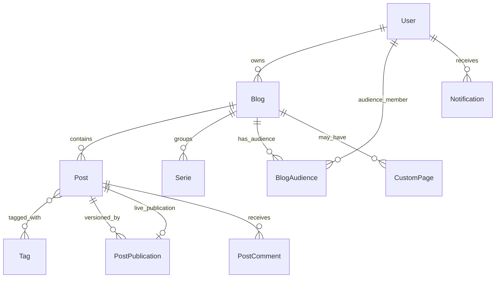

# Contraponto — Domain Specification

Canonical domain language for Contraponto, a multi-blog publishing platform. Developers, reviewers, and AI agents must align code, tests, and UI copy with this document.

**Related references:** [ARCHITECTURE.md](../ARCHITECTURE.md) (technical patterns), [Application-Guidelines.md](Application-Guidelines.md) (routes and flows).

**Maintenance:** When a change introduces or alters domain concepts, UI labels, or business rules, update this file **before** merging (see [.cursor/rules/domain-model.mdc](../.cursor/rules/domain-model.mdc)).

---

## Context

Contraponto lets **authors** publish **posts** on one or more **blogs**, curators (**editors**) feature content on the **home page**, and **readers** discover posts, follow blogs, subscribe by email, and comment. Content is server-rendered (Qute + HTMX); the domain model lives in `dev.vepo.contraponto.*`.

---

## Ubiquitous Language

Terms below are the **only** approved names for aggregates, entities, value objects, states, actions, and user-visible labels unless this document is updated first.

### Platform & people

| Term | Meaning | Code / notes |
|------|---------|--------------|
| **Contraponto** | The publishing platform (product). | — |
| **Guest** | Unauthenticated visitor; may read public content. | No session |
| **User** | Registered account (`tb_users`): username, email, display name, password, roles, active flag. | `User` |
| **Author** | User who owns at least one blog and writes posts. Implied by blog ownership, not a separate role. | `Post.getAuthor()` → blog owner |
| **Reader** | Any user or guest consuming published content. | — |
| **Session** | Authenticated browser state (`__session` cookie). | `LoggedUser` |
| **Role** | Platform capability assigned to a user (multi-role). | `Role` enum |
| **User** (role) | Default role; write own content. | `Role.USER` — label: "User" |
| **Editor** | Curate site-wide: feature posts, review queue, tag metadata. | `Role.EDITOR` — label: "Editor" |
| **User administrator** | Manage users and roles (except assigning Administrator). | `Role.USER_ADMINISTRATOR` |
| **Administrator** | Full access including assigning Administrator. | `Role.ADMIN` |

### Blogs

| Term | Meaning | Code / notes |
|------|---------|--------------|
| **Blog** | A publication channel owned by exactly one user. Has name, slug (unique per owner), description, active flag. | `Blog` |
| **Main blog** | The blog auto-created for a user (`main = true`); slug typically matches username. | `Blog.main` |
| **Secondary blog** | Additional blog owned by the same user (`main = false`). | `Blog` |
| **Blog owner** | User who owns the blog; sole writer for that blog's posts (editors may manage any blog). | `Blog.owner` |
| **Active blog** | Blog with `active = true`; inactive blogs return 404 on public routes. | `Blog.active` |
| **Blog home** | Public listing of published posts for one blog. | `BlogEndpoint` |
| **User profile** | Public page at `/{username}` when the user has multiple blogs: lists their blogs. | `BlogEndpoint` |

### Posts & publishing

| Term | Meaning | Code / notes |
|------|---------|--------------|
| **Post** | A piece of content belonging to one blog: title, slug (unique per author), description, body, format, cover, tags, optional serie, published flag, featured flag, timestamps. Working copy for the author. | `Post` |
| **Draft** | Post with `published = false`; visible only to the author (and editors where applicable). | Library tab: "Drafts" |
| **Published post** | Post with `published = true`; visible to readers (subject to blog active). | Library tab: "Published" |
| **Slug** | URL-safe identifier for a post, blog, tag, serie, or custom page. | Field on entities |
| **Cover** | Optional hero image for a post (`Image`). | `Post.cover` |
| **Format** | Markup dialect: **Markdown** or **AsciiDoc**. | `Format` enum |
| **Publish** | Action that marks the post published, creates a **publication snapshot**, sets **live publication**, fires `PostPublishedEvent`, and may trigger Git export and notifications. | `PostPublicationService.publish` |
| **Republish** | Publish again when content differs from live snapshot; increments version, re-notifies audience. | Same service |
| **Publication snapshot** | Immutable `PostPublication` row: version, content/tags/cover at publish time. | `PostPublication` |
| **Live publication** | The snapshot readers see; pointer on `Post.livePublication`. | `Post.livePublication` |
| **Unpublished changes** | Working post differs from live snapshot while still published. | `hasUnpublishedChanges` |
| **Featured** | Post flagged for homepage curation (`featured = true`). | Editor toggle |
| **Version history** | Diff of publication snapshots; metadata shows live version; full list in a modal on the post page (all readers). | `PostChangeDiffService` |
| **Serie** | Ordered collection of posts within one blog. | `Serie` |
| **Tag** | Global taxonomy label; posts link via join table; snapshots copy tags at publish. | `Tag` |
| **Uploaded image** | Blog-scoped image file stored in `tb_images` with optional **alt text**. | `Image` |
| **Image marker** | HTML comment in stored body: `<!-- contraponto:image uuid="…" -->` immediately before an image reference; hidden in the Write editor. | `ContentImageMarkerService` |
| **Image dependency** | Record that a post, publication snapshot, or custom page uses an uploaded image (`INLINE` or `COVER`). | `PostImageDependency`, `CustomPageImageDependency` |
| **Image control** | Manage screen listing a blog's uploaded images, where each is used, and alt text editing. | `ImageControlEndpoint` |

### Custom pages

| Term | Meaning | Code / notes |
|------|---------|--------------|
| **Custom page** | Static HTML/Markdown page: title, slug, section, content, placement, published flag; optional blog scope. | `CustomPage` |
| **Global custom page** | Page not tied to a blog (`blog = null`); URL `GET /page/{slug}`. | `PageType.GLOBAL` |
| **Blog custom page** | Page scoped to a blog; URL includes owner username and `/page/` segment. | `CustomPagePaths.publicUrl` |
| **Page placement** | Where navigation surfaces the page: **Footer**, **Sidebar**, or **None** (direct URL only). | `PagePlacement` |
| **Custom page cache** | In-memory published pages served by `CustomPageFilter`; invalidated on `CustomPageChangedEvent`. | `CustomPageCache` |

### Audience & notifications

| Term | Meaning | Code / notes |
|------|---------|--------------|
| **Blog audience** | Per user–blog relationship: follow and/or email subscribe flags. | `BlogAudience` |
| **Follow** | In-app notifications when the blog publishes (`followed = true`). | `BlogAudienceFollowEndpoint` |
| **Following** | Active follow state (button label when on). | UI: "Following" |
| **Subscribe by email** | Email on publish (`emailSubscribed = true`); deduped via email notification log. | `BlogAudienceSubscribeEndpoint` |
| **Subscribed** | Active email subscription (button label when on). | UI: "Subscribed" |
| **Notification** | In-app item for a recipient: type, blog, optional post/publication/actor/comment, read flag. | `Notification` |
| **Notification type** | `NEW_POST`, `NEW_FOLLOW`, `NEW_SUBSCRIBE`, `NEW_COMMENT`. | `NotificationType` |
| **Deferred follow** | Guest clicks Follow; after login, pending blog id completes the follow. | `LoginEndpoint` session |
| **Subscriptions page** | Authenticated list of blogs the user follows/subscribes to. | `SubscriptionEndpoint` |

### Comments

| Term | Meaning | Code / notes |
|------|---------|--------------|
| **Post comment** | Text reply on a published post; may be root or nested under an approved parent. | `PostComment` |
| **Comment body** | Required text, max 2000 characters after trim. | `MAX_BODY_LENGTH` |
| **Comment status** | **Pending**, **Approved**, or **Rejected**. | `CommentStatus` |
| **Moderation** | Post owner approves or rejects pending comments. | `PostCommentService` |
| **Root comment** | Top-level comment (`parent = null`). | `PostComment.isRoot` |
| **Reply** | Comment whose parent must be **Approved**. | `createReply` |

### Git sync

| Term | Meaning | Code / notes |
|------|---------|--------------|
| **Git integration** | Per-blog export/import to a remote Git repo (Jekyll layout). | `Blog.gitEnabled`, etc. |
| **Git sync request** | Event after publish to export post to Git when enabled. | `PostGitSyncRequestedEvent` |
| **Remote poll** | Scheduled pull of remote changes when poll enabled. | `GitRemotePollScheduler` |

### Discovery & feeds

| Term | Meaning | Code / notes |
|------|---------|--------------|
| **Home page** | Site landing with **featured** published posts (hero + grid). | `HomeEndpoint` |
| **Search** | Full-text discovery via modal or `/search` page. | `SearchEndpoint` |
| **Tag page** | Public listing of posts with a given tag. | `TagPageEndpoint` |
| **RSS feed** | Syndication for site, blog, serie, or tag. | `rss` package |
| **View count** | Anonymous read metric per post/session. | `View` |

### Author workspaces

| Term | Meaning | Code / notes |
|------|---------|--------------|
| **Write** | Editor for creating or editing a post (`/write`, `/write/draft/{id}`). | `WriteEndpoint` |
| **Image control** | Per-blog list of uploaded images, usages, and alt text (`/blogs/{id}/images`). | `ImageControlEndpoint` |
| **Library** | Author's drafts and published posts across owned blogs. | `LibraryEndpoint` |
| **Dashboard** | Author overview: counts and recent drafts/published. | `DashboardEndpoint` |
| **Profile settings** | Update name, email, password. | `ProfileEndpoint` |
| **Review** | Editor queue of published posts to toggle featured. | `ReviewEndpoint` — title: "Review Featured Posts" |

### UI labels (user-visible copy)

Use these exact strings in templates, toasts, and tests unless this table is updated.

| UI element | Label | Context |
|------------|-------|---------|
| Auth — login | Sign in | Modal, comment gate |
| Auth — register | Sign up | Modal |
| Auth — logout | Log out | Menu |
| Write — save | Save draft | Write toolbar |
| Write — publish | Publish | Write toolbar |
| Blog audience — follow (off) | Follow | Blog page, guest |
| Blog audience — follow (on) | Following | Blog page |
| Blog audience — email (off) | Subscribe by email | Blog page |
| Blog audience — email (on) | Subscribed | Blog page |
| Post — editor feature | Featured / ★ Featured | Post action bar, review row |
| Post — editor not featured | ☆ Not Featured | Review row |
| Home / blog hero | Featured | Category label on featured card |
| Pagination — public lists | Load more | Home, blog grid, search |
| Library tab | Drafts | Library |
| Library tab | Published | Library |
| Notifications empty | No notifications yet. Follow blogs to see new posts here. | Notifications page |
| Menu — editor | Featured Posts | Links to `/review` |
| Dashboard stat | Published posts | Dashboard card |
| Comment moderation | Approve / Reject | Post owner (implicit in moderation UI) |
| Custom page — published badge | Published | Manage list |
| Image control — page title | Images | `/blogs/{id}/images` |
| Image control — empty | No images uploaded for this blog yet. | Image list |
| Image control — alt field | Alt text | Image row form |
| Image control — updated toast | Image updated. | Alt save |
| Post — version (metadata) | Version {n} | Post page metadata trigger |
| Post — version badge | current | Metadata and modal list (latest snapshot) |
| Post — change history modal | Change history | Modal title |
| Post — change details | Changes from version {n} | Expandable diff summary in modal |

Toast messages and validation errors should describe the domain action (e.g. "Cannot follow or subscribe to your own blog") in plain language consistent with the terms above.

---

## Domain events

| Event | When fired | Typical reaction |
|-------|------------|------------------|
| `PostPublishedEvent` | After a new or changed publication snapshot is committed | Notify followers; email subscribers |
| `PostGitSyncRequestedEvent` | After publish when blog has Git enabled | Export post to remote |
| `CustomPageChangedEvent` | After custom page create/update/delete | Refresh `CustomPageCache` |

---

## Business rules (invariants)

1. Every **user** has exactly one **main blog** (created at registration).
2. A **post** belongs to exactly one **blog**; **author** is derived from blog owner.
3. Post **slug** is unique per author (across all their blogs).
4. Blog **slug** is unique per owner.
5. Only **published** posts are visible to readers; **drafts** only to author (and platform editors where implemented).
6. **Publish** creates a monotonically increasing **publication snapshot** version per post.
7. Republishing identical content does not create a duplicate snapshot or re-fire notifications.
8. A user cannot **follow** or **subscribe by email** to their **own blog**.
9. **Blog audience** row is deleted when both follow and email subscribe are off.
10. **Follow** drives in-app **notifications** on publish; **subscribe by email** drives email (with deduplication log).
11. **Comments** are allowed only on **published** posts.
12. Non-owner **comments** start **Pending**; owner comments are auto-**Approved**.
13. Only the **post owner** may **moderate** (approve/reject) comments.
14. **Replies** require an **Approved** parent comment.
15. **Rejected** comments are hidden from everyone except moderation flows.
16. **Featured** posts appear on the **home page**; toggling is immediate (no confirmation).
17. **Editors** may manage any blog (`BlogAccess.canEdit`); **owners** manage their own.
18. **Custom pages** served publicly must be **published** and present in cache after changes.
19. Public URLs for posts and custom pages must use `PostEndpoint.extractUrl` and `CustomPagePaths.publicUrl` — never ad-hoc path building.

---

## Aggregates (summary)

| Aggregate | Root | Main children / links |
|-----------|------|------------------------|
| **User** | `User` | Blogs (owned), roles, blog audience rows |
| **Blog** | `Blog` | Posts, series, custom pages, Git settings |
| **Post** | `Post` | Tags, publication snapshots, live publication, comments |
| **Tag** | `Tag` | Global; referenced by posts and snapshots |
| **Custom page** | `CustomPage` | Optional blog scope |
| **Blog audience** | `BlogAudience` | User + blog pair |
| **Notification** | `Notification` | Recipient-centric inbox item |

---

## Mapping to code

| Domain area | Package |
|-------------|---------|
| Users & roles | `dev.vepo.contraponto.user` |
| Blogs | `dev.vepo.contraponto.blog` |
| Posts & publications | `dev.vepo.contraponto.post` |
| Tags | `dev.vepo.contraponto.tag` |
| Series | `dev.vepo.contraponto.serie` |
| Custom pages | `dev.vepo.contraponto.custompage` |
| Notifications & audience | `dev.vepo.contraponto.notification` |
| Comments | `dev.vepo.contraponto.comment` |
| Git sync | `dev.vepo.contraponto.git` |
| Auth forms | `dev.vepo.contraponto.components.forms` |
| Editor review | `dev.vepo.contraponto.admin` |

Access helpers (not aggregates): `BlogAccess`, `UserAccess`, `CustomPageAccess`.

---

## Checklist for changes

Before implementing a feature or fix:

1. Read **Ubiquitous Language** and **Business rules**.
2. Decide if the change needs new terms, UI labels, events, or rules — update this file first if yes.
3. Name classes, methods, tests, and templates with domain terms from this document.
4. After implementation, re-read this spec and sync any drift.
