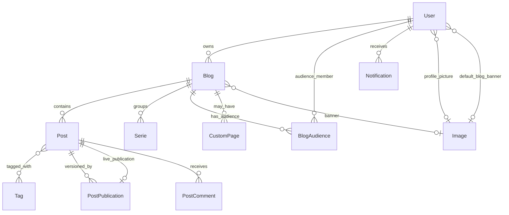

# Contraponto — Domain Specification

Canonical domain language for Contraponto, a multi-blog publishing platform. Developers, reviewers, and AI agents must align code, tests, and UI copy with this document.

**Related references:** [ARCHITECTURE.md](../ARCHITECTURE.md) (technical patterns), [application-guidelines.md](application-guidelines.md) (routes and flows).

**Maintenance:** When a change introduces or alters domain concepts, UI labels, or business rules, update this file **before** merging (see [.cursor/rules/domain-model.mdc](../.cursor/rules/domain-model.mdc)).

---

## Context

Contraponto lets **authors** publish **posts** on one or more **blogs**, curators (**editors**) feature content on the **home page**, and **readers** discover posts, follow blogs, subscribe by email, and comment. Content is server-rendered (Qute + HTMX); the domain model lives in `dev.vepo.contraponto.*`.

---

## Bounded contexts

Contraponto is a **modular monolith**: one deployable, many bounded contexts under `dev.vepo.contraponto.*`. Contexts communicate via **CDI events**, `*Paths` URL builders, and service calls at documented boundaries — not by reaching into another context's repositories from services.

| Context | Packages | May depend on |
|---------|----------|---------------|
| **Shared kernel** | `shared` | JDK/Jakarta only (after kernel cleanup) |
| **Identity & access** | `auth`, `user` | shared |
| **Content publishing** | `blog`, `post`, `write`, `tag`, `serie`, `renderer`, `content` | shared, identity, media |
| **Reader engagement** | `notification`, `comment`, `readinglist`, `readingtime`, `highlight`, `postresponse` | shared, identity, publishing |
| **Discovery & syndication** | `home`, `search`, `directory`, `rss`, `seo`, `view` | shared, publishing |
| **Media** | `image` | shared, identity |
| **Customization** | `custompage` | shared, identity, media |
| **Integration** | `git`, `activitypub` | shared, publishing, media, identity |
| **Author workspace** | `library`, `dashboard`, `admin`, `profile` | shared, identity, publishing |
| **Presentation shell** | `components`, `navigation` | shared + all contexts (HTTP composition only) |
| **Platform insights** | `platforminsights` | shared, view, identity |

**Rules:** Feature services must not depend on unrelated contexts (e.g. `git` must not depend on `notification`; `activitypub` must not depend on `comment`). Publish side-effects (notifications, RSS, sitemap, Git export, ActivityPub delivery) use [CDI events](cdi-events.md). `@TemplateExtension` classes live in their owning context, not in `shared`.

---

## Ubiquitous Language

Terms below are the **only** approved names for aggregates, entities, value objects, states, actions, and user-visible labels unless this document is updated first.

### Platform & people

| Term | Meaning | Code / notes |
|------|---------|--------------|
| **Contraponto** | The publishing platform (product). | — |
| **Platform display name** | White-label name shown in header, footer, page titles, SEO, RSS, and transactional email (default `contraponto`). | `app.site.name` / `APP_SITE_NAME`, `SiteBranding`, Qute globals `siteName` / `siteSeoName` |
| **Platform integration script** | Optional third-party script in page `<head>` (HTTPS URL + `data-token`; disabled unless both are set). Its origin is allowlisted in Content-Security-Policy `script-src` and `connect-src` when enabled. | `app.site.integration.script-url`, `app.site.integration.script-data-token`, `SiteIntegration`, `SecurityHeadersFilter` |
| **Platform host** | Shared HTTPS origin for the app shell, discovery, and author workspace (e.g. `blogs.commit-mestre.dev`). | `APP_PUBLIC_URL`, `app.platform.host`, `BlogSubdomainConfig` |
| **Blog subdomain** | Author-scoped host `{username}.{base-domain}` where the main blog home is `/` and posts are `/post/{slug}`; secondary blogs use `/{blogSlug}/…`. Workspace hubs (`/writing`, `/manage`, `/administration`, …) redirect to the platform host; shell partials (`/components/menu`, …) stay on the author host. URL mapping: [blog-subdomain-urls.md](blog-subdomain-urls.md). | `BlogSubdomainFilter`, `BlogPublicUrlService`, `APP_BLOG_SUBDOMAIN_BASE_DOMAIN` |
| **Dual blog URL** | A published blog or post reachable via platform path (`/{username}/post/{slug}`) and via blog subdomain (`/post/{slug}` on `{username}.{base-domain}`). Canonical SEO/RSS/email links use the subdomain form. | `BlogPublicUrlService.absoluteCanonical`, `BlogSubdomainFilter` |
| **Post embed CSP allowlist** | Origins permitted in Content-Security-Policy `frame-src` for built-in **content render plugins** and sanitized post HTML iframes: Twitter (`platform.twitter.com`), YouTube (`www.youtube.com`, `www.youtube-nocookie.com`). | `SecurityHeadersFilter`, `HtmlSanitizer`, `YoutubeContentRenderPlugin`, `TwitterContentRenderPlugin` |
| **Guest** | Unauthenticated visitor; may read public content. | No session |
| **User** | Registered account (`tb_users`): username, email, display name, password, roles, active flag; optional **profile picture** and **default blog banner**. | `User` |
| **Author** | User who owns at least one blog and writes posts. Implied by blog ownership, not a separate role. | `Post.getAuthor()` → blog owner |
| **Reader** | Any user or guest consuming published content. | — |
| **Session** | Authenticated browser state (`__session` cookie → `SessionStore` → user id, then `User` from DB). | `LoggedUser`, `SessionStore` |
| **Session store** | Backing store for login sessions: in-memory (single instance) or Redis (multi-instance). | `SessionStore`, `SessionStoreProducer` |
| **Password recovery** | Self-service flow to reset a forgotten password via email link. | `PasswordRecoveryEndpoint` |
| **Password reset token** | Single-use, time-limited secret sent by email; stored hashed in `tb_user_account_tokens`. | `UserAccountToken` |
| **Account activation token** | Single-use, time-limited secret sent after self-service signup; stored hashed in `tb_user_account_tokens`. | `UserAccountToken`, `UserAccountTokenType.ACCOUNT_ACTIVATION` |
| **Activation link** | Email link that activates an inactive account and starts a session. | `GET /account/activate?token=…`, `AccountActivationEndpoint` |
| **Unauthorized signup report** | Recipient of an activation email reports they did not create the account; invalidates the activation token and emails site administrators. | `GET /account/report-signup?token=…`, `AccountReportSignupEndpoint` |
| **Pending email** | New email address awaiting verification; login and notifications use the confirmed email until verified. | `User.pendingEmail` |
| **Email verification** | Confirms a **pending email** via link; promotes it to the account email. | `EmailVerificationEndpoint` |
| **Account email** | Transactional HTML message for access or user management (account activation, password reset, password changed, email verification). | `AccountEmailService` |
| **Account email outbox** | Database queue of account emails that could not be delivered immediately; retried by a scheduled job with exponential backoff. | `AccountEmailOutbox`, `tb_account_email_outbox` |
| **Account email delivery retry** | Background job that sends queued account emails when SMTP becomes available again. | `AccountEmailOutboxScheduler`, `AccountEmailOutboxService` |
| **Role** | Platform capability assigned to a user (multi-role). | `Role` enum |
| **User** (role) | Default role; write own content. | `Role.USER` — label: "User" |
| **Editor** | Curate site-wide: feature posts, review queue, tag metadata. | `Role.EDITOR` — label: "Editor" |
| **User administrator** | Manage users and roles (except assigning Administrator). | `Role.USER_ADMINISTRATOR` |
| **Administrator** | Full access including assigning Administrator. | `Role.ADMIN` |

### Blogs

| Term | Meaning | Code / notes |
|------|---------|--------------|
| **Blog** | A publication channel owned by exactly one user. Has name, slug (unique per owner), description, optional **blog banner**, active flag. | `Blog` |
| **Blog description** | Optional short bio on **blog home**; authors may use **Markdown** (bold, links, lists). Rendered to safe HTML on the public blog home only; does not support **content render plugins**. | `Blog.description`, `BlogDescriptionRenderer` |
| **Main blog** | The blog auto-created for a user (`main = true`); slug typically matches username. **Public title** is `Blog.name` (default = author **display name** at registration). | `Blog.main` |
| **Secondary blog** | Additional blog owned by the same user (`main = false`). | `Blog` |
| **Blog public title** | Title shown on blog home, directory cards, and SEO for any blog; always `Blog.name`. | `Blog.name` |
| **Author byline** | On blog home and directory cards: `por {display name}` (i18n `directory.byAuthor`) linking to the author profile when `Blog.showsAuthorByline` — blog name differs from author display name. | `Blog.showsAuthorByline`, `BlogEndpoint`, `blog-directory-card` |
| **Blog owner** | User who owns the blog; sole writer for that blog's posts and the only role that may edit blog settings. | `Blog.owner` |
| **Profile picture** | Optional image on the user; shown in the menu and wherever the author is displayed. When absent, a **generated avatar** shows the user's initials on a brand-colored SVG (`GET /components/avatar`). | `User.profilePicture`, `AvatarEndpoint` |
| **Author profile** | Public page at `/authors/{username}` with bio, social links, top tags, and blog list. | `AuthorProfileEndpoint` |
| **Author profile description** | Optional Markdown bio on the user (`User.profileDescription`); distinct from **blog description**. Edited in **Author appearance**. | `User.profileDescription` |
| **Author social links** | Optional https URLs (website, X, Mastodon, Bluesky, GitHub, LinkedIn) shown on the author profile and in JSON-LD `sameAs`. | `User.websiteUrl`, etc., `AuthorSocialUrls` |
| **Top tags** | Tags most often used on an author's or blog's published posts; shown on profiles and directory cards. | `TagProfileService.topTagsForAuthor`, `topTagsForBlog` |
| **Main authors (for a tag)** | Authors with the most published posts carrying a tag; shown on the **tag page**. | `TagProfileService.mainAuthorsForTag` |
| **Default blog banner** | Optional image on the user used when a blog has no own **blog banner**. | `User.defaultBlogBanner` |
| **Blog banner** | Optional hero image on a blog; overrides the owner's default for that blog's public home. | `Blog.banner` |
| **Effective blog banner** | `blog.banner` if set, else `user.defaultBlogBanner`. | `BlogBannerService.resolveEffectiveBanner` |
| **Active blog** | Blog with `active = true`; inactive blogs return 404 on public routes. | `Blog.active` |
| **Blog home** | Public listing of published posts for one blog. | `BlogEndpoint` |
| **User profile** | Public page at `/{username}` when the user has multiple blogs: lists their blogs. | `BlogEndpoint` |

### Posts & publishing

| Term | Meaning | Code / notes |
|------|---------|--------------|
| **Post** | A piece of content belonging to one blog: title, slug (unique per author), description, body, format, cover, tags, optional serie, published flag, featured flag, timestamps. Working copy for the author. | `Post` |
| **Post description** | Optional short excerpt on the working copy (`Post.description`); capped at **512 characters** in storage. Shown on post cards and metadata when published. | `Post.description`, `PostPublicationDescriptions` |
| **Published snapshot description** | Excerpt copied into each `PostPublication` when publishing; same **512-character** cap as the working copy. Git import truncates longer Jekyll excerpts and may log a sync warning. | `PostPublication.description` |
| **Draft** | Post with `published = false`; visible only to the author (and editors where applicable). | Library tab: "Drafts" |
| **Published post** | Post with `published = true`; visible to readers (subject to blog active). | Library tab: "Published" |
| **Slug** | URL-safe identifier for a post, blog, tag, serie, or custom page. | Field on entities |
| **Cover** | Optional hero image for a post (`Image`). | `Post.cover` |
| **Format** | Markup dialect: **Markdown** or **AsciiDoc**. | `Format` enum |
| **Content render plugin** | Pluggable handler registered via `ServiceLoader` that turns a **render tag** in post body into HTML (e.g. YouTube embed). | `ContentRenderPlugin` |
| **Render tag** | Author syntax in post body: ``. Built-in identifiers: `youtube`, `gist`, `github`, `twitter`. Unknown identifiers remain literal in output. | `ContentRenderTagProcessor` |
| **Publish** | Action that marks the post published, creates a **publication snapshot**, sets **live publication**, fires `PostPublishedEvent`, and may trigger Git export and notifications. | `PostPublicationService.publish` |
| **Unpublish** | Blog owner action: set `Post.published = false`, clear **featured**, keep **publication snapshots** and **live publication** for version history and republish. Public post URL returns 404 for readers; may trigger Git export. | `PostManagementService.unpublish` |
| **Delete post** | Blog owner permanently removes a post with `published = false`. **Published** posts must be **unpublished** first. | `PostManagementService.delete` |
| **Confirm modal** | In-app dialog in `#modal-container` for destructive confirmations; confirm control uses `data-confirm-submit` + HTMX. Never `hx-confirm` or native `confirm()`. | `ConfirmModalEndpoint`, `confirm-modal.js` |
| **Republish** | Publish again when content differs from live snapshot; increments version, re-notifies audience. | Same service |
| **Publication snapshot** | Immutable `PostPublication` row: version, content/tags/cover at publish time. | `PostPublication` |
| **Live publication** | The snapshot readers see; pointer on `Post.livePublication`. | `Post.livePublication` |
| **Unpublished changes** | Working post differs from live snapshot while still published. | `hasUnpublishedChanges` |
| **Featured** | Post flagged for homepage curation (`featured = true`). | Editor toggle |
| **Version history** | Diff of publication snapshots; metadata shows live version; full list in a modal on the post page (all readers). | `PostChangeDiffService` |
| **Serie** | Ordered collection of posts within one blog. | `Serie` |
| **Tag** | Global taxonomy label; posts link via join table; snapshots copy tags at publish. | `Tag` |
| **Uploaded image** | User-scoped image owned by the **image owner** (`owner_user_id`): metadata in `tb_images`, bytes in `tb_image_content` (PostgreSQL `BYTEA`), optional **alt text**, optional **Git asset path** (relative path under the blog's assets directory, without extension, set on Git import). One library per author, usable on any of their blogs. Served at `/api/images/{uuid}{ext}` regardless of Git path. | `Image`, `ImageContent` |
| **Image owner** | The user who owns an uploaded image library entry; uploader may differ (`uploaded_by_user_id`). | `Image.owner` |
| **Git asset path** | Original relative path of an image file in the Git/Jekyll assets tree (e.g. `capas/photo`). Used for Git export filenames and Images hub display; Contraponto content still references `/api/images/{uuid}.ext`. | `Image.gitAssetRelativePath` |
| **Image marker** | HTML comment in stored body: `<!-- contraponto:image uuid="…" -->` immediately before an image reference; hidden in the Write editor and stripped when rendering published post content (markers remain in stored content). | `ContentImageMarkerService` |
| **Image lightbox** | Reader expands an inline post-body image in an on-page overlay (larger view, same image URL); caption prefers AsciiDoc **image block title**, then **alt text**; omits caption when only a filename is available. Closed with ESC, close control, or backdrop click. | `#image-lightbox`, `ImageLightboxManager` in `main.js` |
| **Code block copy** | Reader copies the plain source from a fenced or listing code block via a **Copy** control; label briefly shows **Copied**. | `CodeCopyManager` in `main.js`, `.code-block__copy` |
| **Image dependency** | Record that a post, publication snapshot, or custom page uses an uploaded image (`INLINE` or `COVER`). | `PostImageDependency`, `CustomPageImageDependency` |
| **Image control** | Manage screen listing the author's uploaded images (all blogs), where each is used, and alt text editing. | `ImageControlEndpoint` |
| **Image library search** | Filter the Images hub list by alt text, stored filename, or Git asset path (`GET /writing/images?q=…`). | `ImageControlEndpoint`, Writing hub `images` section |
| **Image picker** | Modal to choose one **uploaded image** from the author's library, filter by alt/path (`q`), or upload a new file (upload zone above the grid); used for post cover, inline post images, and profile/blog banner fields. Shares search UI with the Images hub (`image-library-search`). | `ImagePickerEndpoint`, `ImagePickerManager` in `image-picker.js` |
| **Choose image** | Action that opens the image picker (replaces opening the native file dialog directly). | Cover area, `data-image-upload` areas, Write toolbar image control |

### Custom pages

| Term | Meaning | Code / notes |
|------|---------|--------------|
| **Custom page** | Static HTML/Markdown page: title, slug, section, content, placement, published flag; optional blog scope. | `CustomPage` |
| **Global custom page** | Page not tied to a blog (`blog = null`); URL `GET /page/{slug}`. | `PageType.GLOBAL` |
| **Blog custom page** | Page scoped to a blog; URL includes owner username and `/page/` segment. | `CustomPagePaths.publicUrl` |
| **Page placement** | Where navigation surfaces the page: **Footer**, **Sidebar**, or **None** (direct URL only). | `PagePlacement` |
| **Custom page cache** | In-memory published pages read by `CustomPageEndpoint`; invalidated on `CustomPageChangedEvent`. | `CustomPageCache` |
| **RSS feed cache** | Caffeine cache of rendered RSS XML; invalidated on `PostPublishedEvent`. | `RssFeedService`, `rss-feeds` |

### Audience & notifications

| Term | Meaning | Code / notes |
|------|---------|--------------|
| **Blog audience** | Per user–blog relationship: follow and/or email subscribe flags. | `BlogAudience` |
| **Follow** | In-app notifications when the blog publishes (`followed = true`). | `BlogAudienceFollowEndpoint` |
| **Following** | Active follow state (button label when on). | UI: "Following" |
| **Subscribe by email** | Email on publish (`emailSubscribed = true`); deduped via email notification log. | `BlogAudienceSubscribeEndpoint` |
| **Subscribed** | Active email subscription (button label when on). | UI: "Subscribed" |
| **Notification** | In-app item for a recipient: type, blog, optional post/publication/actor/comment, read flag. | `Notification` |
| **Notification bell** | Header control showing unread count; opens **notification overlay**. | `NotificationBadgeEndpoint`, `#notificationBellBtn` |
| **Notification overlay** | Dropdown preview of latest unread notifications. | `NotificationOverlayEndpoint`, `#notificationOverlay` |
| **Dismiss notification** | Mark one notification read from the overlay. | `DismissNotificationEndpoint` — button: "Dismiss" |
| **Close notification overlay** | Hide the dropdown without changing read state. | Close control (`data-notification-close`) |
| **Notifications changed** | HTMX event; refreshes badge and open overlay. | `HtmxTriggers.NOTIFICATIONS_CHANGED_ON_BODY` |
| **Notification type** | `NEW_POST`, `NEW_FOLLOW`, `NEW_SUBSCRIBE`, `NEW_COMMENT`, `COMMON_HIGHLIGHT_PROPOSAL`, `PUBLIC_HIGHLIGHT_NOTE`, `POST_RESPONSE`, `GIT_SYNC_*`. | `NotificationType` |
| **Follow after login** | Guest clicks Follow, signs in via modal, then clicks Follow again. | Post page / audience widget |
| **Subscriptions page** | Authenticated list of blogs the user follows/subscribes to. | `SubscriptionEndpoint` |

### Comments

| Term | Meaning | Code / notes |
|------|---------|--------------|
| **Post comment** | Text reply on a published post; may be root or nested under an approved parent. | `PostComment` |
| **Comment body** | Required text, max 2000 characters after trim. | `MAX_BODY_LENGTH` |
| **Comment status** | **Pending**, **Approved**, or **Rejected**. | `CommentStatus` |
| **Moderation** | Post owner approves or rejects pending comments. | `PostCommentService` |
| **Root comment** | Top-level comment (`parent = null`). | `PostComment.isRoot` |
| **Reply** | Comment whose parent must be **Approved**. | `createReply` |

### Highlights & post responses

| Term | Meaning | Code / notes |
|------|---------|--------------|
| **Post text highlight** | Reader's saved passage on a **published post** (**live publication**). Private on the post body unless part of an **official highlight**. | `PostTextHighlight` |
| **Highlight passage** | Selected plain text (trimmed), max 500 characters. | `PostTextHighlight.passage` |
| **Highlight anchor** | Locator for the passage within a **publication snapshot** (character offsets in article plain text). | `PostTextHighlight.anchorJson` |
| **Highlight passage cluster** | Highlights on the same post with the same `anchor_cluster_hash`. | `HighlightAnchorClusterer` |
| **Common highlight proposal** | Inbox item for the **author** when distinct readers reach the cluster threshold. | `CommonHighlightProposal` |
| **Official highlight** | **Author-approved** passage shown on the post for all readers. | `OfficialHighlight` |
| **Highlight note** | Optional text on a **post text highlight** (max 1000 characters). | `HighlightNote` |
| **Private highlight note** | Note visible only to the highlight author (default). | `HighlightNoteStatus.PRIVATE` |
| **Public highlight note** | Reader marks note **public**; requires **author approval** before display on post. | `HighlightNoteStatus.PENDING` → `APPROVED` |
| **Add note button** | Opens **highlight note dialog** on post page. | `data-highlight-action="note"` |
| **Remove highlight button** | Removes the reader's **post text highlight** from the post. | `data-highlight-action="remove-mark"` |
| **Remove note button** | Removes the reader's **highlight note**. | `data-highlight-action="remove-note"` |
| **Highlight action bar** | Floating options when clicking an owned highlight or note. | `#highlights-action-bar` |
| **Highlight note dialog** | Floating panel near selected text with note text, public checkbox, **OK** / **Cancel**. | `#highlightNoteDialog` |
| **Highlight note card** | Shows note body, owner, status badge, timestamp after save. | `.highlight-note-card` |
| **Noted highlight mark** | Inline mark with a **highlight note**; distinct color from a plain personal highlight. | `.post-highlight--noted` |
| **Drop-cap highlight mark** | Highlight that starts at the first letter of the opening paragraph; suppresses the drop cap so the letter is covered by the mark. | `.post-highlight--affects-drop-cap` |
| **Highlight note tooltip** | Hover preview of the reader's note on a **noted highlight mark**. | `#post-highlight-note-tooltip` |
| **Text selection bar** | Floating UI after text selection in `.article-page__content`. | `PostHighlightManager` |
| **Highlights library** | Reader's list of own highlights and notes. | Reading hub — `GET /reading/highlights` (`GET /highlights` redirects) |
| **Reading list** | Reader's private queue of whole posts saved to read later, with explicit read/unread state. | Reading hub — `GET /reading/saved`; post page **Salvar para ler** |
| **Reading list item** | One published post saved by a reader; unread until **marked as read**. | `ReadingListItem` — `tb_reading_list_items` |
| **Save to reading list** | Add or re-queue a post as unread on the reader's list. | `POST /forms/posts/{postId}/reading-list` |
| **Mark as read** | Record that the reader finished the post; removes from Unread tab. | `POST /forms/reading-list/{itemId}/read` |
| **Reading hub** | Signed-in reader hub for saved posts, highlights, and notes. | `ReadingHubEndpoint` — `GET /reading`; user menu **Reading** |
| **Highlight moderation** | Author queue: proposals, public notes, post responses. | `HighlightManageEndpoint` — `GET /writing/highlights` |
| **Post response** | **Published post** on responder's blog that responds to another **published post**. | `PostResponse` |
| **Source post** | Post being responded to. | `PostResponse.sourcePost` |
| **Response post** | New post; always links to **source post**. | `PostResponse.responsePost` |
| **Response link-back** | Link from **source post** to **response post**; shown when **Approved**. | `PostResponseLinkBackStatus` |
| **Destacar** | Create highlight action (PT-BR). | `highlight.create` |
| **Entre para destacar** | Guest gate on highlight. | `highlight.signInToHighlight` |
| **Destaques e respostas** | Writing hub moderation nav label. | `highlight.moderation.title` |
| **Responder com post** | Start **post response** from source post. | `postResponse.create` |
| **Em resposta a** | Banner on **response post**. | `postResponse.inResponseTo` |
| **Respostas** | Section on **source post** for approved link-backs. | `postResponse.sectionTitle` |

**Notification types (highlights):** `COMMON_HIGHLIGHT_PROPOSAL`, `PUBLIC_HIGHLIGHT_NOTE`, `POST_RESPONSE`.

### Git sync

| Term | Meaning | Code / notes |
|------|---------|--------------|
| **Git integration** | Per-blog export/import to a remote Git repo over HTTPS (any host; Jekyll layout). Available on the **main blog** and **secondary blogs**; configured on blog **Edit** (default blog) or **Settings** (`GET /blogs/{id}/settings`). | `Blog.gitEnabled`, etc. |
| **Git sync request** | Event after draft save or publish to export post to Git when enabled. | `PostGitSyncRequestedEvent` |
| **Remote poll** | Scheduled pull of remote changes when poll enabled. | `GitRemotePollScheduler` |
| **Git sync run** | One execution of Git export (push) or import (pull) for a blog. | `GitSyncRun` |
| **Git sync trigger** | What started the run: draft save, publish, remote poll, or blog save warmup. | `GitSyncTrigger` |
| **Git sync operation** | `EXPORT` (Contraponto → remote) or `IMPORT` (remote → Contraponto). | `GitSyncOperation` |
| **Git sync outcome** | `SUCCESS`, `PARTIAL`, `FAILED`, or `SKIPPED`. | `GitSyncOutcome` |
| **Git error kind** | Classification of failure: `NONE`, `AUTHENTICATION`, `NETWORK`, `REPOSITORY`, `WORKSPACE`, `CONVENTION`, `POST`, `UNKNOWN`. | `GitErrorKind` |
| **Repository readable** | Contraponto prepared the workspace and resolved layout (`_contraponto.yml` or defaults). | Flag on `GitSyncRun` |
| **Data loadable** | Remote was reachable and clone/fetch/pull succeeded. | Flag on `GitSyncRun` |
| **Git sync log entry** | One step or per-post result within a run (phase, message, remediation). | `GitSyncRunEntry` |
| **Legacy Jekyll front matter** | Import-only YAML aliases (`permalink`, `image`, `publish_date`, `series`) mapped to slug, cover, publish time, and serie; native keys win when both are set. | `GitFrontMatterResolver` |
| **Git publish date alignment** | On import, when only `published_at` / `publish_date` (or the dated filename) changes, Contraponto updates both the post and the **live publication** timestamp without creating a new version. On export, filename date and front matter `published_at` use the same live snapshot timestamp; stale dated files for the same slug are removed from the repo. | `PostPublicationService.alignPublicationTimestampFromGit`, `BlogGitIntegrationService` |

### ActivityPub federation

| Term | Meaning | Code / notes |
|------|---------|--------------|
| **Fediverse** | Decentralized social network of ActivityPub-compatible servers (Mastodon, Pleroma, Misskey, …). | [feature/activitypub-integration.md](../feature/activitypub-integration.md) |
| **ActivityPub federation** | Server-to-server syndication: Contraponto exposes **ActivityPub actors** and delivers **Create** / **Update** / **Delete** activities when authors publish on their **main blog**. Distinct from in-app **blog audience Follow** and from the optional **Mastodon profile URL** on author appearance. | `activitypub` package; ADRs [0006](adr/0006-activitypub-federation.md)–[0008](adr/0008-activitypub-actor-identity.md) |
| **Fediverse actor** | ActivityStreams **Person** — **one per `User`** (not per blog); has `inbox`, `outbox`, `followers`, and `publicKey`. Served as JSON-LD at the actor URL on the user's **blog subdomain**. MVP outbox: **main blog** posts only; future: same actor may carry highlight/comment activities (deferred). | `ActivityPubActor` |
| **Fediverse handle** | Human-readable `@username@domain` resolved via **WebFinger** to the actor URL (e.g. `@alice@blog.example.com`). | `/.well-known/webfinger` |
| **Fediverse opt-in** | Author enables federation on **Author appearance**; when off, actor endpoints return **404**. | Author appearance — Fediverse section |
| **Fediverse follow** | Remote user on another ActivityPub server sends a **Follow** activity to the author's **inbox**; author **Accept** or **Reject** (manual approval model). | `ActivityPubInboxService` |
| **ActivityPub delivery** | Outbound signed POST of an activity to a remote instance's **inbox** after publish/unpublish (async queue with retry). | `ActivityPubDeliveryService` |
| **Fediverse follower count** | Count of accepted remote followers (optional display on appearance/profile per **FQ4**). | Followers collection |
| **ActivityPub global kill-switch** | Platform admin toggle that enables/disables ActivityPub federation for the whole instance. When disabled, user opt-in and delivery/inbox processing are blocked by guardrails. | `POST /forms/administration/activitypub`, `ActivityPubSettings.enabled()` |

### Discovery & feeds

| Term | Meaning | Code / notes |
|------|---------|--------------|
| **Home page** | Site landing with **featured** published posts (hero + grid). | `HomeEndpoint` |
| **Guest introduction masthead** | Short editorial welcome on the **home page** for **guests** only; explains curated featured posts; dismissible per browser (`localStorage`). | `HomeEndpoint/guest-masthead.html`, `HomeGuestMastheadManager` |
| **Search** | Full-text discovery via modal or `/search` page. | `SearchEndpoint` |
| **Tag page** | Public listing of posts with a given tag. | `TagPageEndpoint` |
| **RSS feed** | Syndication for site, blog, serie, or tag. | `rss` package |
| **RSS feed link** | Public control that opens the matching feed URL in a new tab. | `components/rss-feed-link.html`, `RssFeedPaths` |
| **Page metadata** | Per-route SEO bundle: document title, description, canonical URL, `noindex`, Open Graph / Twitter Card fields, optional JSON-LD (`BlogPosting`, `BreadcrumbList`, `WebSite` + `SearchAction`, …), `article:modified_time` on republished posts. | `SeoMetadata`, `SeoService`, `components/seo-meta-tags.html` |
| **Post slug alias** | Former URL slug for a published post; registered when the live slug changes on republish; old URLs respond with **301** to the current post URL. | `PostSlugAlias`, `PostSlugAliasRepository`, `PostEndpoint` |
| **Related posts** | Post-page rail listing other published articles that share tags with the current post (ranked by tag overlap, then recency). Shown in the **right margin aside** on wide viewports; stacks below the article on narrow viewports. | `PostRepository.findRelatedPublishedBySharedTags`, `PostEndpoint/related-posts-aside.html` |
| **Share actions** | LinkedIn, Bluesky, and Copy controls on published post pages and blog home pages. LinkedIn opens the share dialog with the canonical URL; Bluesky opens compose with pre-filled **share text**; Copy copies the same text to the clipboard. | `components/share-actions.html`, `ShareLinks`, `ShareView` |
| **Share text** | Single-line snippet copied or pre-filled for Bluesky: post or blog title followed by the canonical absolute URL. | `ShareLinks.from` |
| **Author directory** | Public card index of authors; links to **author profile**. | `GET /authors`, `AuthorDirectoryEndpoint` |
| **Blog directory** | Public card index of active blogs with description, author, and top tags. | `GET /explore/blogs`, `BlogDirectoryEndpoint` |
| **Browse page shell** | Home and blog listing layout: main column at **reading width** (`container-narrow`); **SIDEBAR** custom pages in the left margin; explore + RSS in the right margin. Sidebars do not shrink the main column. Post pages reuse the shell with **related posts only** in the right margin (no left SIDEBAR, no explore/RSS). | `browse-page-shell`, `browse-page--article`, `components/browse-sidebar-nav.html`, `components/home-explore-aside.html`, `PostEndpoint/related-posts-aside.html` |
| **Sitemap** | Machine-readable list of public URLs for crawlers. | `GET /sitemap.xml`, `SitemapEndpoint` |
| **Robots policy** | Crawl rules and sitemap reference for crawlers. | `GET /robots.txt`, `RobotsEndpoint` |
| **View count** | Read metric per post load (one row per page GET per session). Author rows are not stored (see **Author self-access**). | `View`, `PostEngagementService` |
| **Estimated read time** | Word-count hint on post cards (e.g. "5 min read"); not tracked engagement. | `TemplateExtensions.readTime` |
| **Reading time** | Actual seconds a reader spends on a published post while the browser tab is **visible**; extended by 5-second client heartbeats. Author rows are not stored (see **Author self-access**). | `ReadingSession`, `PostEngagementService` |
| **Reading session** | One post + `__view_session` (+ optional user) row accumulating `total_seconds`. Not persisted for **author self-access**. | `ReadingSession` |
| **Average reading time** | Mean `total_seconds` across reading sessions for a post; shown on post metadata. | `ReadingTimeRepository.averageSecondsByPost` |
| **Author self-access** | When the post author loads their own published post while signed in, view count and reading time are not recorded. Historical author-attributed rows are removed by Flyway migration; login session migration skips the author's own posts. | `PostEngagementService`, `PostEndpoint`, `ReadingTimeEndpoint`, `V0.0.7__purge_author_engagement.sql` |

### Author workspaces

| Term | Meaning | Code / notes |
|------|---------|--------------|
| **Write** | Editor for creating or editing a post (`/write`, `/write/draft/{id}`). | `WriteEndpoint` |
| **Image control** | Per-author image library (all owned blogs), usages, alt text, and search. Writing hub **Images** at `/writing/images` (`q`, `page`); legacy `/blogs/{id}/images` redirects to the hub. | `ImageControlEndpoint`, Writing hub `images` section |
| **Library** | Author's drafts and published posts across owned blogs. | `LibraryEndpoint` |
| **Dashboard** | Author overview per selected blog: analytics (daily views, daily reading time, new followers, new email subscribers by month), counts, and recent drafts/published. | `DashboardEndpoint` |
| **Dashboard analytics** | Time-series metrics for one blog: daily views (with optional comparison to the previous calendar month), daily reading time, daily new follows, daily new email subscribes. | `DashboardAnalyticsService` |
| **Account security** | Update email (with verification) and password. | `AccountSecurityEndpoint`, `AccountSecurityUpdateEndpoint` |
| **Author appearance** | Update display name, **author profile description**, **author social links**, profile picture, and default blog banner. | `AuthorAppearanceEndpoint`, `AuthorAppearanceUpdateEndpoint` |
| **Author blogs** | List, create, and edit own blogs (name, slug, banner) in the Writing hub. Extended settings (description, active, Git) on the blog settings form. | `BlogManageEndpoint`, Writing hub `blogs` section |
| **Platform blog management** | Editors list all blogs and deactivate others’ secondary blogs. | `BlogManageEndpoint`, Manage hub `blogs` section (`EDITOR`+) |
| **User management** | Administrators create and edit users, roles, and passwords. | `UserManageEndpoint`, `UserSaveEndpoint` |
| **Platform insights** | Administration panel showing platform-wide daily engagement metrics: post views, unique visitors (registered vs guest), highlights added, and comments created. | `PlatformInsightsEndpoint`, `/administration/insights` |
| **Daily unique registered visitor** | Distinct logged-in user ids with at least one post **View count** row that calendar day. | `ViewRepository.countDailyUniqueVisitorsPlatform` |
| **Daily unique guest visitor** | Distinct anonymous view sessions (`session_id` where `user_id` is null) with at least one post view that day. | `ViewRepository.countDailyUniqueVisitorsPlatform` |
| **Review** | Editor queue of published posts to toggle featured. | `ReviewEndpoint` — title: "Review Featured Posts" |
| **Navigation hub** | Logged-in shell with sticky left sidebar sections and distinct URLs per feature (Writing → Library, Images, Blogs, Appearance; Manage; Account; Review; Administration). Writing hub does not duplicate the header Write action. Manage **Blogs** nav is visible only to `EDITOR`+. Menu opens the hub default section. | `navigation` package — `/writing`, `/manage`, `/account`, `/editor`, `/administration` and `/{hub}/{section}` |
| **Breadcrumb trail** | Ordered navigation labels from Home or a hub to the current page; last item is not linked. | `BreadcrumbService`, `components/breadcrumb.html` |
| **Locale** | User-facing language for interface chrome (`pt-BR`, `en`, `es`). Default is **pt-BR** (text in HTML). | `LocalePreference`, cookie `contraponto_locale` |
| **Language preference** | Persisted locale choice; applied client-side via `data-i18n` markers. | `LocaleSwitchEndpoint`, `i18n.js` |
| **Language switcher** | Flag dropdown in header and footer (compact trigger); full list with hint on Account hub. | `components/locale-switcher.html` |

### Interface internationalization (i18n)

- **Default locale:** `pt-BR` — canonical copy lives in Qute templates (visible without JavaScript).
- **Secondary locales:** `en`, `es` — JSON bundles at `GET /i18n/messages/{locale}.json`; the browser applies them to elements with `data-i18n` keys.
- **Scope:** menus, forms, validation messages, toasts, pagination, hub chrome — **not** post/comment/blog body, custom page content from DB. **Account emails** use the same locale cookie and `accountEmail.*` keys (PT-BR default, EN/ES bundles).
- **Keys:** dot-separated identifiers (e.g. `auth.signIn`, `menu.writing`). Full catalog: `src/main/resources/i18n/messages_en.json` and `messages_es.json`.
- **Markup rules:** `data-i18n` on leaf text nodes only; form placeholders use `data-i18n-attr` (never `textContent` on `input`/`textarea`). Placeholder and field value are distinct.

### UI labels (user-visible copy)

Templates use **PT-BR** as default text with `data-i18n` keys. English and Spanish are in the JSON bundles. Email subjects below are **not** translated by the interface i18n layer.

| UI element | i18n key | PT-BR (default) | EN | Context |
|------------|----------|-----------------|-----|---------|
| Auth — login | `auth.signIn` | Entrar | Sign in | Modal, comment gate |
| Auth — register | `auth.signUp` | Cadastrar-se | Sign up | Modal |
| Auth — logout | `auth.signOut` | Sair | Sign out | Menu |
| Menu — writing hub | `menu.writing` | Escrita | Writing | User menu → `/writing` |
| Menu — reading hub | `menu.reading` | Leitura | Reading | User menu → `/reading` |
| Menu — manage hub | `menu.manage` | Gerenciar | Manage | User menu → `/manage` |
| Menu — account hub | `menu.account` | Conta | Account | User menu → `/account` |
| Menu — review hub | `menu.review` | Revisão | Review | User menu (editor) → `/editor` |
| Menu — administration hub | `menu.administration` | Administração | Administration | User menu (admin) → `/administration` |
| Administration — platform insights nav | `administration.nav.insights` | Insights da plataforma | Platform insights | Administration hub → `/administration/insights` |
| Platform insights — title | `platformInsights.title` | Insights da plataforma | Platform insights | Administration insights panel |
| Platform insights — daily post views | `platformInsights.dailyPostViews` | Visualizações diárias de posts | Daily post views | Platform insights chart |
| Platform insights — daily unique visitors | `platformInsights.dailyUniqueVisitors` | Visitantes únicos diários | Daily unique visitors | Platform insights chart (registered vs guest) |
| Platform insights — daily highlights | `platformInsights.dailyHighlights` | Destaques adicionados por dia | Daily highlights added | Platform insights chart |
| Platform insights — daily comments | `platformInsights.dailyComments` | Comentários por dia | Daily comments | Platform insights chart |
| Breadcrumb — home | `breadcrumb.home` | Início | Home | Public pages root segment |
| Write — header | `write.title` | Escrever | Write | Header button → `/write` (icon + label) |
| Write — dirty editor | — | — | — | Post form on `/write` or `/write/draft/{id}` differs from the snapshot taken when the editor mounted |
| Write — leave confirmation | `write.leaveConfirm.*` | Alterações não salvas (modal) | Unsaved changes (modal) | Modal on HTMX navigation away from a dirty editor: **Save draft**, **Leave without saving**, **Cancel** |
| Auth — forgot password link | `auth.forgotPassword` | Esqueceu a senha? | Forgot password? | Login modal |
| Auth — signup activation sent | `auth.signupActivationSent` | Verifique seu e-mail para ativar sua conta. | Check your email to activate your account. | Sign up modal after submit |
| Account activation — invalid link | — | Este link de ativação é inválido ou expirou. | This activation link is invalid or has expired. | `/account/activate` error |
| Account email — activation subject | — | Activate your {siteName} account | — | Signup activation email |
| Account email — activation report link | `accountEmail.activation.report` | Notificar administrador | Notify site administrator | Signup activation email (did not create account) |
| Account — unauthorized signup reported | `accountReportSignup.confirmed` | O administrador foi notificado. O link de ativação desta conta foi invalidado. | The site administrator has been notified. The activation link for this account has been invalidated. | After unauthorized signup report |

Further interface labels use the same four-column shape; canonical keys and EN/ES strings live in `src/main/resources/i18n/messages_en.json` and `messages_es.json`. Legacy rows below retain English reference text — prefer the JSON catalog when adding or changing copy.

| UI element | Label (EN reference) | Context |
|------------|----------------------|---------|
| Password recovery — title | Reset your password | `/password-recovery` |
| Password recovery — submit | Send reset link | Request form |
| Password recovery — success | If an account exists for that email, we sent reset instructions. | After request |
| Password reset — title | Choose a new password | `/password-recovery/reset` |
| Password reset — submit | Update password | Reset form |
| Password reset — success | Your password was updated. Sign in with your new password. | After reset |
| Password reset — invalid token | This reset link is invalid or has expired. Request a new one. | Invalid/expired token |
| Account — pending email | Verification pending for {email}. | Account security |
| Account — security saved toast | Account updated. | After account security save |
| Author appearance — saved toast | Appearance updated. | After appearance save |
| Blog settings — description hint | Markdown supported (bold, links, lists). | Blog settings form description field |
| Profile — email verification sent | Check your new email to confirm the address change. | After email change request |
| Profile — email verified | Email address updated. | After verification |
| Account email — password changed subject | Your contraponto password was changed | Security notice |
| Account email — reset subject | Reset your contraponto password | Password recovery |
| Account email — verify email subject | Confirm your new email address | Email verification |
| Account email — email changed subject | Your contraponto email address was changed | Notice to old address |
| Write — save | Save draft | Write toolbar |
| Write — publish | Publish | Write toolbar |
| Blog audience — follow (off) | Follow | Blog page, guest |
| Blog audience — follow (on) | Following | Blog page |
| Blog audience — email (off) | Subscribe by email | Blog page |
| Blog audience — email (on) | Subscribed | Blog page |
| Post — editor feature | Featured / ★ Featured | Post action bar, review row |
| Post — editor not featured | ☆ Not Featured | Review row |
| Review — open post | Abrir publicação | `review.openPost` | Review row link (new tab) |
| Post — code block copy | Copy | Code block toolbar |
| Post — code block copied | Copied | After successful copy |
| Share — LinkedIn | LinkedIn | Post and blog share actions |
| Share — Bluesky | Bluesky | Post and blog share actions |
| Share — copy | Copy | Post and blog share actions |
| Share — copied | Copied | After successful share copy |
| Home / blog hero | Featured | Category label on featured card |
| Pagination — public lists | Load more | Home, blog grid, search |
| Library tab | Drafts | Library |
| Library tab | Published | Library |
| Library — unpublish button | Despublicar | Library Published tab row — opens **confirm modal** |
| Library — delete post button | Excluir | Library Drafts tab row — opens **confirm modal** |
| Notifications empty | No notifications yet. Follow blogs to see new posts here. | Notifications page |
| Notifications overlay empty | No notification | Notification overlay |
| RSS feed link | RSS | Blog, tag, serie, home, footer |
| Home — explore authors card | Autores | Authors | Home **aside** → `/authors` |
| Home — explore blogs card | Blogs | Blogs | Home **aside** → `/explore/blogs` |
| Home — guest masthead title | Ideias em contraponto | Counterpoint ideas | `home.guestMasthead.title` |
| Home — guest masthead body | Um espaço editorial onde autores publicam blogs independentes e editores destacam as melhores histórias. | An editorial space where authors publish independent blogs and editors highlight the best stories. | `home.guestMasthead.body` |
| Home — guest masthead explore authors | Conheça os autores | Meet the authors | `home.guestMasthead.exploreAuthors` → `/authors` |
| Home — guest masthead about | Sobre o projeto | About the project | `home.guestMasthead.about` → `/page/sobre` |
| Home — dismiss guest masthead | Fechar | Close | `home.guestMasthead.dismiss` (× control, `aria-label`) |
| Author directory — title | Autores | Authors | `/authors` page heading |
| Blog directory — title | Blogs | Blogs | `/explore/blogs` page heading |
| Author profile — main blog CTA | Ver blog principal | View main blog | `/authors/{username}` |
| Tag page — main authors | Principais autores | Main authors | `/tags/{slug}` |
| Author appearance — profile description | Descrição do perfil | Author profile description | Appearance form |
| Dismiss notification (button) | Dismiss | Notification overlay row |
| Close notification overlay (button) | Close (×, aria-label) | Notification overlay header |
| View all notifications (link) | View all notifications | Notification overlay footer |
| Menu — editor | Featured Posts | Links to `/review` |
| Dashboard stat | Published posts | Dashboard card |
| Dashboard — blog selector | Blog | Analytics scope |
| Dashboard — month navigation | Previous month / Next month | Analytics toolbar |
| Dashboard — compare views | Compare with previous month / Hide comparison | Views chart toggle |
| Dashboard chart | Daily views | Views bar chart heading |
| Dashboard chart | Daily reading time | Reading time bar chart heading |
| Dashboard chart | New followers | Followers bar chart heading |
| Dashboard chart | New email subscribers | Subscribers bar chart heading |
| Dashboard summary | {n} views this month | Views chart total |
| Dashboard summary | {duration} reading time this month | Reading time chart total (humanized hours/minutes) |
| Post — average reading time | Avg reading time: {duration} | Post page metadata (when sessions exist) |
| Dashboard summary | +{n} new this month · {m} followers total | Followers chart |
| Dashboard summary | +{n} new this month · {m} subscribers total | Subscribers chart |
| Comment moderation | Approve / Reject | Post owner (implicit in moderation UI) |
| Custom page — published badge | Published | Manage list |
| Image control — page title | Images | `/writing/images` |
| Image control — empty | No images in your library yet. | Image list |
| Image control — search label | Search images | Images hub search field |
| Image control — search placeholder | Search by alt text or path… | Images hub search field |
| Image picker — owner subtitle | Library: {name} | Picker modal header |
| Image control — alt field | Alt text | Image row form |
| Image control — updated toast | Image updated. | Alt save |
| Post — version (metadata) | Version {n} | Post page metadata trigger |
| Post — version badge | current | Metadata and modal list (latest snapshot) |
| Post — change history modal | Change history | Modal title |
| Post — change details | Changes from version {n} | Expandable diff summary in modal |
| Post — serie nav aria | Series navigation | On-post serie parts list |
| Post — serie part count | Series of {n} parts | Subtitle under serie title on post page |
| Author appearance — picture field | Profile picture | Author appearance |
| Author appearance — default banner field | Default blog banner | Author appearance |
| Author appearance — display name field | Display name | Author appearance |
| Author appearance — Bluesky field | Bluesky | Author appearance social links |
| Author appearance — profile section | Perfil | Author appearance |
| Author appearance — public profile section | Perfil público | Author appearance |
| Author appearance — profile description field | Descrição do perfil | Author appearance |
| Author appearance — social website field | Site | Author appearance |
| Author appearance — social X field | X (Twitter) | Author appearance |
| Author appearance — social Mastodon field | Mastodon | Author appearance |
| Author appearance — Fediverse section | Fediverse (ActivityPub) | Author appearance |
| Author appearance — Fediverse opt-in | Publish my main blog posts to the Fediverse | Fediverse section |
| Author appearance — Fediverse handle | Your handle | Fediverse section — `@user@domain` |
| Author appearance — regenerate keys | Regenerate keys | Fediverse section — destructive confirm |
| Fediverse follow requests — Accept | Accept | Follow-request review |
| Fediverse follow requests — Reject | Reject | Follow-request review |
| Platform insights — ActivityPub global switch | Enable ActivityPub federation globally | Administration → Platform insights |
| Author appearance — social GitHub field | GitHub | Author appearance |
| Author appearance — social LinkedIn field | LinkedIn | Author appearance |
| Writing hub — blogs nav | Blogs | Writing left nav |
| Manage hub — blogs nav | Blogs | Manage left nav (editors) |
| Blog manage — banner field | Blog banner | Blog edit form |
| Profile/blog — remove image | Remove | Image upload areas |
| Git sync — history page title | Git sync history | `/blogs/{id}/git-sync` |
| Git sync — view history link | View sync history | Blog manage Git section |
| Git sync — succeeded | Sync succeeded | Run list/detail badge |
| Git sync — failed | Sync failed | Run list/detail badge |
| Git sync — partial | Sync partially completed | Run list/detail badge |
| Git sync — skipped | Sync skipped | Run list/detail badge |
| Git sync — how to fix | How to fix | Detail entry column |
| Git sync — data loadable | Data loadable | Detail summary |
| Git sync — repository readable | Repository readable | Detail summary |
| Git sync — notification success | Git sync succeeded for {blog} | In-app notification |
| Git sync — notification failure | Git sync failed for {blog} | In-app notification |

Toast messages and validation errors should describe the domain action (e.g. "Cannot follow or subscribe to your own blog") in plain language consistent with the terms above.

---

## Domain events

| Event | When fired | Typical reaction |
|-------|------------|------------------|
| `PostPublishedEvent` | After a new or changed publication snapshot is committed | Notify followers; email subscribers |
| `PostGitSyncRequestedEvent` | After draft save or publish when blog has Git enabled | Export post to remote; record **Git sync run** |
| `CustomPageChangedEvent` | After custom page create/update/delete | Refresh `CustomPageCache` |
| `notificationsChanged` (HTMX) | After dismiss notification or mark all read | Refresh notification bell badge; reload open overlay |

---

## Business rules (invariants)

1. Every **user** has exactly one **main blog** (created at registration).
2. A **post** belongs to exactly one **blog**; **author** is derived from blog owner.
3. Post **slug** is unique per author (across all their blogs).
4. Blog **slug** is unique per owner.
5. Only **published** posts are visible to readers; **drafts** only to author (and platform editors where implemented).
6. **Publish** creates a monotonically increasing **publication snapshot** version per post.
7. Republishing identical content does not create a duplicate snapshot or re-fire notifications.
8. A user cannot **follow** or **subscribe by email** to their **own blog**.
9. **Blog audience** row is deleted when both follow and email subscribe are off.
10. **Follow** drives in-app **notifications** on publish; **subscribe by email** drives email (with deduplication log).
11. **Comments** are allowed only on **published** posts.
12. Non-owner **comments** start **Pending**; owner comments are auto-**Approved**.
13. Only the **post owner** may **moderate** (approve/reject) comments.
14. **Replies** require an **Approved** parent comment.
15. **Rejected** comments are hidden from everyone except moderation flows.
16. **Featured** posts appear on the **home page**; toggling is immediate (no confirmation).
17. Only the **blog owner** may change blog settings (name, slug, description, Git, **blog banner**, active flag on the edit form). **Editors** and **administrators** may **deactivate** another user's **secondary** blog but cannot edit blog fields.
18. **Effective blog banner** is resolved at display time; new secondary blogs copy the owner's **default blog banner** FK at creation when set (same `Image` row, not a duplicate file).
19. **Blog public title** is always `Blog.name` for main and secondary blogs. The main blog defaults to the author's **display name** at registration; when the author renames their display name and the main blog name still matches the previous display name, the main blog name is updated to stay in sync until the author sets a custom blog name.
20. **Author byline** (`por {display name}`) appears on blog home and blog directory cards when the blog name differs from the author's display name.
21. **Custom pages** served publicly must be **published** and present in cache after changes.
22. Public URLs for posts and custom pages must use `PostPaths.extractUrl` and `CustomPagePaths.publicUrl` — never ad-hoc path building or endpoint pass-through wrappers.
23. **Password recovery** always responds with the same success message whether or not the email is registered (no email enumeration).
24. **Password reset tokens** are single-use, expire after a configured interval, and are invalidated when a new token of the same type is issued for the same user.
25. **Inactive users** cannot complete password recovery or sign in with password until activated.
26. **Self-service signup** creates an **inactive** user, sends an **account activation token** by email, and does not start a session; the user becomes **active** only via a valid **activation link**, which also logs them in.
27. **Admin-created users** are **active** immediately (no activation email).
28. **Account activation tokens** are single-use, expire after a configured interval, and are invalidated when a new token of the same type is issued for the same user.
28a. An **unauthorized signup report** consumes the activation token (the account cannot be activated via that link afterward), notifies configured administrator email address(es) or active **user administrators** / **administrators**, and leaves the inactive user row for review in user management.
29. **Email change** keeps the confirmed email until the user verifies the **pending email**; another account cannot claim an email already used or pending elsewhere.
30. Changing a password (self-service reset, profile, or **user administrator**) sends a **password changed** **account email** to the user's current confirmed email; the email never contains the new password.
31. After a successful password reset, all **sessions** for that user are invalidated.

---

## Aggregates (summary)

| Aggregate | Root | Main children / links |
|-----------|------|------------------------|
| **User** | `User` | Blogs (owned), roles, blog audience rows |
| **Blog** | `Blog` | Posts, series, custom pages, Git settings |
| **Post** | `Post` | Tags, publication snapshots, live publication, comments |
| **Tag** | `Tag` | Global; referenced by posts and snapshots |
| **Custom page** | `CustomPage` | Optional blog scope |
| **Blog audience** | `BlogAudience` | User + blog pair |
| **Notification** | `Notification` | Recipient-centric inbox item |

---

## Mapping to code

| Domain area | Package |
|-------------|---------|
| Users & roles | `dev.vepo.contraponto.user` |
| Blogs | `dev.vepo.contraponto.blog` |
| Posts & publications | `dev.vepo.contraponto.post` |
| Tags | `dev.vepo.contraponto.tag` |
| Series | `dev.vepo.contraponto.serie` |
| Custom pages | `dev.vepo.contraponto.custompage` |
| Notifications & audience | `dev.vepo.contraponto.notification` |
| Comments | `dev.vepo.contraponto.comment` |
| Git sync | `dev.vepo.contraponto.git` |
| ActivityPub federation | `dev.vepo.contraponto.activitypub` |
| Auth (tokens, account email, recovery) | `dev.vepo.contraponto.auth` |
| Auth & profile forms | `dev.vepo.contraponto.components.forms` |
| Profile page | `dev.vepo.contraponto.components` |
| Editor review | `dev.vepo.contraponto.admin` |

Access helpers (not aggregates): `BlogAccess`, `UserAccess`, `CustomPageAccess`.

---

## Checklist for changes

Before implementing a feature or fix:

1. Read **Ubiquitous Language** and **Business rules**.
2. Decide if the change needs new terms, UI labels, events, or rules — update this file first if yes.
3. Name classes, methods, tests, and templates with domain terms from this document.
4. After implementation, re-read this spec and sync any drift.
