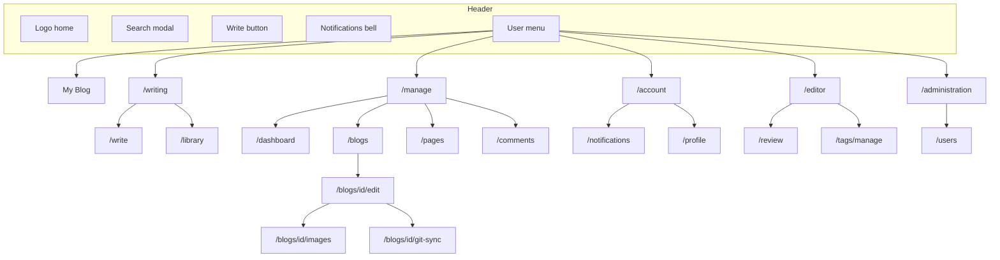

# Feature catalog (UI access)

Living index of **user-facing features reachable through the UI** (header, user menu, modals, in-page links, footer/sidebar). For technical routes, RSS, and APIs see [ARCHITECTURE.md](../ARCHITECTURE.md). For UX narrative see [application-guidelines.md](application-guidelines.md).

**Last verified:** 2026-05-18 · menu hub redesign

---

## How to read this document

### Step-counting rules

| Rule | Definition |
|------|------------|
| One step | One deliberate click/tap that opens a new surface or completes sign-in/sign-up (not keystrokes inside a field). |
| Sign in / Sign up | **1 step** (open modal + submit counts as one). |
| Open user menu | **1 step** (avatar + name in header). |
| Menu or nav link | **1 step** each. |
| In-page link or button | **1 step** each. |
| Tab on same page | **+0** if default tab on first load; **+1** if a non-default tab is required. |
| Modal | Opening the modal = **1 step**; typing inside does not add steps. |
| Starting point | Anonymous visitor at **`/`** (featured home), unless the feature naturally starts elsewhere (e.g. Follow on a blog page). |

Paths below list clicks in order. **Steps** = number of steps in that path from the stated starting point.

### Out of scope here

RSS feeds (`/feed`, `…/feed`), image JSON API (`/api/images`), email-only flows (`/account/verify-email`, password-reset token links). See [ARCHITECTURE.md](../ARCHITECTURE.md).

---

## Role matrix (user menu)

| Menu section | Guest | `USER` | `EDITOR` | `USER_ADMINISTRATOR` / `ADMIN` |
|--------------|:-----:|:------:|:--------:|:------------------------------:|
| Header: Search, Sign In/Up | yes | — | — | — |
| Header: Write, Publish, Save draft | — | on `/write` only | on `/write` only | on `/write` only |
| Header: Notifications bell | — | yes | yes | yes |
| My Blog, Writing, Manage, Account | — | yes | yes | yes |
| Review hub (editor) | — | — | yes | yes |
| Administration hub | — | — | — | yes |

---

## Public reading (guest or any visitor)

| Feature | Audience | URL | Steps | UI path (from `/`) |
|---------|----------|-----|------:|---------------------|
| Featured homepage | anyone | `GET /` | 0 | Land on `/` (or click logo). |
| Featured homepage (return) | anyone | `GET /` | 1 | Click **contraponto** logo in header. |
| Load more featured posts | anyone | `GET /components/grid?page=` | 1 | On `/` → **Load more**. |
| Blog home (default blog) | anyone | `GET /{username}` | 2 | Home → open a post author byline **or** search result **or** **My Blog** (signed in). |
| Multi-blog profile | anyone | `GET /{username}` | 2 | Home → author with multiple blogs (lists blogs instead of redirecting). |
| Blog home (secondary blog) | anyone | `GET /{username}/{blogSlug}` | 3 | Home → multi-blog profile → blog name. |
| Read post (main blog) | anyone | `GET /{username}/post/{slug}` | 3 | Home → blog → post card. |
| Read post (secondary blog) | anyone | `GET /{username}/{blogSlug}/post/{slug}` | 4 | Home → profile → secondary blog → post. |
| Serie listing | anyone | `GET /{username}/serie/{slug}` or `…/{blogSlug}/serie/{slug}` | 3–4 | Open post in serie → serie title link in serie nav. |
| Tag listing | anyone | `GET /tags/{slug}` | 3 | Open post → click tag chip. |
| Custom page (global) | anyone | `GET /page/{slug}` | 2 | Home → footer/sidebar custom page link. |
| Custom page (user/blog) | anyone | `GET /{username}/page/{slug}` etc. | 2–3 | Footer/sidebar link (depends on placement). |
| Sidebar navigation | anyone | varies | 2 | Home → header **menu** icon (left) → sidebar link. |
| Quick search | anyone | `GET /search/modal` | 1 | Header **search** icon. |
| Quick search → open result | anyone | post/blog URL | 2 | Search icon → click a result. |
| Full search page | anyone | `GET /search` | — | **No primary UI link** in header/menu (UI-only catalog omits direct-URL access). |
| Load more (blog/tag lists) | anyone | HTMX grid fragment | +1 | On listing page → **Load more**. |

---

## Authentication

| Feature | Audience | URL | Steps | UI path (from `/`) |
|---------|----------|-----|------:|---------------------|
| Sign up | guest | `GET /auth/modal?mode=signup` | 1 | Header → **Sign Up**. |
| Sign in | guest | `GET /auth/modal?mode=login` | 1 | Header → **Sign In**. |
| Password recovery request | guest | `GET /password-recovery` | 2 | **Sign In** modal → **Forgot password?** |
| Sign out | signed in | `POST /forms/auth/logout` | 2 | Open user menu → **Sign out**. |

---

## Writing (`USER`, blog owner)

| Feature | Audience | URL | Steps | UI path (from `/`) |
|---------|----------|-----|------:|---------------------|
| Writing hub | `USER` | `GET /writing` | 2 | Open user menu → **Writing**. |
| New post | `USER` | `GET /write` | 3 | Open user menu → **Writing** → **Write** card. |
| New post (header) | `USER` | `GET /write` | 1 | Header **Escrever** (Write) button. |
| Edit draft/post | `USER` | `GET /write/draft/{id}` | 4 | Open user menu → **Writing** → **Library** → **Edit** on row. |
| Edit own published post | `USER` | `GET /write/draft/{id}` | 4 | Home → blog → post → **Edit** (author only). |
| Library (drafts tab) | `USER` | `GET /library` | 3 | Open user menu → **Writing** → **Library** (Drafts tab default). |
| Library (published tab) | `USER` | `GET /library` + tab | 3 | **Library** → **Published** tab (+0). |
| Delete draft | `USER` | HTMX delete on library | 3 | **Library** → **Delete** on draft row. |
| Save draft | `USER` | `POST /forms/write/draft` | — | On `/write` → header **Salvar Rascunho** (no extra navigation). |
| Publish post | `USER` | `POST /forms/write/publish` | — | On `/write` → header **Publicar**. |

---

## Manage own content (`USER`, blog owner)

| Feature | Audience | URL | Steps | UI path (from `/`) |
|---------|----------|-----|------:|---------------------|
| Manage hub | `USER` | `GET /manage` | 2 | Open user menu → **Manage**. |
| Dashboard | `USER` | `GET /dashboard` | 3 | Open user menu → **Manage** → **Dashboard** card. |
| Dashboard analytics | `USER` | `GET /dashboard/components/analytics` | 3 | **Dashboard** (month controls on same page). |
| My Blog shortcut | `USER` | `GET /{username}` | 2 | Open user menu → **My Blog**. |
| Blog list | `USER` | `GET /blogs` | 3 | Open user menu → **Manage** → **Blogs** card. |
| New blog | `USER` | `GET /blogs/new` | 4 | **Blogs** → **New Blog**. |
| Edit blog | `USER` | `GET /blogs/{id}/edit` | 4 | **Blogs** → **Edit** on row. |
| Blog image library | `USER` | `GET /blogs/{blogId}/images` | 5 | **Blogs** → **Edit** → **Images**. |
| Git sync history | `USER` | `GET /blogs/{blogId}/git-sync` | 5 | **Blogs** → **Edit** → **View sync history**. |
| Git sync run detail | `USER` | `GET /blogs/{blogId}/git-sync/{runId}` | 6 | Sync history → run link. |
| Custom pages list | `USER` | `GET /pages` | 3 | Open user menu → **Manage** → **Custom Pages** card. |
| New custom page | `USER` | `GET /pages/new` | 4 | **Custom Pages** → **New Page**. |
| Edit custom page | `USER` | `GET /pages/{id}/edit` | 4 | **Custom Pages** → **Edit** on row. |
| Comment moderation inbox | `USER` | `GET /comments` | 3 | Open user menu → **Manage** → **Comments** card. |
| Account hub | `USER` | `GET /account` | 2 | Open user menu → **Account**. |
| Profile settings | `USER` | `GET /profile` | 3 | Open user menu → **Account** → **Settings** card. |
| Notifications inbox | `USER` | `GET /notifications` | 2 | Header bell **or** **Account** → **Notifications** card. |
| Notifications (menu path) | `USER` | `GET /notifications` | 3 | Open user menu → **Account** → **Notifications** card. |
| Subscriptions | `USER` | `GET /subscriptions` | 3 | Open user menu → **Account** → **Subscriptions** card. |

---

## Social (reader / author)

| Feature | Audience | URL | Steps | UI path |
|---------|----------|-----|------:|---------|
| Follow blog | signed in | `POST /forms/blogs/{blogId}/follow` | 2 | Blog or post page → **Follow** (starts on that blog/post). |
| Follow blog (guest) | guest | via login modal | 3 | Blog/post → **Follow** → **Sign in** (1) + complete login. |
| Email subscribe | signed in | `POST /forms/blogs/{blogId}/subscribe` | 2 | Blog/post → **Subscribe by email**. |
| Email subscribe (guest) | guest | via login modal | 3 | Blog/post → **Subscribe by email** → **Sign in**. |
| Post comment | signed in | `POST /forms/posts/{postId}/comments` | 3 | Home → blog → post → submit comment form. |
| Post comment (guest) | guest | via login modal | 4 | Post → **Sign in** → submit comment. |
| Reply to comment | signed in | `POST …/comments/{parentId}/replies` | 4 | Post → **Reply** on comment → submit. |
| Version history modal | author | `GET …/components/history/modal` | 4 | Home → own published post → **Version N** control. |
| Approve/reject comment (on post) | post owner | `POST /forms/posts/…/comments/…` | — | Post page pending section (author viewing own post). |

---

## Editor (`EDITOR`)

| Feature | Audience | URL | Steps | UI path (from `/`, signed in) |
|---------|----------|-----|------:|-------------------------------|
| Review hub | `EDITOR` | `GET /editor` | 2 | Open user menu → **Review**. |
| Featured review list | `EDITOR` | `GET /review` | 3 | Open user menu → **Review** → **Featured Posts** card. |
| Toggle featured (review) | `EDITOR` | `PUT /review/components/{postId}/featured/toggle` | 4 | **Featured Posts** → star on row. |
| Toggle featured (on post) | `EDITOR` | `PUT …/component/featured/toggle` | 3–4 | Open post → star control in action bar. |
| Tag admin list | `EDITOR` | `GET /tags/manage` | 3 | Open user menu → **Review** → **Tags** card. |
| Edit tag metadata | `EDITOR` | `GET /tags/{slug}/edit` | 4 | **Tags** → **Edit** on row. |
| Edit tag (from public tag page) | `EDITOR` | `GET /tags/{slug}/edit` | 4 | Home → post → tag → **Edit** (editor-only link on tag page). |
| Platform-wide blog list | `EDITOR` | `GET /blogs` | 2 | Open user menu → **Blogs** (lists all blogs). |

---

## User administration (`USER_ADMINISTRATOR`, `ADMIN`)

| Feature | Audience | URL | Steps | UI path (from `/`, signed in) |
|---------|----------|-----|------:|-------------------------------|
| Administration hub | admin | `GET /administration` | 2 | Open user menu → **Administration**. |
| User list | admin | `GET /users` | 3 | Open user menu → **Administration** → **Users** card. |
| New user | admin | `GET /users/new` | 4 | **Users** → **New User**. |
| Edit user | admin | `GET /users/{id}/edit` | 4 | **Users** → **Edit** on row. |

---

## Dev personas (manual testing)

Use [dev-import.sql](../src/main/resources/dev-import.sql) — all dev users share the **admin** password.

| Username | Roles | Use to reach |
|----------|-------|----------------|
| `alice`, `bob`, `carol` | `USER` | Write, Library, Blogs, Dashboard, own posts |
| `bob` | `USER` | Secondary blog `architecture-notes`, multi-blog URLs |
| `dave` | `USER` | Follower, notifications |
| `eve` | `USER` | Email subscriber |
| `editor` | `USER`, `EDITOR` | `/review`, `/tags/manage`, featured toggle on posts |
| `admin` | `ADMIN`, `USER_ADMINISTRATOR` | `/users`, platform admin |

Run `./mvnw quarkus:dev` → [http://localhost:8080](http://localhost:8080).

---

## Navigation map (authenticated menu)

Full-page surfaces show a **breadcrumb trail** (Home or hub root → current page). Breadcrumbs add zero navigation steps.

**Sources:** [MenuEndpoint/menu.html](../src/main/resources/templates/MenuEndpoint/menu.html), [components/header.html](../src/main/resources/templates/components/header.html), [ARCHITECTURE.md](../ARCHITECTURE.md).
