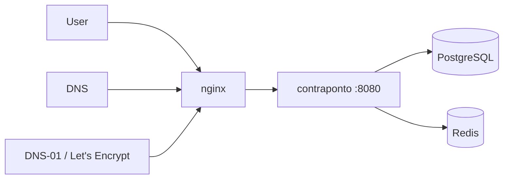

# Greenfield deployment tutorial

Step-by-step guide to deploy Contraponto on a **brand-new** server and domain. Use this for first-time production setup; keep [deployment.md](deployment.md) open as the environment-variable reference.

**Last updated:** 2026-06-24

---

## What you are building

Contraponto runs as a Quarkus app behind nginx, with PostgreSQL and Redis. Production Docker layout lives in the sibling repo **`contraponto-prod`** (compose, nginx, TLS scripts).



| Host role | Example | Purpose |
|-----------|---------|---------|
| **Platform** | `https://blogs.example.com` | Home, discovery, author workspace (`/manage`, `/writing`, …) |
| **Author subdomain** *(optional)* | `https://alice.example.com` | Main blog at `/`, posts at `/post/{slug}` |
| **Apex** | `example.com` | Usually redirects or marketing; cert often includes apex + wildcard |

Set these placeholders before you start:

| Placeholder | Your value | Example |
|-------------|------------|---------|
| `YOUR_DOMAIN` | Apex domain | `commit-mestre.dev` |
| `PLATFORM_HOST` | Platform hostname | `blogs.commit-mestre.dev` |
| `SERVER_IP` | Public IPv4 of the Docker host | `203.0.113.10` |
| `APP_IMAGE` | Container image | `vepo/contraponto:main` |

---

## Phase 0 — Prerequisites

### Accounts and access

- [ ] Domain registered; DNS editable (Squarespace, Cloudflare, Route53, …)
- [ ] Linux server with **Docker** and **docker-compose**
- [ ] Ports **80** and **443** open to the internet
- [ ] SSH access as a user that can run Docker
- [ ] SMTP credentials (signup, password reset, notifications)
- [ ] Clone both repositories on the server (or pull the app image only)

### Choose your URL model

| Model | When to use | Extra DNS/TLS |
|-------|-------------|---------------|
| **Platform only** | Single host, no author subdomains | One A record + HTTP-01 or single-host cert |
| **Platform + author subdomains** *(recommended)* | Canonical blog URLs on `{username}.YOUR_DOMAIN` | Wildcard `*.YOUR_DOMAIN` A record + **DNS-01** wildcard cert |

This tutorial assumes **platform + author subdomains**, matching [`contraponto-prod`](../../contraponto-prod/docker-compose.yml). For platform-only, skip wildcard DNS/TLS sections and omit `APP_BLOG_SUBDOMAIN_BASE_DOMAIN` in compose.

---

## Phase 1 — Server preparation

On the production host:

```bash
git clone <contraponto-prod-repo-url> ~/contraponto-prod
cd ~/contraponto-prod
```

### 1.1 JWT keys (MP-JWT)

```bash
./keys/generate-keys.sh
# Creates keys/private_key.pem and keys/public_key.pem (public key is mounted into the app container)
```

### 1.2 Secrets (never commit)

Export before `docker-compose up` (or put in a gitignored file you `source`):

```bash
export POSTGRES_PASSWORD='<strong-random>'
export PASSWORD_SALT='<strong-random>'
export MAILER_PASSWORD='<smtp-password>'
```

### 1.3 Review `docker-compose.yml`

Edit environment for **your** domain and branding. Minimum production set:

| Variable | Example | Notes |
|----------|---------|-------|
| `APP_PUBLIC_URL` | `https://blogs.commit-mestre.dev` | Must match browser URL (no trailing slash) |
| `IMAGE_BASE_URL` | same as `APP_PUBLIC_URL` with trailing `/` | Used in emails and absolute image URLs |
| `APP_BLOG_SUBDOMAIN_BASE_DOMAIN` | `commit-mestre.dev` | Enables author subdomains in `%prod` |
| `APP_SESSION_COOKIE_DOMAIN` | `.commit-mestre.dev` | Leading dot; shared login on platform + subdomains |
| `APP_SESSION_STORE` | `redis` | Required for single app container + Redis (compose default) |
| `APP_SITE_NAME` | `commit-mestre` | White-label display name |
| `QUARKUS_MAILER_*` | SMTP host, port, user, password | See [deployment.md §3](deployment.md#3-smtp-mailer) |

Full variable list: [deployment.md](deployment.md).

Make scripts executable:

```bash
chmod +x init-letsencrypt.sh renew-wildcard-cert.sh update.sh scripts/*.sh
```

---

## Phase 2 — DNS (permanent records)

Create records at your DNS provider. Squarespace **appends** the domain to **Name** — enter `blogs`, not `blogs.YOUR_DOMAIN`.

| Type | Name | Value | Purpose |
|------|------|-------|---------|
| **A** | `blogs` | `SERVER_IP` | Platform host |
| **A** | `*` | `SERVER_IP` | Author subdomains (wildcard) |

Verify propagation (may take up to a few hours):

```bash
dig +short blogs.YOUR_DOMAIN A @8.8.8.8
dig +short alice.YOUR_DOMAIN A @8.8.8.8
```

**Wildcard caveat (Squarespace):** some accounts cannot save `*` A records. Fallback: add one **A** record per author username, or move DNS to a provider with wildcard support (e.g. Cloudflare).

Update [`data/nginx/app.conf`](../../contraponto-prod/data/nginx/app.conf) `server_name` and certificate paths if your apex name differs from `commit-mestre.dev`.

---

## Phase 3 — Start the stack (before real TLS)

Bring up database, cache, and app:

```bash
cd ~/contraponto-prod
docker-compose up -d postgres redis contraponto
docker-compose ps
docker-compose logs -f contraponto   # wait until Flyway finishes and health is OK
```

Health check (from host, if port 8080 is reachable on the container network):

```bash
docker-compose exec contraponto curl -sf http://localhost:8080/q/health
```

Flyway creates schema and seeds the **`admin`** user on first start. Password is the bcrypt hash from migration — **change it immediately after first login** (see Phase 6).

---

## Phase 4 — TLS wildcard certificate (DNS-01)

HTTP-01 / webroot **cannot** issue `*.YOUR_DOMAIN`. Use the scripts in `contraponto-prod`.

### 4.1 First-time issuance

```bash
cd ~/contraponto-prod
./init-letsencrypt.sh
```

The script:

1. Downloads nginx TLS parameter files
2. Creates a **dummy** cert so nginx can start
3. Starts **postgres, redis, contraponto, nginx**
4. Requests a real cert for `YOUR_DOMAIN` and `*.YOUR_DOMAIN` via DNS-01

### 4.2 Operator actions during certbot

When the hook prints `=== Squarespace DNS-01 ===` (or similar):

1. Read the token:

   ```bash
   cat ~/contraponto-prod/data/certbot/work/squarespace-txt.txt
   ```

2. Add a **TXT** record:

   | Field | Value |
   |-------|-------|
   | Name | `_acme-challenge` |
   | Text | token from the file |

3. Confirm propagation:

   ```bash
   dig +short TXT _acme-challenge.YOUR_DOMAIN @8.8.8.8
   ```

4. Wait for certbot to succeed (do not interrupt). Remove stale `_acme-challenge` TXT records afterward.

**Staging:** set `staging=1` in `init-letsencrypt.sh` for a test run, then `staging=0` for production.

Detailed MoP (Squarespace-specific): [`contraponto-prod/docs/MOP-DEPLOYMENT.md`](../../contraponto-prod/docs/MOP-DEPLOYMENT.md).

---

## Phase 5 — Verification

### 5.1 TLS and HTTP

```bash
curl -sf https://PLATFORM_HOST/q/health
curl -sI https://PLATFORM_HOST/robots.txt | head -5
curl -sI https://PLATFORM_HOST/favicon.svg | head -3
```

Browser checks:

- [ ] `https://PLATFORM_HOST` — valid padlock, home loads
- [ ] `https://<author>.YOUR_DOMAIN` — valid padlock (after author publishes)
- [ ] `https://<author>.YOUR_DOMAIN/post/<slug>` — 200
- [ ] Platform path `https://PLATFORM_HOST/<author>/post/<slug>` — 200; canonical points to subdomain when enabled

### 5.2 Session across hosts

Log in on `https://PLATFORM_HOST`, reload, then open `https://<your-username>.YOUR_DOMAIN`. DevTools → Application → Cookies: `__session` should show `Domain=.YOUR_DOMAIN`, `Secure`, `HttpOnly`.

### 5.3 Hub navigation from author subdomain

Open the user menu on an author subdomain and choose **Manage** or **Administration**. The URL should stay on `{username}.YOUR_DOMAIN` (same-origin HTMX navigation). See [htmx-events.md § Author subdomain](htmx-events.md#author-subdomain--workspace-vs-discovery-routes).

### 5.4 Email

Trigger signup or password recovery in a test account; confirm SMTP delivery.

### 5.5 Search (optional)

Submit `https://PLATFORM_HOST/sitemap.xml` in [Google Search Console](deployment.md#4-search-indexing-production).

---

## Phase 6 — First admin tasks

1. **Log in** as `admin` (migration default password — rotate immediately).
2. Open **Administration** → change admin password and create real users.
3. Confirm `APP_SITE_NAME` and footer copy match your brand.
4. Publish at least one post under a real author to exercise subdomain URLs.

---

## Phase 7 — Ongoing operations

### Application updates

```bash
cd ~/contraponto-prod
./update.sh
```

Pulls `APP_IMAGE` and restarts the app container only when the image digest changed.

After nginx config changes:

```bash
docker-compose exec nginx nginx -s reload
```

### Certificate renewal (~every 60 days)

Let's Encrypt certs expire in 90 days. The idle `certbot` container does **not** auto-renew wildcards.

```bash
cd ~/contraponto-prod
./renew-wildcard-cert.sh
```

Repeat the DNS TXT steps from Phase 4.2. Calendar a reminder every **60 days**.

### Backups

- **PostgreSQL** — includes uploaded images in `tb_image_content`; size backups accordingly.
- **`data/certbot/conf`** — back up before re-issuing certificates.

---

## Phase 8 — Troubleshooting

| Symptom | See |
|---------|-----|
| Certbot hook timeout | [MOP §8](../../contraponto-prod/docs/MOP-DEPLOYMENT.md#8-troubleshooting) — TXT propagation |
| nginx `host not found in upstream` | Start full stack; use current `app.conf` with Docker resolver |
| Login lost on subdomain reload | `APP_SESSION_COOKIE_DOMAIN=.YOUR_DOMAIN` |
| Favicon 404 on author subdomain | Deploy latest app image (`BlogSubdomainFilter` skip list) |
| Menu hub “blocked” on subdomain | Deploy latest app image (`HX-Redirect` for platform routes) |

Application env reference: [deployment.md](deployment.md).

---

## Alternative: deploy without Docker

Build and run the JAR directly:

```bash
cd contraponto
mvn package -DskipTests
docker build -f src/main/docker/Dockerfile.jvm -t contraponto .
```

Run with `QUARKUS_PROFILE=prod` and the same env vars as compose. Terminate TLS at your own reverse proxy; forward `Host`, `X-Forwarded-Proto`, and `X-Forwarded-For`. See [deployment.md §8](deployment.md#8-build-and-run).

---

## Related docs

| Document | Purpose |
|----------|---------|
| [deployment.md](deployment.md) | Env vars, SMTP, Redis, optional Git sync |
| [contraponto-prod/docs/MOP-DEPLOYMENT.md](../../contraponto-prod/docs/MOP-DEPLOYMENT.md) | Operator runbook (commit-mestre.dev instance) |
| [ARCHITECTURE.md](../ARCHITECTURE.md) | Application architecture |
| [htmx-events.md](htmx-events.md) | Subdomain + HTMX platform navigation |
| [feature-catalog.md](feature-catalog.md) | Post-deploy smoke-test UI paths |
