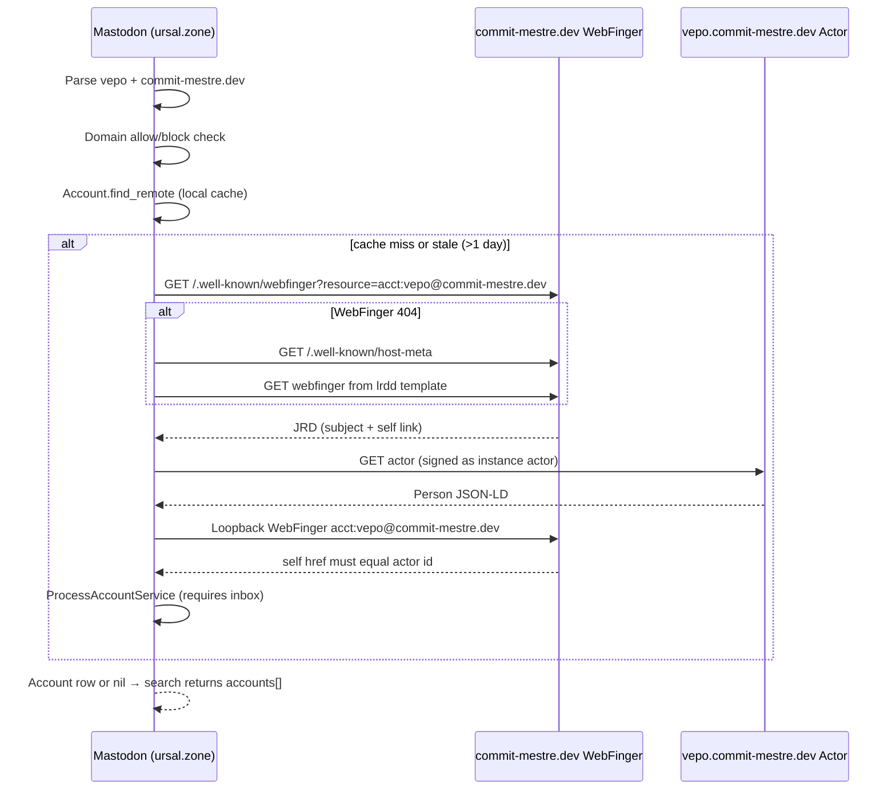

# Mastodon remote account resolution

How [Mastodon](https://github.com/mastodon/mastodon) discovers a remote handle such as `@vepo@commit-mestre.dev`, what Contraponto must expose, and what still blocks interop in practice.

**Related:** [feature/activitypub-integration.md](../feature/activitypub-integration.md), [ADR-0006](adr/0006-activitypub-federation.md)–[ADR-0008](adr/0008-activitypub-actor-identity.md), [Mastodon WebFinger spec](https://docs.joinmastodon.org/spec/webfinger/), [Mastodon FEDERATION.md](https://github.com/mastodon/mastodon/blob/main/FEDERATION.md).

**Last verified:** 2026-07-07 — production `commit-mestre.dev` curl checks + Mastodon `main` source.

---

## 1. User-facing entry points (Mastodon)

Mastodon does **not** use one code path for every UI action. The path matters.

| User action | Mastodon behaviour | Remote fetch? |
|-------------|-------------------|---------------|
| **Search** (compose/search) with `@vepo@commit-mestre.dev` while **signed in** | `GET /api/v2/search?q=…&resolve=true` → `AccountSearchService` → `ResolveAccountService` (full WebFinger + actor) | **Yes** |
| **Search** while logged out | `resolve=true` → **401**; no remote discovery | No |
| **Profile URL** `https://instance/@user@domain` | SPA → `GET /api/v1/accounts/lookup?acct=user@domain` with **`skip_webfinger: true`** | **Only if already in local DB** |
| **Authorize interaction** `/authorize_interaction?acct=…` | Full `ResolveAccountService` | Yes |
| **Paste HTTPS actor URL** | `ResolveURLService` / `FetchResourceService` | Yes |
| **Mention in post text** | `Account.from_text` — local DB cache only | No |

**Implication for testing on ursal.zone:** opening `https://ursal.zone/@vepo@commit-mestre.dev` in the browser **does not** contact `commit-mestre.dev` unless that account was resolved before. Use **search** (logged in) with the full handle, or `/authorize_interaction?acct=vepo@commit-mestre.dev`.

**Source references:**

- `app/services/account_search_service.rb` — `username_complete?`, `exact_match` with `resolve: true`
- `app/controllers/api/v1/accounts/lookup_controller.rb` — `skip_webfinger: true`
- `app/javascript/mastodon/actions/search.ts` — `resolve: true` when signed in

---

## 2. Resolution sequence (Mastodon server)



**Orchestrator:** `app/services/resolve_account_service.rb`  
**WebFinger client:** `app/lib/webfinger.rb`  
**Actor fetch:** `app/services/activitypub/fetch_remote_actor_service.rb`  
**Persist:** `app/services/activitypub/process_account_service.rb`

---

## 3. Step-by-step (search with `resolve=true`)

### 3.1 Parse and gate

1. Strip leading `@` → `vepo@commit-mestre.dev`.
2. Split username / domain; normalize domain.
3. **`domain_not_allowed?`** — instance block list or limited-federation allow list (`DomainControlHelper`). Failure → **no HTTP requests** to Contraponto.
4. **`Account.find_remote('vepo', 'commit-mestre.dev')`** — return cached row if WebFinger refresh not due (~1 day).

### 3.2 WebFinger (unsigned GET)

```
GET https://commit-mestre.dev/.well-known/webfinger?resource=acct:vepo@commit-mestre.dev
Accept: application/jrd+json, application/json
```

**On 404 only:** host-meta fallback:

```
GET https://commit-mestre.dev/.well-known/host-meta
Accept: application/xrd+xml, application/xml, text/xml
```

Parse `Link[@rel="lrdd"]` template, substitute `{uri}`, retry WebFinger once.

**JRD validation** (`Webfinger::Response`):

| Field | Rule |
|-------|------|
| `subject` | Non-empty; parses as `acct:user@host` |
| `links` | At least one `rel: "self"` with `type` ∈ `application/activity+json` **or** `application/ld+json; profile="https://www.w3.org/ns/activitystreams"` |
| `links[].href` | Actor URI for next step |

**Not used for discovery:** NodeInfo (`/.well-known/nodeinfo`).

### 3.3 Actor fetch (signed GET)

```
GET {self_link_href}    # e.g. https://vepo.commit-mestre.dev/
Accept: application/activity+json, application/ld+json
Signature: …           # Mastodon instance actor (production)
```

**Content-Type** must pass `valid_activitypub_content_type?` — plain `application/json` is **rejected** ([mastodon#29709](https://github.com/mastodon/mastodon/issues/29709)).

**JSON-LD checks** (`FetchRemoteActorService`):

| Check | Requirement |
|-------|-------------|
| `@context` | Includes `https://www.w3.org/ns/activitystreams` |
| `type` | `Person`, `Service`, `Group`, `Organization`, or `Application` |
| `preferredUsername` **or** `webfinger` (FEP-2c59) | At least one; `webfinger` string `"user@domain"` preferred |
| `id` | HTTPS actor URI; may follow one redirect |

### 3.4 WebFinger loopback

After parsing actor, Mastodon runs WebFinger again on `acct:{webfinger}` (or `preferredUsername@host`) and requires:

```text
webfinger.self_link_href == actor["id"]   # exact string match
```

(`check_webfinger!` in `fetch_remote_actor_service.rb`.)

### 3.5 Create account

`ProcessAccountService` **aborts** (returns `nil`) if:

- `inbox` is blank
- `id` is not `http`/`https` with host
- domain is blocked on the searching instance
- discovery rate limits exceeded (400 accounts/request, 10 subdomains per domain)

---

## 4. Contraponto contract (commit-mestre.dev)

### 4.1 Required endpoints

| Step | URL | Method | Accept | Response |
|------|-----|--------|--------|----------|
| WebFinger | `https://commit-mestre.dev/.well-known/webfinger?resource=acct:vepo@commit-mestre.dev` | GET | `application/jrd+json` | 200 JRD |
| Host-meta (fallback) | `https://commit-mestre.dev/.well-known/host-meta` | GET | `application/xrd+xml` | 200 XRD + `lrdd` template |
| Actor | `https://vepo.commit-mestre.dev/` | GET | `application/activity+json` | 200 Person |
| Outbox / followers | `…/outbox`, `…/followers` | GET | `application/activity+json` | 200 (optional for discovery; Mastodon may fetch counts later) |
| Inbox | `…/inbox` | POST | activity+json | 202 (GET not required for discovery) |

**Implementation:** `ActivityPubWebFingerEndpoint`, `ActivityPubHostMetaEndpoint`, `ActivityPubJsonResponder` (+ subdomain rewrite in `BlogSubdomainFilter`), collection endpoints under `activitypub/`.

### 4.2 Required actor fields

| Field | Contraponto | Mastodon |
|-------|-------------|----------|
| `@context` | AS + security | Required |
| `type` | `Person` | Required |
| `id` | `https://{user}.{baseDomain}/` | Required; must match WebFinger `self` |
| `webfinger` | `vepo@commit-mestre.dev` | FEP-2c59; used for loopback |
| `preferredUsername` | `vepo` | Fallback |
| `inbox` | `https://vepo.commit-mestre.dev/inbox` | **Required** |
| `outbox`, `followers`, `following` | Present | Stored |
| `publicKey` | `#mainKey` + PEM | Required for delivery |
| `name`, `summary` | Profile | Optional display |
| `url` | HTML profile | Optional |
| `sameAs` | e.g. Mastodon profile URL | Optional; see §6 |

### 4.3 Production smoke (2026-07-07)

```bash
# WebFinger (apex acct)
curl -sS "https://commit-mestre.dev/.well-known/webfinger?resource=acct:vepo@commit-mestre.dev" \
  -H "Accept: application/jrd+json"

# WebFinger (actor-host alias — loopback path)
curl -sS "https://commit-mestre.dev/.well-known/webfinger?resource=acct:vepo@vepo.commit-mestre.dev" \
  -H "Accept: application/jrd+json"

# Actor
curl -sS "https://vepo.commit-mestre.dev/" -H "Accept: application/activity+json"
```

All returned **200** with correct types. Loopback invariant holds: `self` href `https://vepo.commit-mestre.dev/` == actor `id`.

**Preconditions on Contraponto side (not HTTP):**

- `CONTRAPONTO_ACTIVITYPUB_ENABLED=true`
- Platform Fediverse toggle on (`/administration/activitypub`)
- Author Fediverse enabled (appearance panel)
- User account **active**

---

## 5. Gap analysis — Contraponto vs Mastodon

### 5.1 Discovery blockers (would fail `ResolveAccountService`)

| Item | Status | Notes |
|------|--------|-------|
| WebFinger JRD + `application/jrd+json` | ✅ Done | Fixed from wrong `activity+json` content type |
| `self` link type `application/activity+json` | ✅ Done | |
| Actor `Content-Type: application/activity+json` | ✅ Done | |
| ActivityStreams `@context` | ✅ Done | |
| `webfinger` / `preferredUsername` | ✅ Done | FEP-2c59 |
| `inbox` present | ✅ Done | |
| WebFinger loopback (`self` == `id`) | ✅ Done | |
| Host-meta `lrdd` on apex | ✅ Done | |
| Actor-host acct alias | ✅ Done | `acct:vepo@vepo.commit-mestre.dev` |
| Unsigned actor GET | ✅ OK | Contraponto does not require signatures on read |
| User/platform federation flags | ⚙️ Ops | Must be enabled in prod + author UI |

**Conclusion:** the **HTTP discovery contract for `@vepo@commit-mestre.dev` is satisfied** on production as of 2026-07-07.

### 5.2 Not required for discovery (optional / later)

| Item | Status | Mastodon use |
|------|--------|--------------|
| NodeInfo | ❌ Not implemented | Not used in resolve path |
| WebFinger `rel=profile-page` | ✅ Done | `ActivityPubWebFingerService` |
| `discoverable` / `indexable` on actor | ✅ `discoverable` when federation on | `ActivityPubActorDocumentBuilder` |
| `GET /activities/create/{id}` | ✅ Done | `ActivityPubActivityEndpoint` |
| WebFinger `rel=subscribe` | ❌ Not implemented | Authorize-interaction / remote follow UI |
| `indexable` on actor | ❌ Not set | Profile directory flag |
| `sharedInbox` | ❌ Not set | Delivery optimization |

### 5.3 Known bugs (post-discovery / delivery)

| Item | Status | Impact |
|------|--------|--------|
| Double slash in activity IDs | ✅ Fixed | `ActivityPubPaths.activityId` |
| Outbox activity ID construction | Fixed via `ActivityPubPaths.activityId` | |

### 5.4 Operational / Mastodon-side causes of “0 accounts”

When search shows **accounts resolved: 0** but curl from any host succeeds:

| Cause | What to check |
|-------|----------------|
| **Not logged in** on searching instance | Search with `resolve=true` requires auth |
| **Wrong UI path** | Profile URL uses lookup-only; use search or authorize-interaction |
| **Query format** | Must be exact `@user@domain` (`username_complete?`) |
| **Domain block** on ursal.zone | Administration → Federation → domain blocks / limited federation |
| **Cached failed resolve** | Mastodon may cache negative lookups; retry after fix or from another instance |
| **`sameAs` collision** | Actor has `"sameAs": "https://ursal.zone/@vepo"` while `@vepo` exists **locally** on ursal.zone — can confuse identity; remove Mastodon URL from Contraponto profile when testing cross-instance resolve |
| **Sidekiq / worker errors** | On ursal.zone: `ResolveAccountWorker` logs, Rails `Webfinger query for … failed` |
| **Firewall / egress** | Mastodon server must reach `commit-mestre.dev` (not your browser) |

**Debug from Mastodon (admin, logged in):**

```http
GET /api/v2/search?q=@vepo@commit-mestre.dev&resolve=true&type=accounts&limit=1
```

**Debug from any shell (simulates Mastodon steps 1–2 only):**

```bash
ACTOR=$(curl -sS "https://commit-mestre.dev/.well-known/webfinger?resource=acct:vepo@commit-mestre.dev" \
  -H "Accept: application/jrd+json" | jq -r '.links[] | select(.rel=="self") | .href')
curl -sS "$ACTOR" -H "Accept: application/activity+json" | jq '{id, webfinger, inbox, type}'
```

---

## 6. Recommended next implementation tasks

Prioritized for Mastodon findability and follow-up federation — **not** all block discovery today.

| ID | Task | Blocks discovery? | Package / files |
|----|------|-------------------|-----------------|
| **M1** | Fix double-slash activity IDs in outbox | No (delivery) | `ActivityPubPostObjectMapper` — **done** |
| **M2** | Document / run interop checklist on real Mastodon (search + follow) | Verification | This doc + `feature/activitypub-integration.md` |
| **M3** | Add WebFinger `profile-page` link to author HTML URL | No | `ActivityPubWebFingerService` — **done** |
| **M4** | Add `discoverable: true` on actor when federation enabled | No (directory) | `ActivityPubActorDocumentBuilder` — **done** |
| **M5** | Implement `GET /activities/{type}/{id}` | Post-discovery | `ActivityPubActivityEndpoint` — **done** |
| **M6** | Optional: accept signed GET on actor if `AUTHORIZED_FETCH`-style mode added | Future | `ActivityPubJsonResponder` + signature verify |
| **M7** | Guidance: `sameAs` Mastodon URL when user is local on that instance | Ops | Docs + author UI hint |

---

## 7. Mastodon source index

| Concern | File |
|---------|------|
| Orchestration | `app/services/resolve_account_service.rb` |
| WebFinger client | `app/lib/webfinger.rb` |
| Actor fetch + loopback | `app/services/activitypub/fetch_remote_actor_service.rb` |
| Account create/update | `app/services/activitypub/process_account_service.rb` |
| Search exact match | `app/services/account_search_service.rb` |
| Search API | `app/controllers/api/v2/search_controller.rb` |
| Lookup API (no fetch) | `app/controllers/api/v1/accounts/lookup_controller.rb` |
| HTTP + signatures | `app/lib/request.rb`, `app/helpers/json_ld_helper.rb` |
| Domain blocks | `app/helpers/domain_control_helper.rb` |
| Federation overview | `FEDERATION.md` |

---

## 8. Contraponto test coverage map

| Mastodon step | Test |
|---------------|------|
| WebFinger apex acct | `ActivityPubWebFingerTest` |
| WebFinger actor-host alias | `ActivityPubWebFingerSubdomainTest` |
| WebFinger profile-page link | `ActivityPubWebFingerTest#webfingerResolvesAcctResource` |
| Actor JSON fields + discoverable | `ActivityPubOutboxTest#actorJsonReturnsPersonWithInboxAndOutbox` |
| Activity GET by ID | `ActivityPubOutboxTest#createActivityIsFetchableById` |
| Inbox POST + signature | `ActivityPubInboxEndpointTest`, `ActivityPubSignatureTest` |
| Outbox collection | `ActivityPubOutboxTest` |

**Missing automated test:** full loopback assertion (WebFinger `self` == actor `id`) in one test; production curl confirms it manually.
