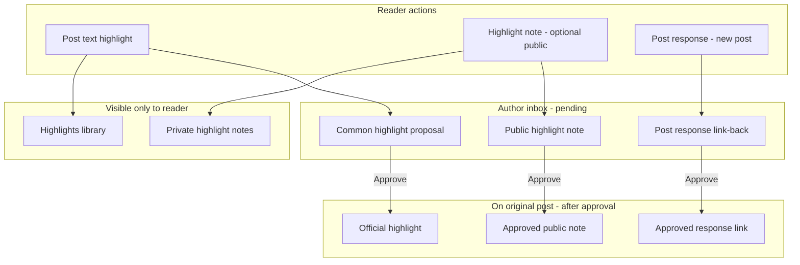
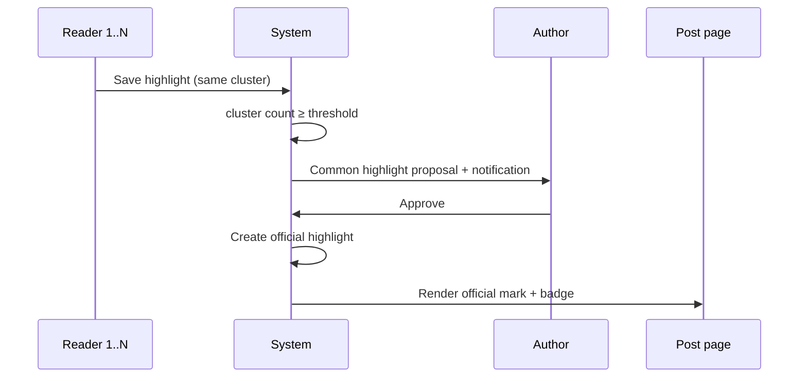

# PRD: Reader highlights, author curation & post responses

**Status:** Draft  
**Author:** Product / engineering  
**Last updated:** 2026-05-19  
**Related:** [domain-specification.md](../domain-specification.md), [ui-guidelines.md](../ui-guidelines.md) §6 (Post page), [ARCHITECTURE.md](../../ARCHITECTURE.md) §4 (Publications)

---

## 1. Summary

This initiative adds a **reader → author curation** loop on top of personal marginalia:

1. **Post text highlight** — readers save passages (private by default on the post body).
2. **Common highlight** — when many readers highlight the same passage, the **author** receives a **proposal** to promote it as an **official highlight** shown to everyone on the post.
3. **Highlight note** — readers may attach a **note** to a highlight; **public notes** require **author approval** before they appear on the post.
4. **Post response** — a reader may **answer with a new post** on their own blog; the response always links to the original, but the original links back only after **author approval**.

The model mirrors existing **comment moderation** (pending → approved/rejected by **post owner**) but applies it to passage-level signal and cross-post discourse. Personal highlights remain in a **Highlights library**; only **author-approved** artifacts surface on the public post page.

**Benchmark:** Medium Highlights (selection + social pile-on). Contraponto goes further by making public surfacing **author-curated**, not automatic.

---

## 2. Problem & goals

### Problem

Readers lack lightweight ways to mark important sentences or respond in long form without flooding **post comments**. Authors cannot see which passages resonate or which reader essays deserve a backlink from the original story.

### Goals

| Goal | Success signal |
|------|----------------|
| Frictionless personal capture | Median selection → saved highlight &lt; 3s |
| Author control of public surface | Zero public notes/highlights/responses without explicit approval |
| Surface “what mattered” | ≥1 official highlight on seeded dev posts after author approval |
| Respect versioning | Anchors survive republish or degrade gracefully (§8) |
| Fit HTMX stack | All moderation via HTML fragments; no SPA |

### Non-goals

- Automatic public display of every reader highlight (Medium-style follower feed)
- Highlights on **custom pages**, **draft** previews, or **blog descriptions**
- Guest-persisted highlights across devices
- Git export of highlights/notes
- Editors moderating on behalf of author (v1: **post owner** only)

---

## 3. Conceptual model



**Principle:** Readers propose; authors publish to the story.

---

## 4. Users & permissions

| Actor | Capability |
|-------|------------|
| **Guest** | Select text; **Sign in to highlight** (no persistence) |
| **Reader** | Create/remove own highlights; add private or **public** notes; start **post response** (draft on own blog) |
| **Author** (post owner) | Review **common highlight proposals**, **public highlight notes**, and **post response** link-backs; approve or reject; revoke approval later |
| **Editor / Administrator** | No override in v1 |

**Invariants (proposed):**

1. Personal **post text highlights** and **private highlight notes** are visible only to the creating user (plus author aggregate counts in manage UI, not passage text).
2. **Official highlights**, **approved public notes**, and **approved post responses** appear on the **published post** page for all readers.
3. All reader actions target **published** posts with a **live publication** (same as **post comments**).
4. Only the **post owner** may approve or reject public artifacts on that post.

---

## 5. Ubiquitous language (proposed)

Add to [domain-specification.md](../domain-specification.md) before implementation.

### Highlights & notes

| Term | Meaning |
|------|---------|
| **Post text highlight** | Reader’s saved passage in a **published post** (**live publication**). Private on the post body unless part of an **official highlight**. |
| **Highlight passage** | Selected plain text (trimmed), max 500 characters. |
| **Highlight anchor** | Locator for the passage within a **publication snapshot** (§8). |
| **Highlight passage cluster** | Set of **post text highlights** on the same post whose anchors resolve to the same passage (same `anchor_cluster_hash`). |
| **Common highlight** | A **highlight passage cluster** that reached the platform threshold (§6.1); not yet public. |
| **Common highlight proposal** | Inbox item for the **author**: “readers often highlighted this passage—promote to **official highlight**?” |
| **Official highlight** | **Author-approved** passage shown on the post for all readers (distinct styling from personal marks). |
| **Highlight note** | Optional text attached to a **post text highlight** (max 1000 characters). |
| **Private highlight note** | Note visible only to the author of the highlight (default). |
| **Public highlight note** | Note the reader explicitly marks **public** when saving; requires **author approval** before display on the post. |
| **Text selection bar** | Floating UI after text selection in `.article-page__content`. |
| **Highlights library** | Reader’s list of own highlights and notes. |
| **Highlight moderation** | Author queue: proposals, public notes, post responses (§7). |

### Post responses

| Term | Meaning |
|------|---------|
| **Post response** | A **published post** (on the responder’s blog) that declares it responds to another **published post**. |
| **Source post** | The post being responded to. |
| **Response post** | The new post; always links to the **source post**. |
| **Response link-back** | Link from **source post** to **response post**; shown only when **approved**. |
| **Pending response** | Response post is **published**, but link-back not yet **approved** by **source post** owner. |

### UI labels (PT-BR default)

| Element | PT-BR | i18n key (proposed) |
|---------|-------|---------------------|
| Highlight action | Destacar | `highlight.create` |
| Guest gate | Entre para destacar | `highlight.signInToHighlight` |
| Remove highlight | Remover destaque | `highlight.remove` |
| Add note | Adicionar nota | `highlight.note.add` |
| Public note checkbox | Tornar nota pública (sujeita à aprovação do autor) | `highlight.note.makePublic` |
| Official highlight label | Destaque do autor | `highlight.official.badge` |
| Approve official highlight | Aprovar destaque | `highlight.proposal.approve` |
| Reject proposal | Recusar | `highlight.proposal.reject` |
| Approve public note | Aprovar nota | `highlight.note.approve` |
| Answer with post | Responder com post | `postResponse.create` |
| Response banner on response post | Em resposta a | `postResponse.inResponseTo` |
| Source post — responses section | Respostas | `postResponse.sectionTitle` |
| Approve response link | Aprovar resposta | `postResponse.approve` |
| Moderation hub nav | Destaques e respostas | `highlight.moderation.title` |
| Toast — highlight saved | Trecho destacado. | `toast.highlight.created` |
| Toast — note pending | Nota enviada para aprovação. | `toast.highlight.notePending` |
| Toast — official approved | Destaque publicado no post. | `toast.highlight.officialApproved` |
| Toast — response pending | Resposta publicada. O autor pode aprová-la no post original. | `toast.postResponse.pending` |

---

## 6. Feature specifications

### 6.1 Common highlight → official highlight

**Detection**

- When a new **post text highlight** is saved, compute `anchor_cluster_hash` (normalized passage + fuzzy anchor bucket per §8).
- Increment cluster size = count of **distinct users** with highlights in that cluster on the same `post_id` + `publication_id`.
- When cluster size ≥ **3** (configurable `contraponto.highlight.common-threshold`) and no **official highlight** exists for that cluster:
  - Create or refresh a **common highlight proposal** (status **Pending**).
  - Notify **author** (`NotificationType.COMMON_HIGHLIGHT_PROPOSAL`).

**Author workflow**

1. Author opens **Highlight moderation** (`GET /writing/highlights` or post-scoped `GET /posts/{id}/moderation/highlights`).
2. Each row shows: **highlight passage** excerpt, reader count, sample avatars (no private note text).
3. Actions: **Aprovar destaque** | **Recusar**.
4. **Approve** creates **official highlight** (copies passage + anchor from cluster canonical row), marks proposal **Approved**, dismisses duplicate proposals for same cluster.
5. **Reject** marks proposal **Rejected**; cluster may re-propose only if count grows by +2 new readers (prevents spam loops).

**Reader-visible result**

- On post page, **official highlight** renders as a persistent mark (e.g. left border + soft background + badge **Destaque do autor**).
- Personal highlights from other readers on the same passage: optional subtle indicator “you highlighted this” for self only; do not duplicate official styling.
- Hover/click official mark: expand panel listing **approved public notes** for that cluster (§6.2).

**Republish**

- If anchor fails after republish, official highlight shows **Trecho indisponível nesta versão** in moderation until author re-approves or removes.

---

### 6.2 Highlight notes (private & public)

**Create / edit**

- From **text selection bar** after highlight exists, or from **Highlights library** row: **Adicionar nota**.
- Fields: note body (required, max **1000** chars), checkbox **Tornar nota pública (sujeita à aprovação do autor)**.
- If checkbox **unchecked**: save as **private highlight note** — visible only in reader’s library and on their personal inline mark (tooltip).
- If checkbox **checked**: save as **public highlight note** with status **Pending**; toast **Nota enviada para aprovação.**; notify author (`NotificationType.PUBLIC_HIGHLIGHT_NOTE`).

**Author workflow**

- Same moderation queue, filtered **Notes** tab: passage excerpt, note preview, reader display name.
- **Aprovar nota** → status **Approved**; note appears in official highlight panel (or passage sidebar if no official highlight yet but note approved—see rule below).
- **Recusar** → **Rejected**; reader sees status in library only.

**Display rule**

| Official highlight | Public note status | On post |
|--------------------|-------------------|---------|
| Yes | Approved | Note in panel under passage |
| No | Approved | Note still hidden on public post (notes attach to curation, not orphan public text) — *or* product choice: show as marginalia with “reader note” label. **Decision: require official highlight first** for public note to appear on post body. |
| Yes | Pending | Hidden |
| Private | — | Never on post |

*Rationale:* avoids unapproved passage-level commentary without a highlighted anchor the author already endorsed.

**Limits**

- Max **5** notes per highlight per user; max **3** public notes pending per post per user.

---

### 6.3 Post response (answer with new post)

**Create**

1. On **source post**, reader clicks **Responder com post** (post action area or end of article).
2. If guest → sign in.
3. Navigate to **Write** with query/context: `?respondsTo={sourcePostId}`.
4. Banner on Write: **Em resposta a: {source title}** (link to source; read-only).
5. Reader composes on **their blog** (blog selector unchanged); **publish** creates a normal **published post** plus **post response** link row.

**Linking rules**

| Direction | Visibility | Rule |
|-----------|------------|------|
| Response post → source | Always | Banner at top of response post: **Em resposta a** + link. Stored: `tb_post_responses.response_post_id`, `source_post_id`. |
| Source post → response | Conditional | Listed under **Respostas** only when `link_back_status = Approved`. |
| Response post author | Always | Sees own post and pending status copy if not approved. |
| Source author | Manage | **Highlight moderation** → **Respostas** tab: approve / reject link-back. |

**Author workflow**

- Notification `NotificationType.POST_RESPONSE` when response post is **published**.
- Row: response title, author, blog, date, link preview.
- **Aprovar resposta** → link-back **Approved**; source post **Respostas** section gains a card (title, author, excerpt, link).
- **Recusar** → link-back **Rejected**; response post still public with forward link only.

**Revocation**

- Author may **remove approved response** from source post later (link-back → **Revoked**); response post unchanged.

**Constraints**

- Cannot respond to own post (toast: use comments or a new post without link).
- Cannot chain responses in v1 (response responding to response).
- Source and response must both be **published** for approval UI; if response is unpublished/draft, no notification.

---

## 7. User experience

### 7.1 Post page (reader)

```
[ Article content with personal marks + official highlights ]
[ Official highlight panel / margin notes when expanded ]
...
[ Respostas ]  ← only approved cards
[ Comments section — unchanged ]
```

- **Text selection bar:** Destacar | Adicionar nota | (if highlighted) Remover destaque
- End of article: **Responder com post**

### 7.2 Highlights library

`GET /highlights` — reader’s highlights with note visibility badge: Private | Pending approval | Approved | Rejected.

### 7.3 Author moderation

`GET /writing/highlights?postId={optional}` — manage hub section (Writing hub left nav: **Destaques e respostas**).

Tabs:

1. **Propostas de destaque** — common highlight proposals  
2. **Notas públicas** — pending public notes  
3. **Respostas** — pending / approved post responses  

Bulk actions deferred to v2.

### 7.4 Sequence: common highlight to official



---

## 8. Anchoring & republish

(Unchanged core; extended for official highlights.)

Store per **post text highlight**:

- `passage`, `anchor_json`, `publication_id`, `anchor_cluster_hash`

**Official highlight** stores its own anchor snapshot at approval time (copied from canonical cluster member).

On **republish**:

| Artifact | Behavior |
|----------|----------|
| Personal highlight | Fuzzy recovery or library-only stale label |
| Official highlight | Moderation flag **Needs review** if anchor fails; hidden on post until re-approved |
| Approved public note | Stays approved but hidden until official anchor valid |
| Post response | Links by post id (unaffected by republish) |

---

## 9. Functional requirements

### Phase 1 — Personal highlights

| ID | Requirement |
|----|-------------|
| H-01 | Authenticated users save/remove highlights on published posts. |
| H-02 | Anchor + `publication_id`; cluster hash computed on save. |
| H-03 | Max 500 chars passage; max 20 highlights per user per post. |
| H-04 | Highlights library + guest gate + tests + dev seed. |

### Phase 2 — Official highlights & public notes

| ID | Requirement |
|----|-------------|
| H-10 | Common highlight proposal when distinct readers ≥ threshold. |
| H-11 | Author approve/reject → **official highlight** on post. |
| H-12 | Private and public notes on highlights; public notes **Pending** until approved. |
| H-13 | Approved public notes visible only under **official highlight** on post. |
| H-14 | Author moderation UI + notifications. |

### Phase 3 — Post responses

| ID | Requirement |
|----|-------------|
| H-20 | Write flow `respondsTo` creates **post response** on publish. |
| H-21 | Response post always shows **Em resposta a** link. |
| H-22 | Source post **Respostas** section only for **approved** link-backs. |
| H-23 | Author approve/reject/revoke link-back. |
| H-24 | Cannot respond to own post. |

### Cross-cutting

| ID | Requirement |
|----|-------------|
| H-30 | i18n for all chrome; user-generated note/passage not translated. |
| H-31 | Rate limits: highlights 30/hour; public notes 10/hour; responses 5/day per user. |
| H-32 | `@WebTest` per phase; dev seed covers proposal, official, note, response pending + approved. |

---

## 10. Data model (proposed)

```sql
-- Reader highlight
CREATE TABLE tb_post_text_highlights (
    id                  BIGSERIAL PRIMARY KEY,
    post_id             BIGINT NOT NULL REFERENCES tb_posts(id) ON DELETE CASCADE,
    publication_id      BIGINT NOT NULL REFERENCES tb_post_publications(id) ON DELETE CASCADE,
    user_id             BIGINT NOT NULL REFERENCES tb_users(id) ON DELETE CASCADE,
    passage             TEXT NOT NULL,
    anchor_json         JSONB NOT NULL,
    anchor_cluster_hash VARCHAR(64) NOT NULL,
    created_at          TIMESTAMP NOT NULL DEFAULT NOW(),
    UNIQUE (user_id, post_id, anchor_cluster_hash)
);

-- Author-curated passage (one per cluster per post)
CREATE TABLE tb_official_highlights (
    id                  BIGSERIAL PRIMARY KEY,
    post_id             BIGINT NOT NULL REFERENCES tb_posts(id) ON DELETE CASCADE,
    publication_id      BIGINT NOT NULL REFERENCES tb_post_publications(id),
    anchor_cluster_hash VARCHAR(64) NOT NULL,
    passage             TEXT NOT NULL,
    anchor_json         JSONB NOT NULL,
    approved_at         TIMESTAMP NOT NULL DEFAULT NOW(),
    approved_by_user_id BIGINT NOT NULL REFERENCES tb_users(id),
    UNIQUE (post_id, anchor_cluster_hash)
);

-- Proposal inbox (optional: could be view-only without table)
CREATE TABLE tb_common_highlight_proposals (
    id                  BIGSERIAL PRIMARY KEY,
    post_id             BIGINT NOT NULL REFERENCES tb_posts(id) ON DELETE CASCADE,
    anchor_cluster_hash VARCHAR(64) NOT NULL,
    reader_count        INT NOT NULL,
    status              VARCHAR(20) NOT NULL, -- PENDING, APPROVED, REJECTED
    created_at          TIMESTAMP NOT NULL DEFAULT NOW(),
    resolved_at         TIMESTAMP,
    UNIQUE (post_id, anchor_cluster_hash, status) -- partial unique on PENDING via app
);

CREATE TABLE tb_highlight_notes (
    id                  BIGSERIAL PRIMARY KEY,
    highlight_id        BIGINT NOT NULL REFERENCES tb_post_text_highlights(id) ON DELETE CASCADE,
    user_id             BIGINT NOT NULL REFERENCES tb_users(id) ON DELETE CASCADE,
    body                TEXT NOT NULL,
    public              BOOLEAN NOT NULL DEFAULT FALSE,
    status              VARCHAR(20) NOT NULL, -- PRIVATE (implicit), PENDING, APPROVED, REJECTED
    created_at          TIMESTAMP NOT NULL DEFAULT NOW(),
  updated_at            TIMESTAMP NOT NULL DEFAULT NOW()
);

-- Cross-post response
CREATE TABLE tb_post_responses (
    id                  BIGSERIAL PRIMARY KEY,
    source_post_id      BIGINT NOT NULL REFERENCES tb_posts(id) ON DELETE CASCADE,
    response_post_id    BIGINT NOT NULL REFERENCES tb_posts(id) ON DELETE CASCADE,
    responder_user_id   BIGINT NOT NULL REFERENCES tb_users(id),
    link_back_status    VARCHAR(20) NOT NULL, -- PENDING, APPROVED, REJECTED, REVOKED
    created_at          TIMESTAMP NOT NULL DEFAULT NOW(),
    resolved_at         TIMESTAMP,
    UNIQUE (response_post_id),
    UNIQUE (source_post_id, response_post_id)
);
```

**Packages:** `dev.vepo.contraponto.highlight`, `dev.vepo.contraponto.postresponse`.

**Events (proposed):**

| Event | When |
|-------|------|
| `CommonHighlightProposedEvent` | Threshold reached |
| `OfficialHighlightApprovedEvent` | Author approves |
| `PublicHighlightNoteSubmittedEvent` | Public note pending |
| `PostResponsePublishedEvent` | Response post published |

---

## 11. API & endpoints (proposed)

| Method | Path | Purpose |
|--------|------|---------|
| `GET` | `/highlights` | Reader library |
| `GET` | `/{postUrl}/components/highlights` | Personal marks + official highlights fragment |
| `POST` | `/forms/posts/{postId}/highlights` | Create highlight |
| `DELETE` | `/forms/posts/{postId}/highlights/{id}` | Remove own highlight |
| `POST` | `/forms/highlights/{id}/notes` | Add/update note |
| `GET` | `/writing/highlights` | Author moderation (hub) |
| `POST` | `/forms/posts/{postId}/highlight-proposals/{id}/approve` | → official highlight |
| `POST` | `/forms/posts/{postId}/highlight-proposals/{id}/reject` | Reject proposal |
| `POST` | `/forms/highlight-notes/{id}/approve` | Approve public note |
| `POST` | `/forms/highlight-notes/{id}/reject` | Reject public note |
| `GET` | `/write?respondsTo={postId}` | Write with response context |
| `POST` | `/forms/post-responses/{id}/approve` | Approve link-back |
| `POST` | `/forms/post-responses/{id}/reject` | Reject link-back |
| `POST` | `/forms/post-responses/{id}/revoke` | Revoke approved link-back |

---

## 12. Notifications

| Type | Recipient | Trigger |
|------|-----------|---------|
| `COMMON_HIGHLIGHT_PROPOSAL` | Source post author | Cluster ≥ threshold |
| `PUBLIC_HIGHLIGHT_NOTE` | Source post author | Public note submitted |
| `POST_RESPONSE` | Source post author | Response post published |

Reuse **notification overlay** + **Dismiss**; link targets moderation or post.

---

## 13. Frontend architecture

| Module | Responsibility |
|--------|----------------|
| `PostHighlightManager` | Selection bar, create/remove highlight, note modal |
| `OfficialHighlightPanel` | Expand/collapse approved notes under official marks |
| `PostResponseBanner` | “Em resposta a” on response post (server-rendered) |

HTMX: moderation actions return OOB updated queue + `HX-Trigger: highlightsModerationChanged`.

**Visual tokens (main.css):**

- `.post-highlight--personal` — subtle reader-only mark  
- `.post-highlight--official` — author-approved mark + badge  
- `.highlight-note--approved` — note card in panel  

---

## 14. Security & abuse

| Risk | Mitigation |
|------|------------|
| XSS | Plain text notes/passages; sanitize rendered HTML wrapper only |
| Brigading official highlights | Threshold + reject cooldown; author-only approve |
| Spam public notes | Pending + rate limits |
| Response spam | Daily cap; author reject; no self-response |
| Enumeration | Moderation lists only for post owner |

---

## 15. Dev seed & testing

**dev-import.sql** (after Phase 2–3):

- 3 readers highlight same passage on `alice` post → pending proposal for `alice`.
- `alice` approves → official highlight visible to guest.
- `dave` public note pending + one approved on official passage.
- `bob` publishes response to `alice` post; one approved link-back, one pending.

**Tests:**

1. Cluster threshold creates proposal; approve shows official mark.  
2. Public note without official highlight not on post body.  
3. Public note approved after official → visible in panel.  
4. Response post shows forward link always; source shows back link only when approved.  
5. Reject response → no card on source.  

---

## 16. Rollout phases

| Phase | Deliverable |
|-------|-------------|
| **1** | Personal highlights + library |
| **2** | Common proposals, official highlights, notes (private + public), moderation UI |
| **3** | Post response write flow + link-back approval |
| **4** | Dashboard metrics, deep links, email digest (optional) |

---

## 17. Open questions

1. **Threshold:** Is 3 distinct readers the right default for **common highlight**?
2. **Official without proposal:** May author manually create an **official highlight** without waiting for readers?
3. **Public note without official highlight:** Keep strict rule (§6.2) or allow approved notes on any passage?
4. **Response blog:** Must response live on responder’s **main blog** only, or any owned blog (recommend: any, like normal Write)?
5. **Editors:** Should `EDITOR` role approve on others’ posts? (Currently no.)
6. **Republish:** Auto-reapprove official highlight if fuzzy match succeeds?

---

## 18. Documentation checklist

- [ ] [domain-specification.md](../domain-specification.md) — all terms in §5 + business rules  
- [ ] [application-guidelines.md](../application-guidelines.md) — flows §6–7  
- [ ] [feature-catalog.md](../feature-catalog.md) — library, moderation, respond with post  
- [ ] [ui-elements.md](../ui-elements.md) — highlight/official/response blocks  
- [ ] [ui-guidelines.md](../ui-guidelines.md) — post page sections  
- [ ] `dev-import.sql` — §15 scenarios  
- [ ] i18n bundles  

---

## 19. Appendix: feature comparison

| Feature | Who sees it | Author gate | Max size |
|---------|-------------|-------------|----------|
| Personal highlight | Reader only (on post) | No | 500 chars passage |
| Official highlight | Everyone | Approve proposal | 500 chars |
| Private note | Reader only | No | 1000 chars |
| Public note | Everyone (if approved) | Approve note | 1000 chars |
| Post comment | Everyone (if approved) | Approve comment | 2000 chars |
| Post response | Forward link always; back link if approved | Approve link-back | Full post |

**Post response** is long-form discourse; **public highlight note** is marginalia on a passage; **post comment** is thread discussion at the bottom.
