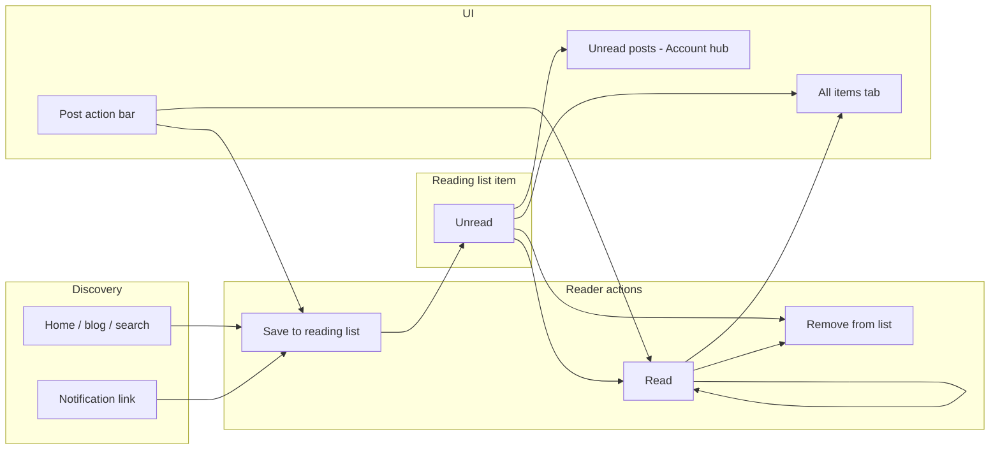
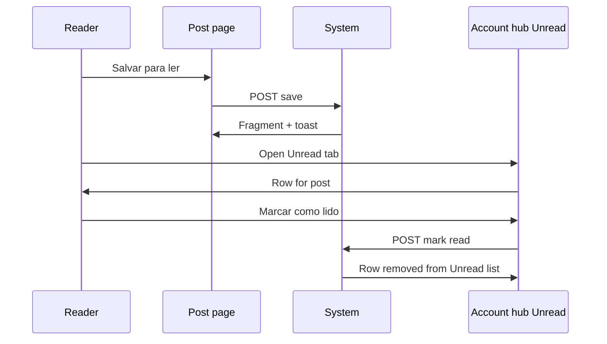

# PRD: Personal reading list

**Status:** Draft  
**Author:** Product / engineering  
**Last updated:** 2026-05-19  
**Related:** [domain-specification.md](../domain-specification.md), [ui-guidelines.md](../ui-guidelines.md), [ARCHITECTURE.md](../../ARCHITECTURE.md), [post-text-highlight.md](post-text-highlight.md)

---

## 1. Summary

This initiative adds a **personal reading list**: a per-user queue of **published posts** they intend to read, with an explicit **read** state.

1. **Save to reading list** — a signed-in reader adds a post they want to read later.
2. **Mark as read** — the reader records that they finished (or no longer need) the post; it leaves the **unread** view but remains in the full list unless removed.
3. **Unread posts page** — Account hub section listing only **unread** items, sorted for triage (oldest saved first by default).

The feature is **reader-centric** and **private**: only the saving user sees their list. It does not change what authors publish or what guests can browse.

**Not this feature:** blog **subscriptions** (follow/email), **notifications** (event inbox), **Library** (author drafts/published), **Highlights library** (saved passages), or **reading time** (passive engagement metric). See §19.

---

## 2. Problem & goals

### Problem

Readers discover posts across the home page, search, tags, and followed blogs, but have no first-class place to **defer reading** or track **what is still unread**. Notifications surface *new* events; they are a poor substitute for a stable “read later” queue.

### Goals

| Goal | Success signal |
|------|----------------|
| Save for later in one gesture | Median post page → saved &lt; 2s |
| Clear unread triage | Unread page shows only items not yet marked read |
| Explicit completion | “Mark as read” is deliberate; not confused with **reading time** |
| Fit hub + HTMX stack | Account hub section + post-page fragment; no SPA |
| Predictable dev UX | `dave` has unread items from followed blogs in `dev-import.sql` |

### Non-goals

- Shared or collaborative reading lists
- Author-side “who saved my post” analytics (v1)
- Auto-adding every **NEW_POST** notification to the list (v1)
- Saving **draft** posts, **custom pages**, or RSS-only URLs
- Guest-persisted lists (sign-in gate, like highlights)
- Import/export (Git, OPML)
- Reordering via drag-and-drop (v1: sort by `saved_at` / `read_at` only)

---

## 3. Conceptual model



**Principle:** The reader curates a **post-level** queue; the platform does not infer “read” from time-on-page alone in v1.

---

## 4. Users & permissions

| Actor | Capability |
|-------|------------|
| **Guest** | Read public posts; **Sign in to save** (no persistence) |
| **Reader** (`USER`+) | Save/remove posts; mark read/unread; view **Unread** and **All** in Account hub |
| **Author** | Same as reader on any **published** post (including own posts — see §17) |
| **Editor / Administrator** | No special override |

**Invariants (proposed):**

1. A **reading list item** belongs to exactly one **user** and one **published post** (`published = true`, blog **active**).
2. At most one item per `(user_id, post_id)`.
3. Only the owning user may save, mark read, mark unread, or remove.
4. **Unread** means `read_at IS NULL`; **read** means `read_at IS NOT NULL`.
5. Saving a post that is already on the list with status **read** resets to **unread** (re-queue) — product default in §6.2.

---

## 5. Ubiquitous language (proposed)

Add to [domain-specification.md](../domain-specification.md) before implementation.

### Reading list

| Term | Meaning |
|------|---------|
| **Reading list** | A user’s private set of **reading list items**. |
| **Reading list item** | One **published post** saved by a user for later reading. |
| **Save to reading list** | Create (or re-queue) an item as **unread**. |
| **Unread reading list item** | Item with no **read mark** (`read_at` null). |
| **Read mark** | Timestamp when the user **marked as read**; clears unread state. |
| **Mark as read** | Set **read mark** on an item. |
| **Mark as unread** | Clear **read mark** (item returns to **unread**). |
| **Remove from reading list** | Delete the item for that user/post. |
| **Unread posts** | Account hub view: only **unread reading list items**. |
| **Reading list (all)** | Account hub tab: unread + read items. |

### Distinction from existing terms

| Existing term | Difference |
|---------------|------------|
| **Reading time** / **Reading session** | Passive seconds on page; not user intent; author-visible aggregate. |
| **Notification** (read flag) | In-app event per follow/comment/etc.; dismiss ≠ finished reading post. |
| **Library** | Author’s own drafts and published posts across owned blogs. |
| **Highlights library** | Passage-level marginalia, not whole posts. |
| **Subscribe by email** / **Follow** | Blog-level audience; not a per-post queue. |

### UI labels (PT-BR default)

| Element | PT-BR | i18n key (proposed) |
|---------|-------|---------------------|
| Save action (off) | Salvar para ler | `readingList.save` |
| Save action (on, unread) | Na lista · Não lido | `readingList.savedUnread` |
| Save action (on, read) | Na lista · Lido | `readingList.savedRead` |
| Mark as read | Marcar como lido | `readingList.markRead` |
| Mark as unread | Marcar como não lido | `readingList.markUnread` |
| Remove | Remover da lista | `readingList.remove` |
| Account hub section | Lista de leitura | `readingList.hub.title` |
| Unread tab | Não lidos | `readingList.tab.unread` |
| All tab | Todos | `readingList.tab.all` |
| Empty unread | Nenhum post para ler. Salve posts para ler depois. | `readingList.empty.unread` |
| Empty all | Sua lista está vazia. | `readingList.empty.all` |
| Guest gate | Entre para salvar na lista de leitura | `readingList.signInToSave` |
| Hub nav (left) | Lista de leitura | `menu.readingList` |
| Toast — saved | Post salvo para ler. | `toast.readingList.saved` |
| Toast — read | Marcado como lido. | `toast.readingList.markedRead` |
| Toast — unread | Marcado como não lido. | `toast.readingList.markedUnread` |
| Toast — removed | Removido da lista. | `toast.readingList.removed` |
| Unavailable post row | Post indisponível | `readingList.postUnavailable` |

**Naming note:** Public **paginated post grids** in [ui-guidelines.md](../ui-guidelines.md) are “reading lists” in a layout sense only. Code and domain use **reading list** exclusively for this **personal queue** feature.

---

## 6. Feature specifications

### 6.1 Save to reading list

**Entry points (v1)**

| Surface | Control |
|---------|---------|
| **Post page** action area | **Salvar para ler** (primary); toggles when already saved |
| **Post page** (when saved) | **Marcar como lido** / **Remover da lista** in overflow or secondary row |
| Account hub **Unread** / **All** | Row link opens post; row actions mark read / remove |

**Deferred (v2):** search result row, notification overlay “Save for later”, blog home card menu.

**Rules**

- Target must be a **published post** with **live publication** (same visibility rules as **post comments**).
- Guest → modal sign-in; preserve intent via `return` URL (existing auth pattern).
- Duplicate save on unread item → no-op, toast optional “Já está na lista.”
- Save on existing **read** item → clear `read_at`, toast **Post salvo para ler.** (re-queue — §4 invariant 5).

**Post page fragment**

- `GET /{postUrl}/components/reading-list` returns action control(s) for HTMX swap.
- After `POST` save/read/remove, return updated fragment + `X-Toast-Message`.

---

### 6.2 Mark as read / mark as unread

**Mark as read**

- From post action area (when item is **unread**) or unread list row.
- Sets `read_at = now()`; item disappears from **Unread** tab; remains on **All** with read styling.
- Does **not** dismiss **notifications** for that post (separate product surface).

**Mark as unread**

- From **All** tab or post page when item is **read**.
- Clears `read_at`; item reappears on **Unread** tab.

**Remove from reading list**

- Deletes row; post page shows **Salvar para ler** again.

---

### 6.3 Unread posts page (Account hub)

**Placement:** Account hub → **Activity** group → **Lista de leitura** (`GET /account/reading-list`).

**Layout**

- Hub shell: left nav (Notifications, Subscriptions, **Lista de leitura**, Security).
- Default section: **Unread** tab active.
- Second tab: **Todos** (all items).

**Unread tab**

- **Managing UI** pagination: `PageQuery.forGrid(20, page)`, `components/manage-pagination.html`.
- Sort: `saved_at ASC` (oldest first — finish backlog).
- Each row: post title (link to public URL), author/blog byline, saved date, **Marcar como lido**, **Remover da lista**.
- Optional header summary: “{n} não lidos” when count &gt; 0.

**All tab**

- Same pagination; sort: `read_at DESC NULLS FIRST, saved_at DESC` (unread at top, then recently read).
- Read rows: muted styling + **Marcar como não lido**.

**Unavailable posts**

- If post **unpublished** or blog **inactive**: row stays, title strikethrough, **Post indisponível**, actions **Remover** only (no mark read).

---

### 6.4 Optional unread badge (v1.1)

- Header or Account hub nav: small count of unread items (not bell-level prominence).
- HTMX event `readingListChanged` refreshes badge when open (mirror `notificationsChanged` pattern).
- **Out of scope for Phase 1** unless trivial; document in Phase 2.

---

## 7. User experience

### 7.1 Post page (reader)

```
[ Title · metadata · content ]
[ Action bar: Save / Mark read / Remove  (authenticated) ]
[ Comments · audience · ... ]
```

- **Guest:** **Entre para salvar na lista de leitura** near audience actions or in action bar.
- **Author on own post:** same controls allowed (§17) — useful for “read later” across blogs they follow.

### 7.2 Account hub — Lista de leitura

```
Tabs: [ Não lidos ] [ Todos ]
[List with manage pagination]
```

Breadcrumb: Home → Account → Lista de leitura.

### 7.3 Sequence: save and mark read



---

## 8. Functional requirements

### Phase 1 — Core

| ID | Requirement |
|----|-------------|
| RL-01 | Authenticated users save **published** posts to **reading list**. |
| RL-02 | One item per user per post; re-save on read item re-queues as unread. |
| RL-03 | **Mark as read**, **mark as unread**, **remove** from post page and hub lists. |
| RL-04 | Account hub section `/account/reading-list` with **Unread** (default) and **All** tabs. |
| RL-05 | Manage pagination (20/page); unavailable post handling. |
| RL-06 | Guest gate + i18n keys in §5. |
| RL-07 | `@WebTest` coverage; `dev-import.sql` seed for `dave` (and one re-read item). |

### Phase 2 — Discovery helpers

| ID | Requirement |
|----|-------------|
| RL-10 | Save from search results (optional). |
| RL-11 | Unread count badge + `readingListChanged` HTMX trigger. |
| RL-12 | “Save for later” on notification rows (does not auto-mark notification read). |

### Cross-cutting

| ID | Requirement |
|----|-------------|
| RL-20 | Rate limit: 60 saves/hour/user. |
| RL-21 | Max 500 active items per user (oldest auto-trim or reject with toast — prefer reject). |
| RL-22 | Cascade delete items when post hard-deleted; soft-handle unpublish (§6.3). |

---

## 9. Data model (proposed)

```sql
CREATE TABLE tb_reading_list_items (
    id          BIGSERIAL PRIMARY KEY,
    user_id     BIGINT NOT NULL REFERENCES tb_users(id) ON DELETE CASCADE,
    post_id     BIGINT NOT NULL REFERENCES tb_posts(id) ON DELETE CASCADE,
    saved_at    TIMESTAMP NOT NULL DEFAULT NOW(),
    read_at     TIMESTAMP,  -- NULL = unread
    UNIQUE (user_id, post_id)
);

CREATE INDEX idx_reading_list_user_unread
    ON tb_reading_list_items (user_id, saved_at)
    WHERE read_at IS NULL;

CREATE INDEX idx_reading_list_user_all
    ON tb_reading_list_items (user_id, read_at DESC NULLS FIRST, saved_at DESC);
```

**Package:** `dev.vepo.contraponto.readinglist`

**Service (if needed):** `ReadingListService` — save, mark read/unread, remove, validate published/active.

**No CDI domain events in v1** (no author notifications). Optional `ReadingListChangedEvent` in Phase 2 for badge refresh.

---

## 10. API & endpoints (proposed)

| Method | Path | Purpose |
|--------|------|---------|
| `GET` | `/account/reading-list` | Hub panel (default tab unread, `?tab=all`, `?page=`) |
| `GET` | `/{postUrl}/components/reading-list` | Post page action fragment |
| `POST` | `/forms/reading-list/save` | Body: `postId` — create or re-queue unread |
| `POST` | `/forms/reading-list/{itemId}/read` | Mark read |
| `POST` | `/forms/reading-list/{itemId}/unread` | Mark unread |
| `DELETE` | `/forms/reading-list/{itemId}` | Remove item |

All mutation endpoints: `@Logged`, `Response` + toast header, HTMX fragment when `HX-Request`.

**Hub routing:** Register section `reading-list` in `NavigationHubRegistry.accountGroups()` under **Activity**, after **Subscriptions**.

---

## 11. Notifications

**None in v1.** Saving or marking read does not create **Notification** rows.

Phase 2 badge only; no email digest in scope.

---

## 12. Frontend architecture

| Piece | Responsibility |
|-------|----------------|
| Post template include | `reading-list-action.html` fragment target |
| `ReadingListHubPanel` | Qute template: tabs + `manage-pagination` |
| HTMX | `hx-post` / `hx-delete` on forms; swap fragment on post page |
| CSS | Reuse `manage-list` / `notification-list` row patterns; modifier `--read` for read rows |

**HTMX trigger (Phase 2):** `readingListChanged` on `body` for badge container.

No new `main.js` module required for v1.

---

## 13. Security & abuse

| Risk | Mitigation |
|------|------------|
| IDOR on mark/remove | Repository methods scoped by `user_id` |
| Scraping save state | Fragment only shows own state when `@Logged` |
| Queue stuffing | 500 item cap + rate limit |
| Saving drafts | Server rejects unpublished `post_id` |
| XSS | List renders post title from DB via existing escape paths |

---

## 14. Dev seed & testing

**dev-import.sql** (Activity section):

- User **`dave`**: 3 **unread** items (posts from followed blogs `alice`, `bob`), 1 **read** item, 1 **unavailable** (post unpublished after save — optional).
- User **`eve`**: empty list (empty state QA).

**Tests (`ReadingListEndpointTest` or `App` flows):**

1. Save post → appears on Unread tab; post page shows saved state.  
2. Mark read → leaves Unread tab, visible on All as read.  
3. Mark unread → returns to Unread.  
4. Remove → gone from hub and post page.  
5. Guest sees sign-in gate, no save.  
6. Re-save read item → unread again.  
7. Cannot save draft (author on own draft page — control hidden or 400).

---

## 15. Rollout phases

| Phase | Deliverable |
|-------|-------------|
| **1** | Schema, repository, service, post fragment, Account hub Unread + All, i18n, seed, tests |
| **2** | Unread badge, `readingListChanged`, save from search/notifications |
| **3** | Optional filters (by blog), bulk mark read, sort toggle |

---

## 16. Open questions

1. **Own posts:** Allow saving your **published** posts to read later (e.g. proofreading queue)? **Recommendation:** yes, same UX.  
2. **Auto mark read:** Should opening the post mark it read after N seconds? **Recommendation:** no in v1 — keeps **reading time** separate; revisit with user research.  
3. **NEW_POST notifications:** Offer “Save to reading list” on notification row without dismissing? (Phase 2)  
4. **Sort on Unread:** Oldest-first (backlog) vs newest-first (feed)? **Recommendation:** oldest `saved_at` first.  
5. **Slug collision:** Static custom page `reading-list` in dev seed is unrelated; hub path `/account/reading-list` is safe.  
6. **Republish:** Post URL stable; list row needs no version pointer (unlike highlights).  
7. **Menu label:** “Lista de leitura” vs “Para ler” — prefer **Lista de leitura** for parity with “Highlights library” naming.

---

## 17. Documentation checklist

- [ ] [domain-specification.md](../domain-specification.md) — terms in §5 + invariants  
- [ ] [application-guidelines.md](../application-guidelines.md) — Account hub §7, post action bar  
- [ ] [feature-catalog.md](../feature-catalog.md) — save, unread page, hub nav  
- [ ] [ui-elements.md](../ui-elements.md) — list row modifiers  
- [ ] [ui-guidelines.md](../ui-guidelines.md) — disambiguate “reading list” vs paginated grids  
- [ ] [htmx-events.md](../htmx-events.md) — `readingListChanged` (Phase 2)  
- [ ] `dev-import.sql` — §14  
- [ ] i18n bundles (`messages_en.json`, `messages_es.json`)  
- [ ] [AGENTS.md](../../AGENTS.md) — index row for this PRD  

---

## 18. Appendix: comparison with adjacent features

| Feature | Granularity | Who sees it | “Unread” meaning |
|---------|-------------|-------------|------------------|
| **Reading list** | Post | Saving user only | User has not **marked as read** |
| **Notification** | Event | Recipient | User has not **dismissed** notification |
| **Follow** | Blog | Public follow state | N/A |
| **Highlights library** | Passage | Highlight author | N/A |
| **Library** | Own post | Post author | Draft vs published tab |
| **Reading time** | Session seconds | Author aggregate on post | N/A |

**Reading list** answers: “Which posts did I mean to read?”  
**Notifications** answer: “What happened since I last visited?”
