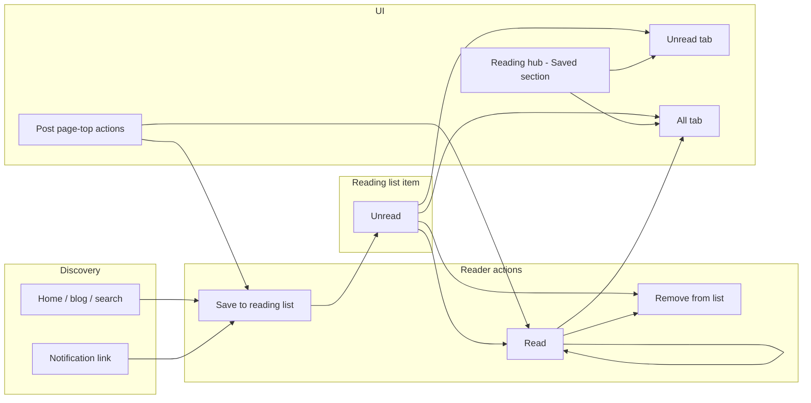
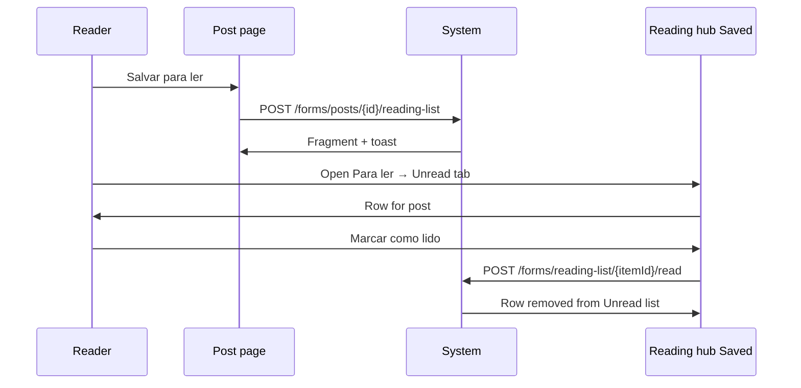
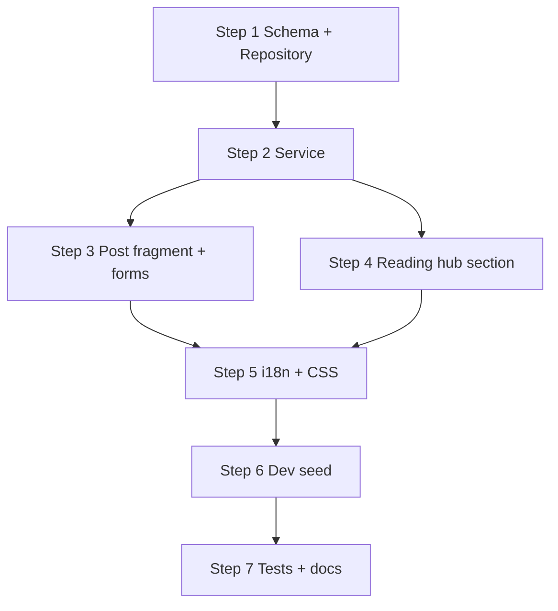

# PRD: Personal reading list

**Status:** Draft (aligned with codebase — ready for implementation)  
**Author:** Product / engineering  
**Last updated:** 2026-06-23  
**Related:** [domain-specification.md](../domain-specification.md), [ui-guidelines.md](../ui-guidelines.md), [ARCHITECTURE.md](../../ARCHITECTURE.md), [post-text-highlight.md](post-text-highlight.md)

---

## 1. Summary

This initiative adds a **personal reading list**: a per-user queue of **published posts** they intend to read, with an explicit **read** state.

1. **Save to reading list** — a signed-in reader adds a post they want to read later.
2. **Mark as read** — the reader records that they finished (or no longer need) the post; it leaves the **unread** view but remains in the full list unless removed.
3. **Unread posts page** — Reading hub section listing only **unread** items, sorted for triage (oldest saved first by default).

The feature is **reader-centric** and **private**: only the saving user sees their list. It does not change what authors publish or what guests can browse.

**Not this feature:** blog **subscriptions** (follow/email), **notifications** (event inbox), **Library** (author drafts/published), **Highlights library** (saved passages — already in Reading hub), or **reading time** (passive engagement metric). See §19.

### Codebase alignment (2026-06-23)

| PRD assumption (2026-05-19) | Current code |
|-----------------------------|--------------|
| Account hub → Activity → Lista de leitura | **Reading hub** already exists (`NavigationHub.READING`, `/reading`) with **Highlights** and **Notes** — reading list belongs here, not under Account |
| `/account/reading-list` | **`/reading/saved`** (section slug `saved`; avoids collision with sidebar custom page `/reading-list` in `dev-import.sql`) |
| `/forms/reading-list/save` | **`POST /forms/posts/{postId}/reading-list`** — matches highlights/comments form namespace |
| Standalone `ReadingListHubPanel` route | **Library-style tabs** inside one hub section: panel shell + `GET /reading/saved/components/tab/{unread\|all}` |
| Package only | Highlights feature is **implemented** (`dev.vepo.contraponto.highlight`); reading list is **net-new** (`dev.vepo.contraponto.readinglist`) |
| `ReadingLibraryService` name | Existing class in `highlight` package serves **highlights library** only — do not reuse that name |

---

## 2. Problem & goals

### Problem

Readers discover posts across the home page, search, tags, and followed blogs, but have no first-class place to **defer reading** or track **what is still unread**. Notifications surface *new* events; they are a poor substitute for a stable “read later” queue.

### Goals

| Goal | Success signal |
|------|----------------|
| Save for later in one gesture | Median post page → saved &lt; 2s |
| Clear unread triage | Unread tab shows only items not yet marked read |
| Explicit completion | “Mark as read” is deliberate; not confused with **reading time** |
| Fit hub + HTMX stack | Reading hub section + post-page fragment; no SPA |
| Predictable dev UX | `dave` has unread items from followed blogs in `dev-import.sql` |

### Non-goals

- Shared or collaborative reading lists
- Author-side “who saved my post” analytics (v1)
- Auto-adding every **NEW_POST** notification to the list (v1)
- Saving **draft** posts, **custom pages**, or RSS-only URLs
- Guest-persisted lists (sign-in gate, like highlights)
- Import/export (Git, OPML)
- Reordering via drag-and-drop (v1: sort by `saved_at` / `read_at` only)

---

## 3. Conceptual model



**Principle:** The reader curates a **post-level** queue; the platform does not infer “read” from time-on-page alone in v1.

---

## 4. Users & permissions

| Actor | Capability |
|-------|------------|
| **Guest** | Read public posts; **Sign in to save** (no persistence) |
| **Reader** (`USER`+) | Save/remove posts; mark read/unread; view **Unread** and **All** in Reading hub |
| **Author** | Same as reader on any **published** post (including own posts — see §17) |
| **Editor / Administrator** | No special override |

**Invariants:**

1. A **reading list item** belongs to exactly one **user** and one **published post** (`published = true` at save time; blog **active** at save time).
2. At most one item per `(user_id, post_id)`.
3. Only the owning user may save, mark read, mark unread, or remove.
4. **Unread** means `read_at IS NULL`; **read** means `read_at IS NOT NULL`.
5. Saving a post that is already on the list with status **read** resets to **unread** (re-queue).
6. Unpublish or blog deactivation after save → row stays with **Post indisponível** styling; **Remove** only (no mark read).

---

## 5. Ubiquitous language

Add to [domain-specification.md](../domain-specification.md) before implementation (extend **Reading hub** subsection).

### Reading list

| Term | Meaning |
|------|---------|
| **Reading list** | A user’s private set of **reading list items**. |
| **Reading list item** | One **published post** saved by a user for later reading. |
| **Save to reading list** | Create (or re-queue) an item as **unread**. |
| **Unread reading list item** | Item with no **read mark** (`read_at` null). |
| **Read mark** | Timestamp when the user **marked as read**; clears unread state. |
| **Mark as read** | Set **read mark** on an item. |
| **Mark as unread** | Clear **read mark** (item returns to **unread**). |
| **Remove from reading list** | Delete the item for that user/post. |
| **Saved (reading hub section)** | Hub nav label for the reading list UI (`/reading/saved`). |
| **Unread tab** | Default tab: only **unread reading list items**. |
| **All tab** | Unread + read items. |

### Distinction from existing terms

| Existing term | Difference |
|---------------|------------|
| **Reading time** / **Reading session** | Passive seconds on page; not user intent; author-visible aggregate. |
| **Notification** (read flag) | In-app event per follow/comment/etc.; dismiss ≠ finished reading post. |
| **Library** | Author’s own drafts and published posts across owned blogs (`/writing/library`). |
| **Highlights library** | Passage-level marginalia (`/reading/highlights`). |
| **Reading hub** | Signed-in reader hub: highlights, notes, **saved posts** (`ReadingHubEndpoint`). |
| **Subscribe by email** / **Follow** | Blog-level audience; not a per-post queue. |
| **Public reading list** (ui-guidelines) | Paginated post **grid** layout on home/blog/tag — unrelated to this feature. |

### UI labels (PT-BR default)

| Element | PT-BR | i18n key |
|---------|-------|----------|
| Save action (off) | Salvar para ler | `reading.saved.save` |
| Save action (on, unread) | Na lista · Não lido | `reading.saved.savedUnread` |
| Save action (on, read) | Na lista · Lido | `reading.saved.savedRead` |
| Mark as read | Marcar como lido | `reading.saved.markRead` |
| Mark as unread | Marcar como não lido | `reading.saved.markUnread` |
| Remove | Remover da lista | `reading.saved.remove` |
| Hub section title | Para ler | `reading.saved.title` |
| Hub section subtitle | Posts que você salvou para ler depois. | `reading.saved.subtitle` |
| Unread tab | Não lidos | `reading.saved.tab.unread` |
| All tab | Todos | `reading.saved.tab.all` |
| Empty unread | Nenhum post para ler. Salve posts para ler depois. | `reading.saved.empty.unread` |
| Empty all | Sua lista está vazia. | `reading.saved.empty.all` |
| Guest gate | Entre para salvar na lista de leitura | `reading.saved.signInToSave` |
| Hub nav (left) | Para ler | `reading.nav.saved` |
| Toast — saved | Post salvo para ler. | `toast.readingList.saved` |
| Toast — already saved | Já está na lista. | `toast.readingList.alreadySaved` |
| Toast — read | Marcado como lido. | `toast.readingList.markedRead` |
| Toast — unread | Marcado como não lido. | `toast.readingList.markedUnread` |
| Toast — removed | Removido da lista. | `toast.readingList.removed` |
| Toast — limit reached | Lista cheia (máximo 500 itens). | `toast.readingList.limitReached` |
| Unavailable post row | Post indisponível | `reading.saved.postUnavailable` |
| Unread count summary | {n} não lidos | `reading.saved.unreadCount` |

**Naming note:** Public **paginated post grids** in [ui-guidelines.md](../ui-guidelines.md) are “reading lists” in a layout sense only. Code and domain use **reading list** exclusively for this **personal queue** feature.

---

## 6. Feature specifications

### 6.1 Save to reading list

**Entry points (v1)**

| Surface | Control |
|---------|---------|
| **Post page** `page-top` actions | **Salvar para ler** (primary); toggles when already saved |
| **Post page** (when saved) | **Marcar como lido** / **Remover da lista** in same control group |
| Reading hub **Saved** → tabs | Row link opens post; row actions mark read / remove |

**Deferred (v2):** search result row, notification overlay “Save for later”, blog home card menu.

**Rules**

- Target must be a **published post** (`post.isPublished()` — same gate as comments/highlights).
- Guest → login modal (`hx-get="/auth/modal?mode=login"`) — same pattern as `BlogAudienceComponentEndpoint/audienceControls.html`.
- Duplicate save on unread item → no-op, optional toast **Já está na lista.**
- Save on existing **read** item → clear `read_at`, toast **Post salvo para ler.** (re-queue).

**Post page fragment**

- `GET {postUrl}/components/reading-list` on `ReadingListComponentEndpoint` (mirror `CommentComponentEndpoint` / `HighlightComponentEndpoint` path layout under `{username}`).
- Lazy-loaded in `post.html` via `hx-get` + `{authRefreshTrigger}` (mirror `#post-highlights` / `#comments`).
- After `POST` save/read/remove, return updated fragment + `Toast` header.

---

### 6.2 Mark as read / mark as unread

**Mark as read**

- From post action area (when item is **unread**) or unread list row.
- Sets `read_at = now()`; item disappears from **Unread** tab; remains on **All** with read styling.
- Does **not** dismiss **notifications** for that post (separate product surface).

**Mark as unread**

- From **All** tab or post page when item is **read**.
- Clears `read_at`; item reappears on **Unread** tab.

**Remove from reading list**

- Deletes row; post page shows **Salvar para ler** again.

---

### 6.3 Saved section (Reading hub)

**Placement:** Reading hub → **Para ler** (`GET /reading/saved`). User menu **Leitura** → left nav **Para ler**.

Reading hub sections after this feature:

| Order | Slug | Label | Route |
|-------|------|-------|-------|
| 1 | `saved` | Para ler | `/reading/saved` |
| 2 | `highlights` | Highlights | `/reading/highlights` (default hub section — unchanged) |
| 3 | `notes` | Notes | `/reading/notes` |

**Layout**

- Hub shell via `NavigationHubService.shell(NavigationHub.READING, …)` — same as highlights/notes.
- **Library-style tabs** inside the panel (mirror `LibraryEndpoint/panel.html`):
  - Tab buttons → `GET /reading/saved/components/tab/unread` or `…/all`
  - Content target `#savedListContent`
- Default tab: **Unread** (loaded on panel open).

**Unread tab**

- **Managing UI** pagination: `PageQuery.forGrid(20, page)`, `components/manage-pagination.html`.
- Sort: `saved_at ASC` (oldest first — finish backlog).
- Each row: post title (link via `PostPaths.extractUrl`), author/blog byline, saved date, **Marcar como lido**, **Remover da lista**.
- Optional header summary: “{n} não lidos” when count &gt; 0.

**All tab**

- Same pagination; sort: `read_at DESC NULLS FIRST, saved_at DESC` (unread at top, then recently read).
- Read rows: muted styling (`--read` modifier) + **Marcar como não lido**.

**Unavailable posts**

- If post **unpublished** or blog **inactive**: row stays, title strikethrough, **Post indisponível**, actions **Remover** only (no mark read).

---

### 6.4 Optional unread badge (v1.1)

- Header or Reading hub nav: small count of unread items (not bell-level prominence).
- HTMX event `readingListChanged` refreshes badge when open (mirror `notificationsChanged` pattern in [htmx-events.md](../htmx-events.md)).
- **Out of scope for Phase 1** unless trivial; document in Phase 2.

---

## 7. User experience

### 7.1 Post page (reader)

```
[ Title · metadata · content ]
[ page-top actions: Edit (author) · Featured (editor) · Save / Mark read · Follow/Subscribe ]
[ Highlights · Comments · ... ]
```

- **Guest:** **Entre para salvar na lista de leitura** in reading-list fragment (login modal).
- **Author on own post:** same controls allowed (§17).

### 7.2 Reading hub — Para ler

```
Tabs: [ Não lidos ] [ Todos ]
[List with manage pagination]
```

Breadcrumb: Home → Reading → Para ler.

### 7.3 Sequence: save and mark read



---

## 8. Functional requirements

### Phase 1 — Core

| ID | Requirement |
|----|-------------|
| RL-01 | Authenticated users save **published** posts to **reading list**. |
| RL-02 | One item per user per post; re-save on read item re-queues as unread. |
| RL-03 | **Mark as read**, **mark as unread**, **remove** from post page and hub lists. |
| RL-04 | Reading hub section `/reading/saved` with **Unread** (default tab) and **All** tabs. |
| RL-05 | Manage pagination (20/page); unavailable post handling. |
| RL-06 | Guest gate + i18n keys in §5. |
| RL-07 | `@WebTest` coverage; `dev-import.sql` seed for `dave` (and one re-read item). |

### Phase 2 — Discovery helpers

| ID | Requirement |
|----|-------------|
| RL-10 | Save from search results (optional). |
| RL-11 | Unread count badge + `readingListChanged` HTMX trigger. |
| RL-12 | “Save for later” on notification rows (does not auto-mark notification read). |

### Cross-cutting

| ID | Requirement |
|----|-------------|
| RL-20 | Rate limit: 60 saves/hour/user (enforce in `ReadingListService`, not IP-based `RateLimitFilter`). |
| RL-21 | Max 500 active items per user (reject with toast — prefer reject over auto-trim). |
| RL-22 | Cascade delete items when post hard-deleted (`ON DELETE CASCADE`); soft-handle unpublish (§6.3). |

---

## 9. Data model

**Migration:** `V0.0.6__reading_list_items.sql`

```sql
CREATE TABLE tb_reading_list_items (
    id          BIGSERIAL PRIMARY KEY,
    user_id     BIGINT NOT NULL REFERENCES tb_users(id) ON DELETE CASCADE,
    post_id     BIGINT NOT NULL REFERENCES tb_posts(id) ON DELETE CASCADE,
    saved_at    TIMESTAMP NOT NULL DEFAULT NOW(),
    read_at     TIMESTAMP,  -- NULL = unread
    UNIQUE (user_id, post_id)
);

CREATE INDEX idx_reading_list_user_unread
    ON tb_reading_list_items (user_id, saved_at)
    WHERE read_at IS NULL;

CREATE INDEX idx_reading_list_user_all
    ON tb_reading_list_items (user_id, read_at DESC NULLS FIRST, saved_at DESC);
```

**Package:** `dev.vepo.contraponto.readinglist`

| Layer | Class |
|-------|-------|
| Entity | `ReadingListItem` |
| Repository | `ReadingListRepository` — paginated unread/all queries, scoped mutations |
| Service | `ReadingListService` — save, mark read/unread, remove, caps, published validation |
| Component | `ReadingListComponentEndpoint` — post page fragment |
| Hub | `ReadingListHubEndpoint` — panel + tab fragments (or methods on a single endpoint class) |
| Forms | `ReadingListSaveEndpoint`, `ReadingListMarkReadEndpoint`, `ReadingListMarkUnreadEndpoint`, `ReadingListRemoveEndpoint` |

**No CDI domain events in v1.** Optional `ReadingListChangedEvent` in Phase 2 for badge refresh.

---

## 10. API & endpoints

| Method | Path | Purpose |
|--------|------|---------|
| `GET` | `/reading/saved` | Hub panel (via `ReadingHubEndpoint` + `NavigationHubPanelService`) |
| `GET` | `/reading/saved/components/tab/{unread\|all}` | Tab content (`?page=`) |
| `GET` | `/{username}/post/{slug}/components/reading-list` | Post page fragment (main blog) |
| `GET` | `/{username}/{blogSlug}/post/{slug}/components/reading-list` | Post page fragment (secondary blog) |
| `POST` | `/forms/posts/{postId}/reading-list` | Save (create or re-queue unread) |
| `POST` | `/forms/reading-list/{itemId}/read` | Mark read |
| `POST` | `/forms/reading-list/{itemId}/unread` | Mark unread |
| `DELETE` | `/forms/reading-list/{itemId}` | Remove item |

All mutation endpoints: `@Logged`, `Response` + `Toast`, HTMX fragment swap on post page when `HX-Request` targets reading-list control.

**Hub wiring:**

1. `NavigationHubRegistry.readingGroups()` — add `HubSectionNav("saved", "Para ler", "reading.nav.saved")` **first** in the Reading group.
2. `NavigationHubPanelService.renderReading()` — delegate to reading list hub renderer.
3. `NavigationHubService.meta(READING)` — extend subtitle to mention saved posts.

Default hub section remains **`highlights`** (existing tests and bookmarks).

---

## 11. Notifications

**None in v1.** Saving or marking read does not create **Notification** rows.

Phase 2 badge only; no email digest in scope.

---

## 12. Frontend architecture

| Piece | Responsibility |
|-------|----------------|
| `post.html` | Lazy `#post-reading-list` container with `hx-get` + `{authRefreshTrigger}` |
| `ReadingListComponentEndpoint/readingListAction.html` | Post page control(s) |
| `ReadingListHubEndpoint/panel.html` | Hub panel shell + library-style tabs |
| `ReadingListHubEndpoint/tab.html` | Tab list rows + `manage-pagination` |
| HTMX | `hx-post` / `hx-delete` on forms; swap fragment on post page |
| CSS | Reuse `manage-list` / `notification-list` row patterns in **manage.css**; modifier `--read` for read rows |

**HTMX trigger (Phase 2):** `readingListChanged` on `body` for badge container.

No new `main.js` module required for v1 (guest gate uses login modal like audience controls).

---

## 13. Security & abuse

| Risk | Mitigation |
|------|------------|
| IDOR on mark/remove | Repository methods scoped by `user_id` |
| Scraping save state | Fragment only shows own state when `@Logged` |
| Queue stuffing | 500 item cap + per-user save rate in service |
| Saving drafts | Server rejects unpublished `post_id` |
| XSS | List renders post title from DB via existing escape paths |

---

## 14. Dev seed & testing

**dev-import.sql** (new block after audience/notifications):

- User **`dave`**: 3 **unread** items (posts from followed blogs `alice`, `bob`), 1 **read** item, 1 **unavailable** (post unpublished after save — optional).
- User **`eve`**: empty list (empty state QA).

**Tests (`ReadingListWebTest` + `App` flows):**

1. Save post → appears on Unread tab; post page shows saved state.  
2. Mark read → leaves Unread tab, visible on All as read.  
3. Mark unread → returns to Unread.  
4. Remove → gone from hub and post page.  
5. Guest sees sign-in gate, no save.  
6. Re-save read item → unread again.  
7. Cannot save draft (control hidden or 400).  
8. Navigation hub: `/reading/saved` in left nav; breadcrumb **Reading → Para ler**.

Extend `NavigationHubTest` or dedicated test for hub nav entry.

---

## 15. Rollout phases

| Phase | Deliverable |
|-------|-------------|
| **1** | Schema, repository, service, post fragment, Reading hub Saved + tabs, i18n, seed, tests, docs |
| **2** | Unread badge, `readingListChanged`, save from search/notifications |
| **3** | Optional filters (by blog), bulk mark read, sort toggle |

---

## 16. Resolved questions

| # | Question | Decision |
|---|----------|----------|
| 1 | Own posts | **Yes** — same UX on own published posts. |
| 2 | Auto mark read on open | **No** in v1 — keeps **reading time** separate. |
| 3 | NEW_POST notifications | Phase 2 — “Save to reading list” on notification row. |
| 4 | Sort on Unread | **Oldest `saved_at` first** (backlog triage). |
| 5 | Hub placement | **Reading hub** (`/reading/saved`), not Account hub — aligns with highlights/notes. |
| 6 | Section slug | **`saved`** — avoids custom page slug `/reading-list` collision. |
| 7 | Default Reading hub section | **`highlights`** unchanged — saved is first in nav but not default redirect. |
| 8 | Republish | Post URL stable; list row needs no version pointer (unlike highlights). |
| 9 | Nav label | **Para ler** in Reading hub; domain term remains **reading list**. |

---

## 17. Documentation checklist

- [ ] [domain-specification.md](../domain-specification.md) — terms in §5 + Reading hub row  
- [ ] [application-guidelines.md](../application-guidelines.md) — Reading hub §, post page-top actions  
- [ ] [feature-catalog.md](../feature-catalog.md) — save, saved section, hub nav  
- [ ] [ui-elements.md](../ui-elements.md) — list row modifiers  
- [ ] [ui-guidelines.md](../ui-guidelines.md) — disambiguate “reading list” vs paginated grids  
- [ ] [htmx-events.md](../htmx-events.md) — `readingListChanged` (Phase 2)  
- [ ] `dev-import.sql` — §14  
- [ ] i18n bundles (`messages_en.json`, `messages_es.json`) + `I18nKeys` / `I18nDefaults`  
- [ ] [AGENTS.md](../../AGENTS.md) — index row (already present)

---

## 18. Appendix: comparison with adjacent features

| Feature | Granularity | Who sees it | “Unread” meaning |
|---------|-------------|-------------|------------------|
| **Reading list** | Post | Saving user only | User has not **marked as read** |
| **Notification** | Event | Recipient | User has not **dismissed** notification |
| **Follow** | Blog | Public follow state | N/A |
| **Highlights library** | Passage | Highlight author | N/A |
| **Library** | Own post | Post author | Draft vs published tab |
| **Reading time** | Session seconds | Author aggregate on post | N/A |

**Reading list** answers: “Which posts did I mean to read?”  
**Notifications** answer: “What happened since I last visited?”

---

## 19. Implementation plan (Phase 1)

Estimated order — each step should compile and be testable before the next.

### Step 1 — Domain & persistence

1. Add ubiquitous language to `docs/domain-specification.md`.
2. Flyway `V0.0.6__reading_list_items.sql`.
3. `ReadingListItem` entity + `ReadingListRepository`:
   - `Optional<ReadingListItem> findByUserAndPost(userId, postId)`
   - `Page<ReadingListRow> findUnreadPage(userId, PageQuery)` — join post/blog/author; detect unavailable
   - `Page<ReadingListRow> findAllPage(userId, PageQuery)`
   - `long countUnread(userId)`
   - `long countByUser(userId)`
   - `@Transactional` save, markRead, markUnread, remove — all scoped by userId

### Step 2 — Service layer

`ReadingListService` (`@ApplicationScoped`):

- `save(userId, postId)` — validate published + active blog; re-queue if exists read; no-op if unread; enforce 500 cap + 60/hour save rate
- `markRead`, `markUnread`, `remove` — IDOR-safe via repository
- `findUnreadPage`, `findAllPage`, `getItemStateForPost(userId, postId)` for component

### Step 3 — Post page fragment

1. `ReadingListComponentEndpoint` under `{username}` (main + secondary blog paths).
2. Template `readingListAction.html` — guest login button; saved/unread/read states; HTMX forms.
3. Wire lazy load in `post.html` (`#post-reading-list`).
4. Form endpoints:
   - `POST /forms/posts/{postId}/reading-list` → swap component + toast
   - `POST /forms/reading-list/{itemId}/read|unread`, `DELETE /forms/reading-list/{itemId}` → hub row OOB or tab refresh + post fragment when applicable

### Step 4 — Reading hub section

1. `ReadingListHubEndpoint` (or split panel/tab routes under `/reading/saved/components/…`).
2. Templates: `panel.html` (library-style tabs), `tab.html` (rows + pagination).
3. Register in `NavigationHubRegistry.readingGroups()` + `NavigationHubPanelService.renderReading()`.
4. Update `NavigationHubService.meta(READING)` subtitle.

### Step 5 — i18n & CSS

1. Keys in §5 → `messages_en.json`, `messages_es.json`, PT defaults in templates.
2. `I18nKeys` / `I18nDefaults` / `I18nMessageCatalog` for toasts.
3. CSS in `manage.css`: `.reading-list-row`, `.reading-list-row--read`, `.reading-list-row--unavailable` — register in `ui-elements.md`.

### Step 6 — Dev seed

Insert reading list rows for `dave` / empty for `eve` in `dev-import.sql` (use subqueries by username + post slug).

### Step 7 — Tests & docs

1. `ReadingListWebTest` — core flows via `App` DSL; extend `App` with `ReadingSavedPage` helper if needed.
2. Update `NavigationHubTest` for `/reading/saved` nav.
3. `feature-catalog.md`, `application-guidelines.md`.
4. Run `GITHUB_ACTIONS=true ./mvnw -B verify`.

### Dependency graph



### Out of scope for Phase 1 PR

- Unread badge / `readingListChanged`
- Save from search or notifications
- Rate limit in `RateLimitFilter` (use service-level per-user check instead)
