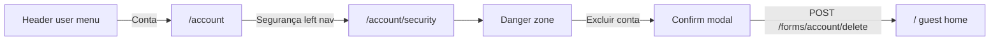

# Account deletion (self-service)

**Feature version:** 1  
**Status:** approved

## Changelog

### Self-service delete with anonymized engagement — 2026-07-08

**Version:** 1  
**Status:** approved

**Domain model:** phase 1b at implementation (Delete account, Account audit, Deleted user label, User audit event)

**Development approval:** approved 2026-07-08 — tasks: T1-java–T12-htmx, Tdev; ADR-0016 accepted.

**Description:** Signed-in **users** can permanently delete their account from the **Account hub — Security** panel. Owned blogs, posts, images, and Fediverse actor data are removed from the **public** site. Comments, highlights, and notes on **other authors' posts** are **anonymized** (display as deleted user; no link to profile). Sessions are invalidated; username and email become available for a new signup. **Platform audit records** (identity, client IP at key events, and content snapshots) are **retained admin-only** so abuse can be investigated after self-delete (FQ9).

**Domain model:** pending (phase 1b)

**Impact on other features:**

| Feature / area | Impact |
|----------------|--------|
| [authentication.md](authentication.md) | Account Security danger zone; session teardown; **IP audit** on signup/login |
| [user-administration.md](user-administration.md) | Deleted users hidden from user list; **Account audit** panel for `ADMIN` |
| [activitypub-integration.md](activitypub-integration.md) | May need **Delete** delivery for published posts before purge when Fediverse opt-in was on |
| [post-comments.md](post-comments.md) | Anonymized comments remain on threads; author link removed |
| [post-text-highlight.md](post-text-highlight.md) | Reader highlights/notes anonymized on others' posts |
| [user-messaging.md](user-messaging.md) | Threads involving deleted user — see FQ4 |
| [blog-audience.md](blog-audience.md) | Follow/subscribe rows CASCADE with user |
| [reading-list.md](reading-list.md) | Reading list items CASCADE |
| [git-sync.md](git-sync.md) | Git remotes on owned blogs removed with blog delete |
| [seo.md](seo.md) | Author profile and post URLs 404 after owned content purge |
| [notification-retention.md](notification-retention.md) | Notifications to/from user CASCADE or actor SET NULL (existing FK) |

## Summary

Today Contraponto supports **account deactivation** (admin-only, reversible). There is **no** self-service or admin **permanent deletion**. Database FKs mix `ON DELETE CASCADE`, bare references, and `SET NULL` — a naive `DELETE FROM tb_users` would fail on `tb_blogs.owner_id`, `tb_posts.blog_id`, images, views, and several engagement tables.

This feature adds **Delete my account** on `GET /account/security`: confirm modal → password re-entry → orchestrated purge in `UserDeletionService`. Owned content is hard-deleted from the public site; cross-post engagement is anonymized. **Before** the user row is removed, the service writes an **account deletion audit snapshot** and relies on **ongoing audit events** (signup, login, publish) so operators can trace harmful content after self-delete.

### Abuse audit (product requirement)

A user may register, publish harmful posts, then self-delete to evade public attribution. Contraponto must still support **operator investigation**:

| Need | Design response |
|------|-----------------|
| Who was this account? | Snapshot: `user_id`, username, email, name, roles, `created_at`, `deleted_at` |
| Where did they connect from? | Client IP (and optional `User-Agent`) on signup, login, each publish, and delete |
| What did they publish? | JSON snapshot of owned posts (and published state) at delete time; optional comment/DM bodies on others' content |
| Public evasion | Profile and post URLs 404; audit data **not** exposed to readers or the deleted user |

Audit data is **admin-only** (`ADMIN` role), separate from the live user graph, with a **retention TTL** (FQ10). Privacy copy on the delete modal notes that abuse-prevention records may be kept after the public account is removed (FQ12).

## UI access and navigation

Account deletion is **not** a top-level menu item. It lives inside the **Account hub**, on the existing **Security** section — the same screen where users change email and password.

### Self-service: Delete my account

| Attribute | Value |
|-----------|-------|
| **Audience** | Signed-in `USER` (and roles that include author capabilities) |
| **Excluded** | `ADMIN`; sole remaining `USER_ADMINISTRATOR` — danger zone hidden or disabled with explanation (FQ5) |
| **Canonical route** | `GET /account/security` |
| **Hub** | Account (`/account`) — section slug `security` |
| **Left nav label** | **Security** / **Segurança** (existing; under group **Account**) |
| **Placement on page** | **Danger zone** block **below** the email/password form and locale block — last content in the Security panel |
| **Primary control** | Button **Excluir conta** (`btn btn--danger`) — opens confirm modal in `#modal-container` |
| **Not placed on** | User menu root, Writing/Manage/Reading hubs, author profile, post editor, footer, signup modal, admin **Edit user** form (`/users/{id}/edit`) |

**Click path to delete control** (from signed-in user at `/`):

| Step | Action | Route / target |
|------|--------|----------------|
| 1 | Open **user menu** | — |
| 2 | Click **Account** / **Conta** | `GET /account` |
| 3 | Left nav **Security** / **Segurança** | `GET /account/security` |
| 4 | Click **Excluir conta** (danger zone) | Confirm modal → `#modal-container` |
| 5 | Enter password → **Excluir conta permanentemente** | `POST /forms/account/delete` → `/` |

**Steps (catalog):** **3** to Security panel (same as [Account security](feature-catalog.md)); **+2** for modal open + confirm = **5** end-to-end for deletion.



| After success | Behaviour |
|---------------|-----------|
| Redirect | `GET /` (home, signed out) |
| Toast | Success message (account deleted) |
| Session | All sessions invalidated; `__session` cookie cleared |

### Administration: Account audit (post-delete investigation)

Separate surface for operators — **not** where users delete accounts.

| Attribute | Value |
|-----------|-------|
| **Audience** | `ADMIN` only |
| **Canonical route** | `GET /administration/account-audit` |
| **Hub** | Administration (`/administration`) — new section slug `account-audit` |
| **Left nav label** | **Account audit** / **Auditoria de contas** (new item in **Platform** group, after **Message reports**) |
| **Detail route** | `GET /administration/account-audit/{deletionId}` |
| **Not placed on** | Account hub, user edit form, message report detail (cross-link only if useful later) |

**Click path** (feature-catalog step count = **3**):

1. Open **user menu**.
2. Click **Administration** / **Administração** → `GET /administration` (default: users).
3. Left nav **Platform** → **Account audit** → list; click row → detail.

### Navigation registry changes

| Hub | Change |
|-----|--------|
| `NavigationHubRegistry.accountGroups()` | No new section — deletion control is **content inside** existing `security` panel |
| `NavigationHubRegistry.administrationGroups()` | Add `HubSectionNav("account-audit", "Account audit", "administration.nav.accountAudit")` under **Platform** |
| `BreadcrumbService` | Detail breadcrumb: Home → Administration → Account audit → {username snapshot} |

### Visibility matrix

| Surface | Delete account | View audit records |
|---------|----------------|-------------------|
| Account → Security | Yes (unless admin guard) | No |
| Administration → Users | No (deactivate only, existing) | No |
| Administration → Account audit | No | Yes (`ADMIN`) |
| Any public / guest page | No | No |

## Wireframe

### Screen: Account hub — Security (`GET /account/security`) — delta

**Entry:** user menu → **Account** → left nav **Security** (see [UI access and navigation](#ui-access-and-navigation)).

| Region | Elements | Notes |
|--------|----------|-------|
| Existing | Locale block, email, password change | Unchanged order above danger zone |
| **Danger zone** (new) | Heading **Excluir conta**, short warning copy | Last block on panel; `manage.css` danger zone (e.g. `profile-form__section--danger`) |
| **Delete account button** | `btn btn--danger`, label **Excluir conta** | `hx-get` confirm modal → `#modal-container`; **not** a form submit |
| **Admin guard** | Info message instead of button | When `ADMIN` or sole `USER_ADMINISTRATOR`: explain account cannot be self-deleted |
| Confirm modal | Title, irreversibility message, **audit retention notice**, password field, **Cancel** / **Excluir conta permanentemente** | `GET /components/confirm-modal/account-delete`; `POST /forms/account/delete` |
| Success | Redirect `GET /` + success toast | Session cleared; guest home |

### Post-delete UX (others' content)

| Surface | Before | After |
|---------|--------|-------|
| Comment author | Linked `@username` | Plain label **Usuário excluído** (i18n); no link |
| Highlight / note attribution | Reader name | Same anonymized label |

### Screen: Administration hub — Account audit (`GET /administration/account-audit`) — new

**Entry:** user menu → **Administration** → left nav **Account audit** (`ADMIN` only).

| Region | Elements | Notes |
|--------|----------|-------|
| Search | Username, email, IP, date range | Filter form above table |
| Results table | Deleted-at, username, email, delete IP, post count | Paginated `manage-pagination`; row links to detail |
| Detail | `GET /administration/account-audit/{deletionId}` | Identity snapshot, IP timeline, post/comment snapshots (read-only) |

## Impact

| Area | Effect |
|------|--------|
| Bounded contexts | `user` (orchestration + audit), `auth` (session + IP on login/signup), `admin` (audit UI), `blog`, `post`, `comment`, `highlight`, `image`, `activitypub`, `messaging`, `notification`, `readinglist` |
| Schema | Flyway: anonymize FK changes; **`tb_user_audit_events`**, **`tb_account_deletion_snapshots`**; scheduled purge job |
| Routes | `GET /components/confirm-modal/account-delete`, `POST /forms/account/delete`, `GET /administration/account-audit`, `GET /administration/account-audit/{id}` |
| Tests | `AccountDeletionTest`, `AccountDeletionWebTest`, `UserAuditEventTest`, `AccountAuditAdminTest` |
| Docs | domain-spec, feature-catalog, htmx-events, privacy/terms copy; [ADR-0016](../docs/adr/0016-account-deletion-audit-retention.md) (Accepted) |

### Risks

| Risk | Mitigation |
|------|------------|
| FK violation mid-purge | Single `@Transactional` orchestration with explicit order; integration test against full seed graph |
| Orphan images after blog delete | Reuse dev-import pattern: null profile/banner/cover FKs then delete images |
| ActivityPub remote followers see stale actor | Optional Delete activities + actor removal (FQ3) |
| User deletes while admin | Block `ADMIN` / sole `USER_ADMINISTRATOR` (FQ5) |
| Partial failure leaves inconsistent state | Transaction rollback; no async delete in v1 |
| Audit vs erasure (LGPD) | Document lawful basis + retention in privacy copy; audit rows purged on schedule (FQ10) |
| No historical IP before ship | Audit events only from feature deploy forward; deletion snapshot still captures delete-time IP |

### Feature questions (FQ*n*)

| # | Question | Status | Answer |
|---|----------|--------|--------|
| FQ1 | Who can delete? | answered | **Self-service only** (signed-in user deletes own account). Admin delete out of scope v1. |
| FQ2 | Owned vs others' content? | answered | **Hard-delete** owned blogs/posts/images from public site; **anonymize** comments, highlights, and notes on others' posts. |
| FQ3 | ActivityPub **Delete** for published posts when federation was enabled? | answered | **Yes** — enqueue Delete activities before local purge (same delivery path as unpublish). |
| FQ4 | **Messaging:** delete threads, anonymize participant name, or freeze threads? | answered | **Anonymize** participant display in threads; threads remain for the other party. |
| FQ5 | Block deletion for `ADMIN` / sole `USER_ADMINISTRATOR`? | answered | **Block** — users with `ADMIN` or sole `USER_ADMINISTRATOR` cannot self-delete; show explanatory copy in danger zone. |
| FQ6 | Require **current password** on confirm (in addition to modal)? | answered | **Yes** — password field in confirm modal. |
| FQ7 | Allow **re-registration** with same username/email after delete? | answered | **Yes** — hard-delete `tb_users` row so identifiers are released. |
| FQ8 | **Cooldown** or email confirmation link before purge? | answered | **No** in v1 — modal + password only. |
| FQ9 | Retain **audit trail** after self-delete for abuse investigation? | answered | **Yes** — admin-only snapshots + IP event log; public profile/content still removed. |
| FQ10 | Audit retention period? | answered | **6 months** — then scheduled purge per [ADR-0016](../docs/adr/0016-account-deletion-audit-retention.md). |
| FQ11 | Admin UI for audit in v1? | answered | **Yes** — Administration hub **Account audit** list + detail for `ADMIN`. |
| FQ12 | User-facing disclosure on delete modal? | answered | **Yes** — short notice that abuse-prevention records (identity, IP, content snapshot) may be retained per privacy policy. |

## Architecture

**Status:** `architecture-ready` — [ADR-0016](../docs/adr/0016-account-deletion-audit-retention.md) Accepted

### Bounded contexts

| Context | Role |
|---------|------|
| `user` | `UserDeletionService`, `UserAuditService`, audit repositories |
| `auth` | Record `ACCOUNT_CREATED` + IP on signup; `SESSION_STARTED` + IP on login |
| `post` | Record `POST_PUBLISHED` + IP on publish; supply owned-post payloads for deletion snapshot |
| `admin` | `AccountAuditAdminEndpoint` — list/detail (mirrors message reports pattern) |
| `shared` | `ClientIpResolver` — single helper for `X-Forwarded-For` / `X-Real-IP` (replaces duplicated logic in `RateLimitFilter`, `GenericExceptionMapper`) |

### Persistence

#### `tb_user_audit_events` (append-only)

| Column | Purpose |
|--------|---------|
| `id` | PK |
| `event_type` | `ACCOUNT_CREATED`, `SESSION_STARTED`, `POST_PUBLISHED`, `COMMENT_CREATED`, `ACCOUNT_DELETED` |
| `user_id` | FK → `tb_users` **ON DELETE SET NULL** (events survive user row) |
| `account_subject_id` | Stable original `tb_users.id` — used for purge after delete (AQ1) |
| `username_snapshot`, `email_snapshot` | Copied at write time |
| `client_ip` | VARCHAR(45) — IPv4/IPv6 |
| `user_agent` | Optional VARCHAR(512) |
| `resource_type`, `resource_id` | e.g. `post` / post id for publish events |
| `payload_json` | Event-specific metadata (slug, title — not full body for every login) |
| `occurred_at` | TIMESTAMP |

Indexes: `(username_snapshot)`, `(email_snapshot)`, `(client_ip)`, `(occurred_at)`, `(user_id)`.

#### `tb_account_deletion_snapshots` (one row per self-delete)

| Column | Purpose |
|--------|---------|
| `id` | PK |
| `former_user_id` | Original `tb_users.id` (no FK — user row gone) |
| `username`, `email`, `name` | Identity at delete |
| `roles_json` | Role set at delete |
| `registered_at`, `deleted_at` | Timestamps |
| `delete_client_ip`, `delete_user_agent` | At delete request |
| `owned_posts_json` | Array: slug, title, blog slug, `published`, `published_at`, **full content**, canonical URL |
| `comments_on_others_json` | Anonymized cross-post comments: post id/slug, body, created_at |
| `message_threads_json` | Optional v1: thread ids + message bodies where user participated (admin review parity with [ADR-0009](../docs/adr/0009-user-messaging-retention.md)) |
| `activitypub_actor_id` | If federation was enabled |
| `purge_after` | `deleted_at + 6 months` — scheduler deletes snapshot + audit events (ADR-0016) |

### Delete workflow (ordered)

```
1. Verify password + admin self-delete guard
2. UserAuditService.record(ACCOUNT_DELETED) + build AccountDeletionSnapshot
   (owned posts, cross comments, delete IP from ClientIpResolver)
3. ActivityPub Delete enqueue for published posts (if opted in)
4. Purge public owned content (blogs, posts, images, actor)
5. Anonymize cross-post engagement (SET NULL author + snapshot already captured)
6. Anonymize messaging participant display
7. Invalidate all sessions
8. DELETE tb_users
```

Steps 2–8 in one `@Transactional` boundary where possible; ActivityPub enqueue may commit outbox rows in same transaction.

### IP capture points

| Event | Hook |
|-------|------|
| Signup | `UserService.createUser` / signup form endpoint |
| Login | `LoginEndpoint` after successful auth |
| Publish | `PostPublicationService.publish` |
| Comment on others' post | Comment create endpoint (if author ≠ post owner) |
| Account delete | `UserDeletionService` |

**Note:** IP is **not** stored on `tb_users`. Historical accounts have no IP until this feature ships.

### Admin UI

| Route | Layer |
|-------|-------|
| `GET /administration/account-audit` | `AccountAuditAdminEndpoint` — paginated search |
| `GET /administration/account-audit/{id}` | Detail template with IP timeline + content snapshots |
| Hub panel | `NavigationHubPanelService` — **Account audit** nav item (`ADMIN` only) in Administration hub |

Search: partial match on username/email, exact IP, deleted-at range. Detail links related `tb_user_audit_events` for the former `user_id`.

### ADRs aplicáveis

| ADR | Relevance |
|-----|-----------|
| [0005](../docs/adr/0005-postgresql-database.md) | Flyway migrations |
| [0006](../docs/adr/0006-activitypub-federation.md) | Delete activities before purge |
| [0009](../docs/adr/0009-user-messaging-retention.md) | Precedent for moderation retention; message bodies in deletion snapshot |
| [0014](../docs/adr/0014-session-store.md) | Session purge on delete |
| **0016 (Accepted)** | [Account-deletion audit retention](../docs/adr/0016-account-deletion-audit-retention.md) — 6 months; purge snapshot + events |

### Architecture questions (AQ*n*)

| # | Question | Status | Answer |
|---|----------|--------|--------|
| AQ1 | Purge job: single scheduler deleting snapshots **and** orphan audit events, or snapshot TTL only? | answered | **Delete snapshot + all `tb_user_audit_events` for the same `former_user_id`** when `purge_after` elapses. |
| AQ2 | Store full post **content** in snapshot vs hash only? | answered | **Full content** — required for harmful-content investigation. |
| AQ3 | `ClientIpResolver` in `shared.infra`? | answered | **Yes** — shared by audit, rate limit, exception mapper. |

### Design direction (purge + anonymize)

| Area | Design |
|------|--------|
| Service | `UserDeletionService.deleteAccount(LoggedUser actor, String currentPassword)` in `user` |
| Audit | `UserAuditService` — append events; `AccountDeletionSnapshotRepository` |
| Auth | `PasswordService.verify` before purge; `LoggedUserProvider.invalidateAllSessions(userId)` |
| Owned content | Delete posts per blog → delete secondary blogs → delete main blog → delete owned images (after FK nulling) |
| Anonymize | Migration: `post_comments.author_id`, `post_text_highlights.user_id`, `highlight_notes.user_id` → `ON DELETE SET NULL`; templates show i18n **deleted user** when `author` null |
| User row | `userRepository.delete(user)` last |
| UI | `ConfirmModalAction.ACCOUNT_DELETE`; danger zone on `AccountSecurityEndpoint/panel.html`; admin audit screens |

### HTMX component model (draft)

| Component id | Fragment route | Activator | Request | Swap | JS |
|--------------|----------------|-----------|---------|------|-----|
| `#account-delete-trigger` | — (inline in `AccountSecurityEndpoint/panel.html`) | Button on Security panel danger zone | `hx-get` `/components/confirm-modal/account-delete` | `#modal-container` innerHTML | none |
| `#confirmModal` | `GET /components/confirm-modal/account-delete` | Modal open | `POST /forms/account/delete` + password | redirect `/` | `confirm-modal.js` |
| `#account-audit-panel` | `GET /administration/account-audit` | Hub nav (`ADMIN`) | — | hub panel swap | none |
| `#account-audit-detail` | `GET /administration/account-audit/{id}` | Row link | — | full page or hub content | none |

## Feature checklist

| ID | Criterion | Done |
|----|-----------|------|
| FC1 | Delete account control on Account Security panel | ☐ |
| FC2 | Confirm modal + password verification + audit retention notice | ☐ |
| FC3 | Owned blogs/posts/images removed; profile 404 | ☐ |
| FC4 | Others' comments/highlights show anonymized label | ☐ |
| FC5 | Session invalidated; cannot sign in after delete | ☐ |
| FC6 | `tb_user_audit_events` records signup, login, publish, delete with client IP | ☐ |
| FC7 | `tb_account_deletion_snapshots` written before user row deleted | ☐ |
| FC8 | Administration **Account audit** list + detail (`ADMIN`) | ☐ |
| FC9 | Scheduled purge after **6 months** (ADR-0016) | ☐ |
| FCdev | Seed persona for delete test; sample audit row in dev-import for admin click-through | ☐ |

#### Tasks (phase 3)

| ID | Layer | Depends | Task | Tests |
|----|-------|---------|------|-------|
| T1-java | java | — | Flyway: `tb_user_audit_events`, `tb_account_deletion_snapshots`; anonymize FKs (`post_comments.author_id`, highlights, notes); `ClientIpResolver` in `shared.infra`; refactor `RateLimitFilter` + `GenericExceptionMapper` | TC1 |
| T2-java | java | T1 | `UserAuditEvent`, `AccountDeletionSnapshot` entities + repositories; `UserAuditService.record(...)` | TC1, TC2 |
| T3-java | java | T2 | `UserDeletionService.deleteAccount` — snapshot, ActivityPub Delete, purge owned content, anonymize engagement/messaging, session invalidate, delete user; `UserAccess.canSelfDelete` | TC3, TC4 |
| T4-java | java | T3 | `AccountDeleteFormEndpoint` `POST /forms/account/delete`; `ConfirmModalEndpoint` `GET /components/confirm-modal/account-delete`; `ConfirmModalAction.ACCOUNT_DELETE` | TC4, TC5 |
| T5-java | java | T2 | IP audit hooks: signup (`UserService`/signup), login (`LoginEndpoint`), publish (`PostPublicationService`), comment on others' post | TC2 |
| T6-java | java | T2 | `AccountDeletionAuditRetentionScheduler` + `app.account-deletion.audit.retention-months` (default 6); purge snapshot + events by `account_subject_id` | TC6 |
| T7-java | java | T2 | `AccountAuditAdminEndpoint` list/detail; `NavigationHubRegistry` + `NavigationHubPanelService` + `BreadcrumbService`; `ADMIN` gate | TC7 |
| T8-htmx | htmx | T4 | `AccountSecurityEndpoint/panel.html` danger zone + admin guard copy; i18n keys | TC5, FC1–FC2 |
| T9-htmx | htmx | T4 | Confirm modal template — password field, audit retention notice | TC5, FC2 |
| T10-htmx | htmx | T3 | Anonymized **deleted user** label on comments, highlights, notes templates | TC8, FC4 |
| T11-htmx | htmx | T7 | Administration account-audit list + detail templates; hub nav i18n | TC7, FC8 |
| T12-htmx | htmx | T8 | `manage.css` danger zone block; `htmx-events.md` confirm modal row | — |
| Tdev | — | T7, T11 | `dev-import.sql` delete-test persona + sample snapshot; `feature-catalog.md`; `domain-specification.md` vocabulary | FCdev |

#### Test coverage (phase 3)

| ID | Tier | Covers | Task |
|----|------|--------|------|
| TC1 | unit | `ClientIpResolver`; audit event persistence | T1, T2 |
| TC2 | unit | `UserAuditService` records signup/login/publish with IP | T2, T5 |
| TC3 | unit | `UserDeletionService` — snapshot before delete, owned content removed, anonymize | T3 |
| TC4 | unit | Admin/sole `USER_ADMINISTRATOR` cannot self-delete | T3 |
| TC5 | web | Account Security → modal → password → redirect home, session cleared | T4, T8, T9 |
| TC6 | unit | Retention scheduler purges snapshot + audit events after `purge_after` | T6 |
| TC7 | web | `ADMIN` account audit list/detail; non-admin forbidden | T7, T11 |
| TC8 | web | Comment on others' post shows **Usuário excluído** after author deletes account | T3, T10 |
