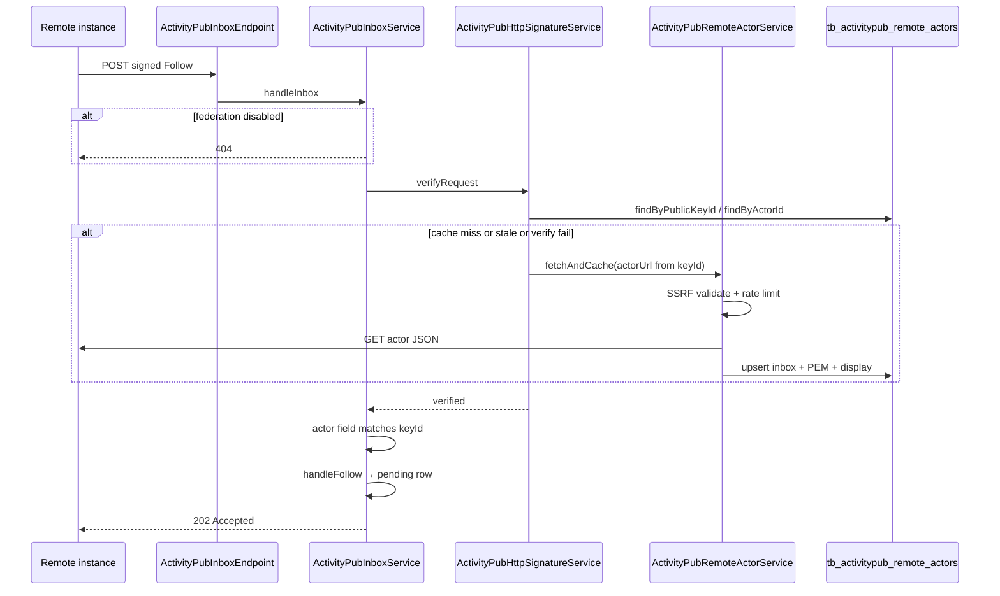

# ActivityPub Fediverse integration

**Feature version:** 1  
**Status:** done  
**Production:** live

## Changelog

### Production baseline — Fediverse integration — 2026-07-06

**Version:** 1  
**Status:** done

**Production:** live — deployed capability

**Description:** ActivityPub S2S federation so authors syndicate main-blog posts to Mastodon and compatible servers.

**Impact on other features:**

| Feature / area | Impact |
|----------------|--------|
| Publish / unpublish | Observers enqueue ActivityPub deliveries |
| Author appearance | New Fediverse section |
| Author profile | Optional `@handle` display |
| RSS / SEO | Same canonical URLs in Activity objects |
| Notifications | Optional future: Fediverse follow → in-app notification |
| Blog audience Follow | **Distinct** — in-app follow ≠ ActivityPub Follow |

## Summary

Enable **authors** to participate in the **Fediverse** via [ActivityPub](https://www.w3.org/TR/activitypub/) **server-to-server** federation: Mastodon (and compatible apps) users can **Follow** an author; **published posts** on the author's **main blog** appear as **Note/Article** activities in followers' timelines. Contraponto implements **actor**, **WebFinger**, **inbox**, **outbox**, and signed **delivery** — not a full Mastodon clone.

**Depends on (Accepted ADRs):**

- [ADR-0006](../docs/adr/0006-activitypub-federation.md) — S2S federation scope  
- [ADR-0007](../docs/adr/0007-activitypub-http-signatures.md) — HTTP Signatures  
- [ADR-0008](../docs/adr/0008-activitypub-actor-identity.md) — Actor identity & WebFinger

## Wireframe

| Field | Value |
|-------|-------|
| **Source** | ASCII below |
| **Last updated** | 2026-07-06 |


### Screen: Author appearance — Fediverse section

```
┌─ Fediverse (ActivityPub) ─────────────────────────────┐
│ [ ] Publish my main blog posts to the Fediverse       │
│                                                       │
│ Your handle: @alice@blog.example.com                  │
│ Actor URL: https://alice.blog.example.com/            │
│                                                       │
│ [ Regenerate keys ]  (destructive — confirm modal)    │
│                                                       │
│ Followers on the Fediverse: 42                        │
│ Pending follow requests: 3  [ Review ]                │
└───────────────────────────────────────────────────────┘
```

### Screen: Manage — Fediverse follow requests (modal or panel)

```
┌─ Fediverse follow requests ─────────────────────────────┐
│ @reader@mastodon.social                               │
│ [ Accept ]  [ Reject ]                                │
│ ─────────────────────────────────────────────────────│
│ @bot@pleroma.example                                  │
│ [ Accept ]  [ Reject ]                                │
└───────────────────────────────────────────────────────┘
```

### Screen: Author profile (public) — Fediverse badge

```
Alice Ferreira
@alice@blog.example.com  (copy handle)
[ Mastodon profile link if mastodonUrl set ]
```

### N/A

No change to post editor wireframe in MVP (publish triggers delivery automatically when opt-in enabled).

## Impact

| Area | Effect |
|------|--------|
| Bounded contexts | New **`activitypub`** under **Integration**; observes `post`, `user`, `blog` via events |
| Packages | `dev.vepo.contraponto.activitypub` |
| API / routes | `/.well-known/webfinger`, `/.well-known/host-meta`, `/{username}/inbox`, `/{username}/outbox`, actor JSON, followers collection, shared inbox POST |
| UI | Author appearance toggle; optional profile badge; follow-request review |
| Schema | `tb_activitypub_actors`, `tb_activitypub_remote_actors`, `tb_activitypub_follows`, `tb_activitypub_deliveries`, `tb_activitypub_inbox_activities` (names TBD in Architecture) |
| **`dev-import.sql`** | `alice` federation-enabled with key pair; sample remote follow |
| Tests | Unit (signature, JSON-LD), `@QuarkusTest` inbox/outbox, optional `@WebTest` for settings UI |
| Docs | domain-spec, feature-catalog, cdi-events, ARCHITECTURE § syndication, ADRs 0006–0008 |

### Risks

* **Spam follows** and inbox abuse — mitigate with signature verification + rate limits ([ADR-0007](../docs/adr/0007-activitypub-http-signatures.md)).
* **Delivery failures** to remote instances — retry queue; authors may not know unless we add dashboard later.
* **Key rotation** breaks remote caches — document regen as destructive.
* **Republish / slug change** — object ID stability (**AQ3**).
* **HTML vs plain text** in Note content — Mastodon sanitization limits (**FQ3**).

### Feature questions (FQ*n*)

| # | Question | Status | Answer |
|---|----------|--------|--------|
| FQ1 | Should **follow requests** require author **manual Accept** (Mastodon locked account model) or **auto-Accept** all verified Follow activities? | answered | **Manual Accept** — pending requests in appearance panel |
| FQ2 | Include **secondary blog** posts in the same actor outbox in MVP, or **main blog only**? | answered | **Main blog only** (ADR-0008) |
| FQ3 | Activity **content**: full sanitized HTML body, summary + link only, or title + link only? | answered | **title + link** |
| FQ4 | Show **public follower count** on profile / appearance panel? | answered | **yes** |
| FQ5 | Platform **admin** kill-switch to disable federation globally? | answered | **yes** |

**Gate:** phase 3 requires blocking **FQ*n*** answered or marked `not valid`.

### Architecture questions (AQ*n*)

| # | Question | Status | Answer |
|---|----------|--------|--------|
| AQ1 | Delivery: synchronous on `PostPublishedEvent` vs **async queue** worker? | answered | **Async queue** (DB table + scheduler) — avoid blocking publish transaction |
| AQ2 | Shared inbox URL pattern: per-actor inbox vs platform **sharedInbox**? | answered | **Per-actor inbox** on subdomain host per ADR-0008 |
| AQ3 | Activity **object id** for post: canonical post URL vs stable UUID path `/posts/{uuid}`? | answered | **stable object id** |
| AQ4 | Private key encryption: Quarkus **SmallRye JWT** secret vs dedicated `ACTIVITYPUB_KEY_ENCRYPTION_SECRET`? | answered | **yes** — dedicated `ACTIVITYPUB_KEY_ENCRYPTION_SECRET` |
| AQ5 | Mastodon **NodeInfo** / **FediWellKnown** endpoints for discovery? | answered | **NodeInfo 2.0** + `/.well-known/nodeinfo` JRD; public URLs rewritten to `/__activity_pub__/...` via `ActivityPubIngressFilter` |

## Architecture

### ADRs aplicáveis

| ADR | Status | Relevância |
|-----|--------|------------|
| [0002](../docs/adr/0002-backend-java-quarkus-jakarta-ee.md) | Accepted | JAX-RS JSON-LD endpoints |
| [0003](../docs/adr/0003-frontend-qute-htmx.md) | Accepted | Settings UI |
| [0005](../docs/adr/0005-postgresql-database.md) | Accepted | Queue + actor tables |
| [0006](../docs/adr/0006-activitypub-federation.md) | Accepted | S2S scope |
| [0007](../docs/adr/0007-activitypub-http-signatures.md) | Accepted | Signatures |
| [0008](../docs/adr/0008-activitypub-actor-identity.md) | Accepted | One **Person** per **User**; highlights/comments deferred |

### Design específico da feature

| Area | Design |
|------|--------|
| **Bounded context** | `activitypub` — Integration (may depend on: shared, user, blog, post, image) |
| **Layers** | `ActivityPubActorEndpoint`, `ActivityPubInboxEndpoint`, `ActivityPubWebFingerEndpoint` → `ActivityPubActorService`, `ActivityPubInboxService`, `ActivityPubDeliveryService` → `*Repository` |
| **Events** | `@Observes PostPublishedEvent` → enqueue Create; `@Observes PostUnpublishedEvent` → enqueue Delete; optional `ActivityPubFollowAcceptedEvent` internal |
| **Actor JSON** | ActivityStreams 2.0 + `publicKey`; served with `application/activity+json` |
| **Post object** | `type`: `Article`; content format = **title + canonical link** (FQ3); `published`, `updated`, `url`, `to`: `Public`, `cc`: followers collection |
| **Follow flow** | Inbound `Follow` → store pending → author Accept → `Accept` activity to remote + add to followers collection |
| **Delivery** | POST signed JSON to remote `inbox` from actor record; exponential backoff |
| **Paths** | `ActivityPubPaths` public URLs; `ActivityPubIngressFilter` rewrites to `/__activity_pub__/...` internal JAX-RS tree (see [rest-url-guide.md](../docs/rest-url-guide.md) §11) |
| **Manage auth** | Actor owner enables federation; **admin global kill-switch required** (FQ5=yes) |
| **Tests** | Signature verify/generate; inbox rejects unsigned; outbox paging; delivery job marks success/failure |

### Architecture questions (AQ*n*)

See table above.

### Screen: Author appearance — Fediverse section

```
┌─ Fediverse (ActivityPub) ─────────────────────────────┐
│ [ ] Publish my main blog posts to the Fediverse       │
│                                                       │
│ Your handle: @alice@blog.example.com                  │
│ Actor URL: https://alice.blog.example.com/            │
│                                                       │
│ [ Regenerate keys ]  (destructive — confirm modal)    │
│                                                       │
│ Followers on the Fediverse: 42                        │
│ Pending follow requests: 3  [ Review ]                │
└───────────────────────────────────────────────────────┘
```

### Screen: Manage — Fediverse follow requests (modal or panel)

```
┌─ Fediverse follow requests ─────────────────────────────┐
│ @reader@mastodon.social                               │
│ [ Accept ]  [ Reject ]                                │
│ ─────────────────────────────────────────────────────│
│ @bot@pleroma.example                                  │
│ [ Accept ]  [ Reject ]                                │
└───────────────────────────────────────────────────────┘
```

### Screen: Author profile (public) — Fediverse badge

```
Alice Ferreira
@alice@blog.example.com  (copy handle)
[ Mastodon profile link if mastodonUrl set ]
```

### N/A

No change to post editor wireframe in MVP (publish triggers delivery automatically when opt-in enabled).

## Impact

| Area | Effect |
|------|--------|
| Bounded contexts | New **`activitypub`** under **Integration**; observes `post`, `user`, `blog` via events |
| Packages | `dev.vepo.contraponto.activitypub` |
| API / routes | `/.well-known/webfinger`, `/.well-known/host-meta`, `/{username}/inbox`, `/{username}/outbox`, actor JSON, followers collection, shared inbox POST |
| UI | Author appearance toggle; optional profile badge; follow-request review |
| Schema | `tb_activitypub_actors`, `tb_activitypub_remote_actors`, `tb_activitypub_follows`, `tb_activitypub_deliveries`, `tb_activitypub_inbox_activities` (names TBD in Architecture) |
| **`dev-import.sql`** | `alice` federation-enabled with key pair; sample remote follow |
| Tests | Unit (signature, JSON-LD), `@QuarkusTest` inbox/outbox, optional `@WebTest` for settings UI |
| Docs | domain-spec, feature-catalog, cdi-events, ARCHITECTURE § syndication, ADRs 0006–0008 |

#### Feature checklist

| ID | Criterion | Source | Done |
|----|-----------|--------|------|
| FC1 | WebFinger resolves `@user@domain` to actor | ADR-0008 | ☑ |
| FC2 | Actor JSON valid; inbox/outbox URLs work | ADR-0006 | ☑ |
| FC3 | Mastodon Follow → Accept → follower receives Create on publish | FQ1 | ☑ |
| FC4 | Unpublish sends Delete (or Update tombstone) | ADR-0006 | ☑ |
| FC5 | Unsigned inbox POST rejected in prod | ADR-0007 | ☑ |
| FC6 | Author opt-in off → actor 404 | ADR-0008 | ☑ |
| FC7 | Appearance UI matches wireframe | Wireframe | ☑ |
| FCdev | `alice` federation-enabled in dev-import | dev-import | ☑ |
| FC8 | domain-spec + cdi-events + feature-catalog updated | Docs | ☑ |

#### Tasks (phase 4 — approved)

| ID | Task | Done |
|----|------|------|
| T1 | Flyway: activitypub tables (actor, keys, follows, deliveries, inbox log) | ☑ |
| T2 | `ActivityPubActor` entity + repository + key generation | ☑ |
| T3 | Actor JSON + WebFinger + host-meta endpoints | ☑ |
| T4 | HTTP Signatures: sign outbound + verify inbound | ☑ |
| T5 | Inbox: Follow / Undo / Accept / Reject handling | ☑ |
| T6 | Outbox: paged OrderedCollection; object endpoints for posts | ☑ |
| T7 | `ActivityPubDeliveryService` + scheduler retry | ☑ |
| T8 | Observers: PostPublished / PostUnpublished → queue | ☑ |
| T9 | Map post → Note/Article JSON-LD | ☑ |
| T10 | Author appearance: enable toggle + handle display + HTMX save | ☑ |
| T11 | Follow-request review UI (if FQ1 = manual Accept) | ☑ |
| T12 | ArchUnit: activitypub dependency rules | ☑ |
| T13 | Admin global ActivityPub kill-switch (config + admin UI/guardrails) | ☑ |
| Tdev | dev-import.sql: alice actor + sample follow | ☑ |

**Development approval:** approved 2026-07-06 — tasks: T1, T2, T3, T4, T5, T6, T7, T8, T9, T10, T11, T12; approved 2026-07-07 — task: T13

#### Test coverage (phase 5)

| ID | Test | Covers | Done |
|----|------|--------|------|
| TC1 | `ActivityPubSignatureTest` round-trip | T4 | ☑ |
| TC2 | `ActivityPubInboxEndpointTest` rejects unsigned Follow | T4, T5 | ☑ |
| TC3 | `ActivityPubWebFingerTest` acct resolution | T3 | ☑ |
| TC4 | `ActivityPubDeliveryServiceTest` enqueues on publish event | T7, T8 | ☑ |
| TC5 | `ActivityPubOutboxTest` Create appears after publish | T6, T9 | ☑ |
| TC6 | `ActivityPubWebTest` appearance toggle | T10 | ☑ |
| TC7 | `BoundedContextRulesTest` includes activitypub | T12 | ☑ |
| TC8 | `ActivityPubInboxFollowTest` signed Follow → Accept → Create delivery | T5, T7, T8 | ☑ |
| TC9 | `ActivityPubDeliveryServiceTest` Delete on unpublish | T8 | ☑ |

**Implementation notes:** Package `dev.vepo.contraponto.activitypub` (33 classes). Actor/post JSON via `ActivityPubJsonResourceFilter` + `ActivityPubJsonResponder` (`Accept: application/activity+json`) on canonical HTML paths. Manual follow Accept (FQ1). Main-blog-only outbox (FQ2). Title + link in Create activities (FQ3). Admin global kill-switch on Platform insights (FQ5/T13). Alice federation seeded in `%dev` via `ActivityPubDevSeed` + `dev-import.sql`. Config: `contraponto.activitypub.enabled` (`%dev`/`%test` true). Automated: signature, WebFinger, inbox (unsigned reject + signed follow→accept→Create), outbox/actor JSON, delivery publish/unpublish, appearance WebTest, ArchUnit. **Manual:** Mastodon interop checklist below.

---

## Mastodon interop checklist (manual)

See **[docs/mastodon-remote-account-resolution.md](../docs/mastodon-remote-account-resolution.md)** for the full Mastodon resolve flow, production smoke commands, and gap analysis.

After implementation, verify against a test Mastodon instance:

1. **While logged in**, search `@vepo@commit-mestre.dev` (not profile URL alone) → profile loads.
2. Follow → Accept (if manual) → follow shows **Following**.
3. Publish post on Contraponto → appears in Mastodon home timeline with link.
4. Unpublish → post removed or marked deleted on Mastodon (best-effort).
5. [test.activitypub.rocks](https://test.activitypub.rocks/) suite where applicable.

**If search returns 0 accounts:** check ursal.zone domain blocks, Sidekiq logs, and remove `sameAs` Mastodon URL from Contraponto profile when `@vepo` exists locally on ursal.zone.

### Fediverse follow backfill and outbox paging — 2026-07-07

**Version:** 1.1  
**Status:** done

**Description:** When an author accepts a Fediverse follow, deliver historical main-blog **Create** activities to the new follower; expose standard outbox collection paging links.

**Impact on other features:**

| Feature / area | Impact |
|----------------|--------|
| Fediverse follow Accept | Enqueues historical **Create** deliveries (oldest first) |
| Outbox GET | Main-blog-only query; `first`/`last`/`next`/`prev` when paginated |

#### Feature checklist

| ID | Criterion | Done |
|----|-----------|------|
| FC9 | Accept follow backfills published main-blog posts to remote inbox | ☑ |
| FC10 | Outbox exposes paging links across multiple pages | ☑ |

#### Tasks

| ID | Task | Done |
|----|------|------|
| T14 | `enqueueHistoricalPostsForAcceptedFollow` on follow Accept | ☑ |
| T15 | Main-blog outbox query + pagination links | ☑ |
| T16 | Tests for backfill and outbox paging | ☑ |

**Development approval:** approved 2026-07-07 — tasks: T14, T15, T16

#### Test coverage

| ID | Test | Covers | Done |
|----|------|--------|------|
| TC10 | `ActivityPubInboxFollowTest.acceptFollowBackfillsHistoricalMainBlogPosts` | T14 | ☑ |
| TC11 | `ActivityPubDeliveryServiceTest.enqueueHistoricalPostsForAcceptedFollow` | T14 | ☑ |
| TC12 | `ActivityPubOutboxTest.outboxExposesPaginationLinksAcrossPages` | T15 | ☑ |

**Implementation notes:** Backfill runs after **Accept** delivery is queued; uses existing async delivery queue. Outbox page size remains 20; page 2+ uses `OrderedCollectionPage` with `partOf`.

---

### Remote actor fetch for inbox signatures — 2026-07-07

**Version:** 1.2  
**Status:** done

**Development approval:** approved 2026-07-07 — tasks: T17–Tdev

**Summary:** [ADR-0007](../docs/adr/0007-activitypub-http-signatures.md) requires remote `publicKey` lookup from the actor document and cache — but production verifies signatures **before** `ActivityPubInboxService.handleFollow` runs, and `resolvePublicKey()` only reads `tb_activitypub_remote_actors` rows that already have PEM material. First contact from a new instance (e.g. Mastodon **ursal.zone** signing with `keyId=https://ursal.zone/users/vepo#main-key`) therefore returns **401** even though discovery and outbound delivery work. v1.2 closes the gap: on cache miss, **fetch the remote actor JSON**, validate the URL, persist `inbox` + `publicKey`, then verify — without weakening the signature gate or accepting unsigned POSTs in production.

**Production symptom:** `ActivityPubHttpSignatureService.resolvePublicKey()` returns `null` → log `No public key found for keyId=…` → `NotAuthorizedException` **before** `handleFollow` creates or updates the remote row. Tests pass because `ActivityPubInboxFollowTest` pre-seeds remote actors with keys; real Mastodon first Follow does not.

**Root cause (ordering):** verify → parse activity → `handleFollow` → `remoteActorRepository.create(actorUrl, actorUrl)` without keys. ADR-0007 assumption (“fetched from actor document and cached”) was never wired into the verify path.

**Impact on other features:**

| Feature / area | Impact |
|----------------|--------|
| **Inbox Follow / Undo / Accept / Reject** | First signed POST from a new remote actor succeeds; pending follow row created; **Accept** can enqueue **Create** deliveries to the real remote `inbox` (today `handleFollow` may persist `inbox_url = actor_id` until fetch) |
| **Follow-request review UI** | Requests appear only after verify + `handleFollow`; **FQ7** decides whether rows show actor URL only or fetched display name |
| **Outbound delivery queue** | Correct `inbox_url` on first contact improves **Accept** / **Create** / backfill (v1.1) delivery targets |
| **Notifications** | No new notification type in v1.2; fix **unblocks** the manual-review path authors expect after Mastodon Follow (future “Fediverse follow request” in-app alert remains optional per baseline changelog) |
| **Blog audience Follow** | **Unchanged** — in-app blog follow ≠ ActivityPub Follow |
| **Platform admin kill-switch** | `contraponto.activitypub.enabled=false` should reject inbox before outbound fetch (cheap gate) |
| **Author Fediverse opt-out** | Actor 404 / disabled federation unchanged; fetch must not run for rejected actors |
| **Rate limiting / abuse** | ADR-0007 calls for per-IP + per-actor limits; v1.2 adds **outbound GET** on first contact — cap per domain/IP to limit SSRF/fetch-storm abuse (**FQ6**, **FC14**) |
| **Security / SSRF** | Actor URL derived from `keyId` must pass HTTPS + blocked-host rules (reuse pattern from `GitRemoteUrlValidator` — **AQ10**) |
| **`tb_activitypub_remote_actors`** | Rows gain populated `inbox_url`, `public_key_pem`, `public_key_id`, `profile_fetched_at`; optional display fields if **FQ9** |
| **Search / SEO / RSS** | No reader-surface change |
| **Messaging / comments** | No change |
| **`dev-import.sql`** | Seed already includes pre-fetched remote keys; add **pending** follow without keys for manual dev repro, or integration test-only path (**FCdev**) |
| **Docs** | [mastodon-remote-account-resolution.md](../docs/mastodon-remote-account-resolution.md) gap “inbound signature verify” — update after ship |

### Risks

* **SSRF** — `keyId` embeds an HTTPS actor URI; must reject non-HTTPS, localhost, RFC1918, link-local, and metadata endpoints before `GET` (**FC14**).
* **Fetch storms** — burst of signed Follow spam from many domains → many outbound GETs; mitigate with per-domain rate limit + DB cache (**FQ8**).
* **Stale keys** — remote key rotation leaves cached PEM invalid until refresh (**AQ6**, **FQ8**).
* **Inbox latency** — synchronous fetch inside verify blocks the Mastodon delivery worker; hard timeout required (**AQ7**); remote may retry on 5xx (**FQ10**).
* **KeyId / actor mismatch** — signature `keyId` must resolve to PEM that verifies the POST; malicious `keyId` pointing at a victim actor is a known federation concern — fetch must not trust Activity `actor` over verified `keyId` binding (**AQ11**).
* **Display metadata** — storing `icon` URL without hotlinking in UI avoids CSP/privacy leaks (**FQ7**, **FQ9**).
* **Regression** — existing tests that seed keys must remain green; add test where **no** pre-seeded remote row exists (**FC11**).

### Wireframe (v1.2)

| Field | Value |
|-------|-------|
| **Source** | ASCII below (updated per **FQ7** answer) |
| **Last updated** | 2026-07-07 |

**Fediverse follow requests** — each pending row shows fetched display metadata (**FQ7**): display name, derived `@user@domain` handle, and actor HTTPS link. **No remote avatar** in v1.2 (**FQ9**).

```
┌─ Fediverse follow requests ─────────────────────────────┐
│ Vepo                                                    │
│ @vepo@ursal.zone                                        │
│ https://ursal.zone/users/vepo                           │
│ [ Accept ]  [ Reject ]                                  │
└─────────────────────────────────────────────────────────┘
```

### Feature questions (FQ*n*)

| # | Question | Blocking? | Status | Answer |
|---|----------|-----------|--------|--------|
| FQ6 | When actor fetch fails (404, timeout, TLS, invalid JSON, missing `publicKey`), reject inbox POST with **401** only, or also structured **warn** logs / metrics for ops (no user-facing detail)? | **blocking** | answered | **401 only** to caller (same as invalid signature). **Warn** log with `keyId`, host, failure class; no admin UI in v1.2. Micrometer counter deferred. |
| FQ7 | Should authors see **remote follower display name / acct handle** in follow-request review after fetch, or **actor URL only** (current)? | **blocking** | answered | Show **display name** (`name` or `preferredUsername` fallback) + **derived handle** `@user@domain` when parseable; keep actor HTTPS link. **No avatar** in v1.2. |
| FQ8 | Refetch remote actor on every unknown `keyId`, or only when missing/stale? If stale, max age? | **blocking** | answered | Fetch when no row or row lacks `publicKeyPem`; on verify miss with existing row, **refetch**. Refresh if `profileFetchedAt` older than **7 days**. |
| FQ9 | Persist **display fields** (`name`, `preferredUsername`, `icon` URL) on `ActivityPubRemoteActor` in v1.2, or **keys + inbox only**? | **blocking** | answered | Persist **display name** + **preferred username** (nullable) for follow-request UI. **Do not** persist `icon` in v1.2. Inbox + keys mandatory. |
| FQ10 | On actor fetch failure, always **401**, or **503** for timeout/upstream errors so Mastodon retries? | **blocking** | answered | **401 for all** verify failures in v1.2 (ADR-0007). Mastodon retries Follow on its schedule; 503 deferred unless interop shows lost follows. |
| FQ11 | After first verified Follow, send **in-app notification** (“Fediverse follow request”) to the author? | informational | answered | **Defer** — manual review panel sufficient for v1.2. |
| FQ12 | Should platform admin **Platform insights** show federation fetch failures / rate-limit hits? | informational | answered | **Defer** — logs first; dashboard widget v1.3+. |

**Gate:** phase 3 — **FQ6–FQ10** answered (2026-07-07, PO recommendations accepted).

### Architecture questions (AQ*n*)

| # | Question | Status | Answer |
|---|----------|--------|--------|
| AQ6 | Key rotation: refetch when `publicKeyId` lookup fails but actor row exists with old PEM? | answered | **Yes** — verify path: use cached PEM when `profileFetchedAt` within **7 days**; on **signature verify failure** OR missing PEM OR stale row → **one** synchronous refetch + single retry. No background refresh in v1.2. Aligns with PO **FQ8**. |
| AQ7 | Synchronous fetch inside `verifyRequest` vs short-lived cache + background refresh? | answered | **Synchronous fetch on cache miss/stale/failed verify** inside `resolvePublicKey` (called from `verifyRequest`). Inbox must not accept POST until PEM is available or fetch fails → **401**. Background refresh deferred — Mastodon retries Follow on its own schedule (**FQ10** PO default). |
| AQ8 | Outbound actor GET: unsigned only, or sign with local actor key (Mastodon authorized fetch)? | answered | **Unsigned GET** with `Accept: application/activity+json` and standard `User-Agent`. Matches Mastodon public actor interop ([mastodon-remote-account-resolution.md](../docs/mastodon-remote-account-resolution.md) §3.3). Authorized fetch (M6) deferred. |
| AQ9 | New `ActivityPubRemoteActorService` vs extend `ActivityPubHttpSignatureService`? | answered | **`ActivityPubRemoteActorService`** owns fetch, parse, cache upsert, rate limit, and URL validation. `ActivityPubHttpSignatureService.resolvePublicKey` delegates on cache miss; keeps signature canonicalization separate from HTTP client concerns. |
| AQ10 | Reuse / extract `GitRemoteUrlValidator` host blocking for actor fetch URLs? | answered | **Extract** `shared.security.OutboundHttpsUrlValidator`; `GitRemoteUrlValidator` delegates (no behaviour change). `ActivityPubRemoteActorService` uses same validator before `HttpClient` GET. Transversal rules in [ADR-0015](../docs/adr/0015-federation-outbound-fetch-ssrf.md) (**Accepted**). |
| AQ11 | Bind verify to `keyId` actor document only, or cross-check Activity JSON `actor` field matches `keyId` base URI? | answered | **Both** — PEM resolution trusts **only** `Signature` `keyId` (strip fragment → actor URL). After verify succeeds, `handleInbox` **rejects** Follow/Undo when activity `actor` URI (no fragment) ≠ actor URL derived from `keyId`. Prevents signed POST with mismatched actor attribution. |
| AQ12 | Actor fetch timeout budget (connect vs request)? | answered | **Connect 5s**, **request 10s** (`java.net.http.HttpClient` — separate from delivery POST 30s). Fail → warn log + **401**. Config: `contraponto.activitypub.fetch.connect-timeout`, `contraponto.activitypub.fetch.request-timeout`. |
| AQ13 | Per-domain fetch rate limit default? | answered | **30 GET / domain / minute** in-memory sliding window (`ActivityPubFetchRateLimiter`). Over limit → skip fetch, warn log, **401**. Config: `contraponto.activitypub.fetch.max-per-domain-per-minute`. Inbox POST rate limit (ADR-0007 per-IP) unchanged — separate follow-up if ops needs it. |

**FQ answers locked (2026-07-07):** architecture aligns with accepted PO recommendations — **401** on all verify/fetch failures (**FQ6**, **FQ10**); **7-day** profile cache (**FQ8**); display name + handle in follow-request UI, no avatar (**FQ7**, **FQ9**); **T23-htmx** required for **FC18**.

#### Feature checklist

| ID | Criterion | Source | Done |
|----|-----------|--------|------|
| FC11 | Signed inbox POST from **unknown** remote actor verifies after on-demand actor fetch (no pre-seeded PEM) | ADR-0007 | ☑ |
| FC12 | Remote actor row stores **inbox URL** + **public key** (+ `publicKeyId`) from fetched document | ADR-0006 | ☑ |
| FC13 | Invalid/unreachable actor URL or fetch failure rejects POST — **no unsigned bypass** in prod | FQ6, FQ10 | ☑ |
| FC14 | Actor URL from `keyId` validated (HTTPS, blocked hosts) before outbound GET | ADR-0007 | ☑ |
| FC15 | `handleFollow` no longer leaves `inbox_url = actor_id` when fetch has populated real inbox | v1.1 delivery | ☑ |
| FC16 | Mastodon-style `keyId` fragment (`#main-key`) resolves after fetch | Production ursal.zone | ☑ |
| FC17 | Federation disabled (platform or author) rejects inbox before actor fetch | FQ5 kill-switch | ☑ |
| FC18 | Follow-request UI shows display name + derived `@handle` + actor link (no avatar) | FQ7, FQ9 | ☑ |
| FCdev | dev-import or `%dev` docs: reproducible path for pending follow / fetch (seeded keys documented as test shortcut) | dev-import | ☑ |

#### Tasks

| ID | Layer | Depends | Expected outcome | Tests | Done |
|----|-------|---------|------------------|-------|------|
| T17-java | java | — | Flyway: `display_name`, `preferred_username` on `tb_activitypub_remote_actors` (nullable) | TC13 | ☑ |
| T18-java | java | — | `OutboundHttpsUrlValidator` in `shared.security`; `GitRemoteUrlValidator` delegates | TC14 | ☑ |
| T19-java | java | T18 | `ActivityPubRemoteActorService`: validate URL, rate limit, unsigned GET, parse `inbox` + `publicKey` + display fields; upsert row | TC15, TC16 | ☑ |
| T20-java | java | T19 | `ActivityPubHttpSignatureService.resolvePublicKey`: cache → fetch on miss/stale/failed verify; `#fragment` strip | TC15, TC17 | ☑ |
| T21-java | java | T20 | `ActivityPubInboxService`: kill-switch before fetch; post-verify `actor` vs `keyId` binding; `handleFollow` uses fetched row (no `inbox_url = actor_id` stub) | TC15, TC18 | ☑ |
| T22-java | java | T19 | `ActivityPubFetchRateLimiter` + config properties | TC19 | ☑ |
| T23-htmx | htmx | T17, T21 | Follow-request row: display name + derived `@handle` + actor link (**FQ7**); update `panel.html` + `ActivityPubFollowRequestsFragment` + `ActivityPubFederationView` | TC20 | ☑ |
| Tdev | dev | T21 | `dev-import.sql`: comment that pre-seeded remote keys are test shortcut; optional pending follow without PEM for manual repro | FCdev | ☑ |

#### Test coverage

| ID | Kind | Covers | Scenario | Done |
|----|------|--------|----------|------|
| TC13 | unit / migration | T17 | Entity maps new columns; Flyway applies cleanly | ☑ |
| TC14 | unit | T18 | Blocked hosts rejected; valid public HTTPS passes; Git validator regression | ☑ |
| TC15 | quarkus | T19, T20, T21 | Signed Follow with **no** pre-seeded remote row → mock actor GET → 202 + pending follow + row has inbox + PEM | ☑ |
| TC16 | unit | T19 | Parse Mastodon-style actor JSON (`#main-key`, `preferredUsername`, `inbox`) | ☑ |
| TC17 | unit | T20 | `keyId` with fragment resolves; stale row triggers refetch | ☑ |
| TC18 | quarkus | T21 | Mismatched activity `actor` vs `keyId` → 401; `enabled=false` → 404 before fetch | ☑ |
| TC19 | unit | T22 | Per-domain rate limit blocks excess fetches | ☑ |
| TC20 | web | T23 | Appearance panel shows name + handle for pending request | ☑ |

**Implementation notes:** [ADR-0015](../docs/adr/0015-federation-outbound-fetch-ssrf.md) accepted 2026-07-07. `ActivityPubRemoteActorService` fetches on cache miss inside `verifyRequest`; one forced refetch retry on signature failure. `%test` uses `contraponto.activitypub.fetch.trust-all-tls=true` and `contraponto.security.outbound-test-allowed-hosts=127.0.0.1` for embedded HTTPS actor server in `ActivityPubInboxFollowFetchTest`. Config: `contraponto.activitypub.fetch.*` (connect/request timeout, profile max age 7d, 30 GET/domain/min).

## Architecture

### ADRs aplicáveis

| ADR | Status | Relevância |
|-----|--------|------------|
| [0006](../docs/adr/0006-activitypub-federation.md) | Accepted | S2S inbox/outbox; remote actor cache |
| [0007](../docs/adr/0007-activitypub-http-signatures.md) | Accepted | Verify before parse; fetch+cache `publicKey` on miss |
| [0008](../docs/adr/0008-activitypub-actor-identity.md) | Accepted | Per-actor inbox URL; one Person per User |
| [0015](../docs/adr/0015-federation-outbound-fetch-ssrf.md) | **Accepted** | SSRF host blocking + per-domain fetch rate limit |

### Bounded contexts

| Context | Role in v1.2 |
|---------|----------------|
| **`activitypub`** (Integration) | `ActivityPubRemoteActorService`, fetch rate limiter, signature resolve hook, inbox actor binding, follow-request display fields |
| **`shared.security`** | `OutboundHttpsUrlValidator` (extracted SSRF rules) |
| **`git`** | `GitRemoteUrlValidator` delegates to shared validator — no new Git behaviour |

No cross-context CDI events — fetch is synchronous inside inbox verify transaction boundary.

### Packages / layers

```
ActivityPubInboxEndpoint
  → ActivityPubInboxService.handleInbox
       → settings.enabled() gate (404)                    [FC17]
       → actorService.findEnabledByUsername (404)
       → verifySignature
            → ActivityPubHttpSignatureService.verifyRequest
                 → resolvePublicKey(keyId)
                      → remoteActorRepository (by publicKeyId / actorId)
                      → ActivityPubRemoteActorService.fetchAndCache(actorUrl)  [cache miss / stale / verify retry]
       → parse JSON; assertActorMatchesKeyId (Follow/Undo)   [AQ11]
       → handleFollow / handleUndo (remote row already populated)

ActivityPubRemoteActorService
  → OutboundHttpsUrlValidator.validate(actorUrl)
  → ActivityPubFetchRateLimiter.check(domain)
  → HttpClient GET (unsigned, Accept: activity+json)
  → parse actor JSON → upsert ActivityPubRemoteActor

ActivityPubAppearanceService / ActivityPubFollowRequestsFragment  [T23-htmx if FQ7]
  → read display_name + derived acct from remote actor row
```

**Forbidden:** `handleFollow` creating `new ActivityPubRemoteActor(actorUrl, actorUrl)` when fetch already ran — use `findByActorId` only; `orElseThrow` or no-op if row missing (should not happen after verify).

### Request flow (inbox first contact)



### Routes / templates

| Route | Change |
|-------|--------|
| `POST /{username}/inbox` | No path change — behaviour: fetch-on-miss inside verify |
| `POST /forms/writing/activitypub/follows/{id}/accept\|reject` | Unchanged; fragment re-render shows display name + handle (**FQ7**) |
| Author appearance `panel.html` `#activitypubFollowRequests` | Row markup: display name, `@handle`, actor link (**T23-htmx**) |

No new routes. No `htmx-events.md` §2 allowlist rows — federation inbox is not HTMX.

### Schema / persistence

**Flyway** (incremental, e.g. `V0.0.x__activitypub_remote_actor_profile.sql`):

| Column | Type | Notes |
|--------|------|-------|
| `display_name` | `VARCHAR(512)` NULL | Actor `name` from JSON (**FQ9**) |
| `preferred_username` | `VARCHAR(255)` NULL | Actor `preferredUsername`; used to derive `@user@domain` |

Existing columns used: `actor_id`, `inbox_url`, `public_key_pem`, `public_key_id`, `profile_fetched_at`.

**`ActivityPubRemoteActor`** — add fields + `updateFromFetchedProfile(...)` intent method (inbox, pem, keyId, displayName, preferredUsername, fetchedAt).

**Repository** — `save` / upsert by `actor_id`; lookup by `public_key_id` and `actor_id` (unchanged).

No new tables.

### Configuration

| Property | Default | Purpose |
|----------|---------|---------|
| `contraponto.activitypub.fetch.connect-timeout` | `5s` | HTTP connect (**AQ12**) |
| `contraponto.activitypub.fetch.request-timeout` | `10s` | Full actor GET |
| `contraponto.activitypub.fetch.max-per-domain-per-minute` | `30` | Fetch storm cap (**AQ13**) |
| `contraponto.activitypub.fetch.profile-max-age-days` | `7` | Stale cache threshold (**FQ8**) |

### CDI events

**None** — v1.2 is inline in verify path. Delivery queue unchanged.

### `docs/htmx-events.md` delta

**No change** — no new custom events, auth refresh, or JS lifecycle coupling. Follow-request UI continues inline/OOB re-render via `hx-target="#activitypubFollowRequests"` `innerHTML` on accept/reject (existing pattern §1 priority 1).

### HTMX component model

| Component id | Fragment route | Activator | Request | Swap scope | Events out | Events in | JS | Auth allowlist |
|--------------|----------------|-----------|---------|------------|------------|-----------|-----|----------------|
| `#activitypubFollowRequests` | Inline in `AuthorAppearanceEndpoint/panel.html`; partial from `ActivityPubFollowManageEndpoint` accept/reject | Page load (panel); Accept/Reject buttons | `POST /forms/writing/activitypub/follows/{id}/accept\|reject` | `hx-target="#activitypubFollowRequests"` `innerHTML` | none | none | none | No |

Row markup (server-rendered — no remote `icon` hotlink per **FQ9**):

```
displayName (or preferredUsername fallback)
@preferredUsername@domain (derived)
<a href="{actorId}">{actorId}</a>
[Accept] [Reject]
```

### Tests

| Area | Tests |
|------|-------|
| SSRF validator | `OutboundHttpsUrlValidatorTest`; `GitRemoteUrlValidatorTest` regression |
| Fetch + verify | `ActivityPubRemoteActorServiceTest`; extend `ActivityPubInboxFollowTest` with WireMock actor (no `seedRemoteActorWithKeys`) |
| Signature | `ActivityPubSignatureTest` — keyId fragment strip |
| Security | Fetch failure → 401; kill-switch → 404 before HTTP client |
| UI | `ActivityPubWebTest` pending row copy (**TC20**) |
| Arch | `BoundedContextRulesTest` — `activitypub` may depend on `shared.security`; `shared` must not depend on `activitypub` |

### Domain specification (updated 2026-07-07)

| Term | Meaning |
|------|---------|
| **Fediverse remote actor** | Cached record of a remote ActivityPub **Person**: `actor_id`, `inbox_url`, `public_key_pem`, `public_key_id`, optional **display name** and **preferred username**, `profile_fetched_at`. |
| **Remote actor profile fetch** | On-demand HTTPS GET of the actor JSON document to resolve `publicKey` and `inbox` for inbound signature verification (ADR-0007). |
| **Fediverse remote handle** | Human-readable `@user@domain` derived from `preferredUsername` + actor host (shown in follow-request review UI). |

### Implementation notes (architecture)

* Reuse `java.net.http.HttpClient` pattern from `ActivityPubDeliveryService` — separate instance or shared bean with fetch-specific timeouts.
* Actor JSON parse: read `publicKey.id`, `publicKey.publicKeyPem` (or `publicKey` object per AS2), `inbox` (string or array first element), `name`, `preferredUsername`.
* `keyId` normalization: `URI.create(keyId).getScheme() != null` → strip fragment via `URI#resolve` or manual split on `#`.
* **FQ7/FQ9 locked:** **T23-htmx** implements display name + handle row; no `icon` persistence or hotlink.

---

## References

* [Mastodon remote account resolution](../docs/mastodon-remote-account-resolution.md)
* [W3C ActivityPub Recommendation](https://www.w3.org/TR/activitypub/)
* [ActivityStreams 2.0](https://www.w3.org/TR/activitystreams-core/)
* Mastodon ActivityPub documentation (implementers' notes)
