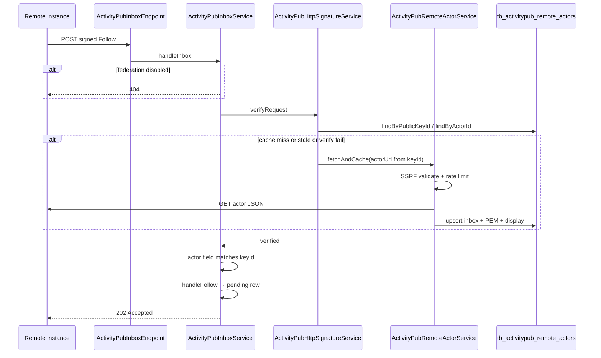

# ActivityPub Fediverse integration

**Feature version:** 1  
**Status:** done  
**Production:** live

## Changelog

### Mastodon-like author timeline (remote profile statuses) — 2026-07-08

**Version:** 1.4  
**Status:** review-ready

**Description:** Make a Contraponto author **look like a Mastodon user** when another Fediverse user opens **that author's timeline**: remote **profile / statuses** and the follower's **home** timeline after Follow/Accept are both success surfaces (**FQ13**). The archive is **all** published posts with no recent-N cap (**FQ14**), including **secondary-blog** posts with a **different** Create content template that points at the secondary blog (**FQ17** — reopens FQ2 / ADR-0008 MVP main-only). Each Create must carry top-level activity `published` = publication date (**FQ15**). **Outbox crawl shape and Accept/re-Follow inbox backfill must match** for membership, ids, dates, and ordering (**FQ16**). Archive / outbox / backfill are ordered primarily by **publication date**, **interleaving** main and secondary posts by `publishedAt` (**FQ23**). **`attributedTo`** is the **same Person** for every blog (**FQ22** — ADR-0008 one Person per User; no per-blog actor). Live secondary-blog publish **enqueues Create immediately** when Fediverse opt-in is on, same as main (**FQ24**). Opt-in / appearance **covers all blogs** under that one control — not silent secondary, not a separate per-blog toggle in v1.4 (**FQ25**). Secondary Create **content** = **title + blog name + canonical post link** (**FQ20**); secondary object **`id`/`url`/content link** = platform secondary post path `/{username}/{blogSlug}/post/{slug}` via existing `PostPaths` / `ActivityPubPaths.postObjectId` rules (**FQ21**). User approved **reopen ADR-0008** to amend outbox/syndication scope for multi-blog on one Person (**FQ26**); user then **re-accepted** ADR-0008 (`Aceito o ADR-0008`, 2026-07-08) — phase 3 gate unblocked. Today actor, paged outbox, and Accept backfill exist (v1.1) but are main-blog / date-semantics / multi-blog incomplete relative to these answers. **Ops dependency:** production **FAILED** outbound Creates (historically HTTP **401** signature/`Date`/`Host`, addressed in v1.3) must be re-queued successfully before remotes show history.

**Domain model:** updated 2026-07-08 (phase 1b). Ubiquitous Language (ActivityPub) amended in [`docs/domain-specification.md`](../docs/domain-specification.md): dropped MVP **main-blog-only** outbox/syndication; **multi-blog** Creates on **one Person** (`attributedTo` same); archive/outbox/backfill ordered by **`publishedAt`** (interleaved); **Fediverse Create content** (main = title + canonical post link per FQ3; secondary = title + blog name + canonical post link); **Fediverse post object URL** documents main `/{username}/post/{slug}` and secondary `/{username}/{blogSlug}/post/{slug}`; **Fediverse opt-in** = one control for **all blogs**; **Fediverse author timeline** = remote profile/statuses **and** follower home; Create top-level **`published`**; unfollow → **REJECTED**, re-Follow reopens (retained). Business rules **32–35** added. UI label: Fediverse opt-in copy → all blogs. Boundedness: Integration (`activitypub`); no new packages.

**Architecture (phase 2):** 2026-07-08 — see **Architecture (v1.4)** below. **ADR-0008** amended (multi-blog outbox/syndication) and **Accepted** again by user 2026-07-08. **ADR-0006** Accepted MVP table still says “main blog posts in outbox” — drift tracked as **AQ27** (editorial reopen optional; **0008** governs outbox membership).

**Task break (phase 3):** 2026-07-08 — Tasks **T24-java** … **T30-htmx**, **Tdev**; Test coverage **TC21–TC29**. Status **`tasks-ready`**. **Stop for Development approval (phase 4)** — no production/test code until user approves task IDs.

**Development (phase 5):** 2026-07-08 — Java/HTMX/`Tdev` implementation in progress under **Development approval**. Status **`in-progress`**.

**Impact review (2026-07-08, Architect):** Verified code gaps: outbox/backfill/live fan-out/activity fetch are **main-blog-only**; Create lacks top-level `published`; `content` still embeds post description (align FQ3/FQ20); appearance i18n says main blog. Locked product answers unchanged. Opened **AQ27–AQ29**; answered **AQ28**, **AQ29**. **FQ18** / **FQ19** remain informational open.

**Impact on other features:**

| Feature / area | Impact |
|----------------|--------|
| ActivityPub outbox (v1.1) | Must list **full** archive (main **+ secondary**) ordered primarily by **`publishedAt`** (interleaved across blogs, **FQ23**), with correct activity `published`, stable ids (`/{username}/{blogSlug}/post/{slug}` for secondary, **FQ21**), and paging so crawlers match inbox backfill (**FQ14**, **FQ16**, **FQ17**) |
| Fediverse follow backfill (v1.1) | Deliver **all** published posts in that interleaved archive to new followers (no recent-N); same order rule as outbox; activity top-level `published`; secondary content = **title + blog name + post link** (**FQ14**, **FQ15**, **FQ17**, **FQ20**, **FQ23**) |
| Publish / unpublish observers | **Live Create** on secondary publish when opt-in on (**FQ24**), same path as main; Deletes/unpublish for secondary expected to mirror main (Architect — no extra FQ) |
| ActivityPub delivery queue / ops | Full-history + secondary + live secondary publish multiplies volume; FAILED historical Creates still block visible remote history; re-queue / monitoring after v1.3 |
| Actor identity / ADR-0008 | **FQ22** locks **same Person** `attributedTo` for all blogs (no per-blog actor). **FQ26:** ADR-0008 reopened, amended, and **re-Accepted** 2026-07-08 (outbox/syndication = multi-blog Creates on one Person) |
| Secondary blogs / FQ2 | **Scope expansion** — FQ2 “main only” superseded for v1.4 by FQ17 + FQ20–FQ26; content/URL/ADR path now locked |
| Multi-blog URLs / `PostPaths` | Secondary Create `id`/`url`/content link = platform `/{username}/{blogSlug}/post/{slug}` (**FQ21**) via `PostPaths` / `ActivityPubPaths.postObjectId` — align with RSS/SEO platform forms (not blog-subdomain-only) |
| Blog audience Follow (in-app) | No change — distinct from Fediverse Follow |
| Contraponto UI (appearance, follow requests) | Still primarily S2S; **FQ25** requires opt-in label/copy to say **all blogs** (not “main blog”); **FQ19** may still add optional history/timeline help under that control |
| RSS / SEO | Same platform canonical post URLs in Activity objects as HTML public URLs (secondary includes `blogSlug` segment); no reader HTML chrome change expected |
| Author appearance Fediverse opt-in | **All blogs** under one toggle (**FQ25**); update wireframe checkbox copy; existing authors who opted in under old “main” wording now federate secondary too once shipped — communicate via copy change |
| Domain spec | Phase 1b must drop / amend “MVP outbox main blog only” and backfill wording to all blogs + secondary content template + secondary post object path |

**Wireframe:** N/A for local **timeline** chrome — no new Contraponto Qute/HTMX timeline surface. Observable UX is on **remote** Mastodon (or compatible):

1. **Author profile / statuses** — full archive, statuses dated/ordered by publication date, main + secondary interleaved (**FQ23**); all statuses `attributedTo` the same Person (**FQ22**).
2. **Follower home** after Follow/Accept — same archive membership via backfill + **live** Creates including secondary (**FQ13**, **FQ24**).

**Create content (remote status text):**

| Blog | Content template (FQ3 / FQ20) |
|------|-------------------------------|
| Main | **title + link** (FQ3) — title + canonical main post link |
| Secondary | **title + blog name + canonical post link** (**FQ20**) — includes secondary blog name so the status is distinct under one Person |

**Object `id` / `url` / content link (**FQ21**):** platform secondary path `/{username}/{blogSlug}/post/{slug}` (same stable platform-URL rules as main via `PostPaths` / `ActivityPubPaths.postObjectId`) — not blog-home-only, not subdomain-only as the object id.

Local appearance (opt-in copy locked by **FQ25**; optional extra help still **FQ19**):

```
┌─ Fediverse (ActivityPub) ─────────────────────────────┐
│ [ ] Publish my blog posts to the Fediverse            │
│     (all blogs — main and secondary)                    │
│ …                                                     │
└───────────────────────────────────────────────────────┘
```

**Risks**

* **Delivery load (confirmed)** — **full** archive (**FQ14**) to every new follower, including **secondary** (**FQ17**), + **live** secondary Creates (**FQ24**), floods queue/inboxes for multi-blog authors.
* **Outbox ↔ inbox drift** — product requires **both** paths to match (**FQ16**), including **interleaved `publishedAt` order** (**FQ23**); fixing only one leaves wrong profile or home behaviour.
* **Date semantics** — activity-level `published` required (**FQ15**); ordering primarily by publication date (**FQ23**).
* **Ops gate** — protocol fixes do not surface history while Creates remain FAILED; product “done” depends on successful delivery after v1.3.
* **Idempotent re-deliver** — re-queue or re-Follow backfill may duplicate statuses if activity/object IDs unstable or remotes do not dedupe; **FQ18** (informational) covers wrong-date remediation via Update.
* **Secondary presentation** — content template and URLs locked (**FQ20**, **FQ21**); remotes must still show blog name clearly so secondary statuses do not look like duplicate main title+link posts under the same Person (**FQ22**).
* **ADR / domain drift** — **FQ26** path locked: ADR-0008 Architect amend **re-Accepted** 2026-07-08. ADR-0006 Accepted MVP row still says main-only (**AQ27**). Domain-spec vocabulary is aligned with FQ17 / FQ20–FQ25 (phase 1b).
* **Opt-in expectation shift** — authors who enabled under “main blog” copy will get **all blogs** after ship (**FQ25**); mitigate with updated appearance wording (not silent). Existing enabled actors need migration/comms awareness in Implementation notes later.

#### Feature checklist

| ID | Criterion | Status |
|----|-----------|--------|
| FC25 | Remote **author profile / statuses** shows the author’s federated archive with publication dates (main + secondary, interleaved by `publishedAt` per FQ23; secondary content/URL per FQ20–FQ21) | ☐ |
| FC26 | Follower **home** after Follow/Accept receives Creates for that same archive (verification surface per FQ13); dates via activity `published` (FQ15); live secondary Creates when opted in (FQ24) | ☐ |
| FC27 | Outbox Create activities and Accept/re-Follow inbox backfill **match** for membership, ids, `published`, and **`publishedAt` order** (FQ16, FQ23) | ☐ |
| FC28 | Historical Create volume = **all** published posts on **all blogs** under the Person (no recent-N) for Accept / re-Follow backfill and outbox completeness (FQ14, FQ17, FQ25) | ☐ |
| FC29 | Create **activity** top-level `published` = post publication date; object `published`/`updated` remain correct | ☐ |
| FC30 | Secondary-blog posts **included** in outbox + backfill + **live Create** (FQ24); content = **title + blog name + canonical post link** (FQ20); object `id`/`url`/link = platform `/{username}/{blogSlug}/post/{slug}` (FQ21); `attributedTo` = same Person (FQ22) | ☐ |
| FC31 | Ops path documented: FAILED historical Creates can be re-queued after delivery/signature fixes so remotes receive the archive | ☐ |
| FC32 | Product/docs/ADR alignment for secondary / all-blog outbox scope — ADR-0008 Architect amend (FQ26) **re-Accepted** by user 2026-07-08; domain-spec phase 1b done; checkbox stays open until shipped behaviour + docs/`verify` match Accepted ADR | ☐ |
| FC33 | Author appearance Fediverse opt-in copy/behaviour describes **all blogs** (not main-only); single control; no silent secondary syndication (FQ25) | ☐ |
| FCdev | `%dev` alice (or chosen persona) has enough published **main** and **secondary** blog posts to exercise multi-page outbox + interleaved date order + live secondary Create + distinct secondary content (title+blog name+link); feature-catalog / appearance copy / ops notes if click path or SQL changes | ☐ |

#### Feature questions (FQ*n*)

| # | Question | Blocking? | Status | Answer | PO recommendation (not an answer) |
|---|----------|-----------|--------|--------|-----------------------------------|
| FQ13 | Which remote surface is the success criterion: Mastodon **remote profile / statuses** (author timeline), the follower's **home** timeline after Follow/Accept, or **both**? | **blocking** | answered | **both** — remote profile/statuses AND follower home timeline | Prefer **remote profile / statuses** as primary; treat home as secondary verification. |
| FQ14 | Must **all** published main-blog posts appear on that surface, or is a **recent-N** cap acceptable for Accept/re-Follow backfill (and optionally outbox completeness for crawlers)? (~100+ posts on large authors.) | **blocking** | answered | **all** — all posts (no recent-N cap). Scope now includes secondary blogs per FQ17 (volume impact). | Prefer **all** for archive parity; measure queue after secondary expansion. |
| FQ15 | Should the Create **activity** also set top-level `published` (matching the object / `Post.getPublishedAt()`), or is object-level `published` enough for Mastodon status dates? | **blocking** | answered | **yes** — Create activity top-level `published` = publication date | Prefer activity `published` = object publication time. |
| FQ16 | For "timeline", is the product expectation primarily **outbox crawl** (Mastodon fetches `/outbox`), **inbox backfill** on Accept/re-Follow, or **both must match**? | **blocking** | answered | **both** — outbox crawl shape AND inbox backfill must match | Prefer both match for ids, `published`, membership. |
| FQ17 | Are **secondary blogs** still deferred (main blog only), or should this change reopen FQ2 / ADR-0008? | **blocking** | answered | **no (secondary blogs included)** — Secondary blog **is** included, but the message/content is **different**, pointing to the blog (not the same as main-blog Create preview). Reopens FQ2 MVP main-only for v1.4 product scope; ADR-0008 Person-per-User confirmed by FQ22; outbox scope via FQ26 reopen. | Had preferred defer; user chose include-with-different-content — FQ20–FQ21, FQ26 closed. |
| FQ18 | If remotes already stored statuses with wrong dates from earlier Creates, is **re-delivery / Update** required in v1.4, or is **correct dates for new + re-Follow backfill** enough? | informational | open | | Prefer **correct going forward + ops re-queue of FAILED** in v1.4; explicit Update-to-fix-dates as follow-up unless interop shows remotes never correct without Update. |
| FQ19 | Should authors see any Contraponto UI copy about "your Fediverse profile shows your post history with publication dates", or remain S2S-only? | informational | open | | Prefer **S2S-only** for v1.4 beyond the **FQ25** all-blogs opt-in wording (already required). Optional one-line timeline/history help under Fediverse appearance later. |
| FQ20 | For **secondary-blog** Creates, what is the exact **content template** (e.g. title + blog name + link; title + blog name + blog home link only; other)? How does it differ field-by-field from main-blog **title + link** (FQ3)? | **blocking** | answered | **title + blog name + canonical post link** — Secondary Create content = post title, secondary **blog name**, and canonical **post** link. Differs from main (**FQ3** title + link) by inserting the blog name between title and link (no summary; not blog-home-only). | Prefer title + **blog name** + canonical **post** link so the status points at the secondary blog context without a second actor (FQ22 locked). |
| FQ21 | Which **URL(s)** appear on secondary Creates — post object `id` / `url`, and any link in content: platform `/{username}/{blogSlug}/post/{slug}`, blog-subdomain form, **blog home** only, or mix? | **blocking** | answered | **platform secondary post path** — object `id` / `url` and content link use `/{username}/{blogSlug}/post/{slug}` via existing `PostPaths` / `ActivityPubPaths.postObjectId` rules (same stable **platform** URL rules as main). Not blog-home-only; not subdomain-only as object id. | Prefer same stable **post object id** rules as main (platform username-prefixed secondary path) so remotes resolve the post; content may still name the blog. |
| FQ22 | Does `attributedTo` remain the **same User Person actor** for secondary-blog Creates (ADR-0008 one Person), with no per-blog actor? | **blocking** | answered | **yes** — same Person `attributedTo` for all blogs | Prefer **yes — same Person**; secondary is outbox membership + different content only. |
| FQ23 | How is the **full archive** composed for outbox + backfill: all main + secondary posts **interleaved by `publishedAt`**, main then secondary, or another rule? Unlisted/draft excluded as today? | **blocking** | answered | **publish date is the main order** — archive / outbox / backfill ordered primarily by publication date (interleave across blogs by `publishedAt`) | Prefer **single timeline interleaved by publication date** across blogs the user owns (published only). |
| FQ24 | On **live publish** of a secondary-blog post (Fediverse opt-in on), enqueue Create to followers immediately (same as main), or only ensure secondary appears via outbox/backfill? | **blocking** | answered | **create now** — live secondary-blog publish enqueues Create immediately (same as main) | Prefer **live Create** same as main so home timeline stays current. |
| FQ25 | Author appearance opt-in currently says publish **main blog** posts — with FQ17, update copy/behaviour to **all blogs**, keep main-only wording but deliver secondary, or add a separate secondary control? | **blocking** | answered | **all blogs** — Fediverse opt-in / appearance covers all blogs (not silent, not separate per-blog control for v1.4) | Prefer update copy to reflect **all blogs** under one Person; avoid silent secondary syndication. |
| FQ26 | How should **Accepted ADR-0008** / domain-spec “MVP main-blog outbox only” be handled for this changelog — user **reopens** ADR-0008 for amendment, **Superseded** by a new ADR, or feature-local Architecture note only (ADR stays Person-per-User, outbox scope updated elsewhere)? | **blocking** | answered | **reopen ADR-0008** — User-declared reopen (justification: FQ17 secondary blogs federated with distinct Create content). Amend **outbox/syndication scope** for multi-blog on one Person; keep one-Person-per-User (**FQ22**). PO records path only — Architect/parent may set status `Reopened`; user alone later Accepts amendment. Not Superseded; not feature-local Architecture-only. | Prefer **reopen ADR-0008** (or small amend) so Accepted text matches all-blog outbox + FQ22 one Person; do not leave Accepted ADR contradicting shipped behaviour. Person rule already matches FQ22; amend primarily **syndication/outbox scope**. |

**Gate:** All **blocking** FQs for v1.4 (**FQ13–FQ17**, **FQ20–FQ26**) are `answered`. **FQ18** / **FQ19** remain informational open. **ADR-0008** re-Accepted 2026-07-08 — phase 3 complete (`tasks-ready`). Optionally answer **AQ27** (ADR-0006 sync). **Stop for Development approval (phase 4):** user must approve task IDs below before squad starts phase 5.

#### Architecture questions (AQ*n*) — v1.4

| # | Question | Blocking? | Status | Answer |
|---|----------|-----------|--------|--------|
| AQ27 | ADR-0006 Accepted MVP table still lists “main blog posts in outbox” / “Secondary blog actors” later — after ADR-0008 re-accept, **reopen ADR-0006** for a small MVP-table amend, or leave 0006 as historical S2S scope and treat **0008** as governing outbox membership? | informational (docs) | open | Prefer: **re-accept 0008 first** (governs v1.4). Then either reopen **0006** for editorial MVP-table sync or add “see ADR-0008 for outbox membership” in 0006 More Information — user chooses. **Do not** implement against the stale 0006 row. |
| AQ28 | Shared archive query for outbox + backfill: new `PostRepository` methods (all blogs, `publishedAt` ASC/DESC + page) vs reuse/extend `findPublishedByAuthor` (already all-blog `DESC`)? Backfill needs **full** list oldest-first; outbox keeps page size **20**. | no (design) | answered | **Shared predicate** (owner, `published = true`, blog active as public read) in `PostRepository`: paged **DESC** for outbox (may refactor `findPublishedByAuthor` / replace `findPublishedMainBlogByAuthor`); **ASC NULLS LAST, id ASC** full list (or paged chunk if memory becomes an issue — v1.4 keeps full list like today) for backfill. Drop main-only ActivityPub call sites. Outbox page size remains **20**. |
| AQ29 | Object AS2 `summary` field today = `Post.description`; FQ3/FQ20 require Create **`content`** without description. Strip description from `content` only, also clear/omit object `summary`, or keep `summary` as description? | no (design) | answered | **`content` HTML** = title (+ blog name if secondary) + link only — **no** description paragraph. Omit object **`summary`** (or leave unset) so remotes do not surface the old description as a second blurb. Aligns FQ3/FQ20. |

#### Architecture (v1.4)

### ADRs aplicáveis

| ADR | Status | Relevância |
|-----|--------|------------|
| [0002](../docs/adr/0002-backend-java-quarkus-jakarta-ee.md) | Accepted | Stack |
| [0003](../docs/adr/0003-frontend-qute-htmx.md) | Accepted | Appearance panel i18n / form (FQ25) |
| [0005](../docs/adr/0005-postgresql-database.md) | Accepted | Existing delivery queue |
| [0006](../docs/adr/0006-activitypub-federation.md) | Accepted | S2S scope; **MVP table still main-only** — see **AQ27**; do not contradict 0008 after re-accept |
| [0007](../docs/adr/0007-activitypub-http-signatures.md) | Accepted | Signatures unchanged |
| [0008](../docs/adr/0008-activitypub-actor-identity.md) | **Accepted** (re-accepted 2026-07-08) | One Person per User (**unchanged**); **outbox/syndication = all blogs** (Architect amend) |
| [0015](../docs/adr/0015-federation-outbound-fetch-ssrf.md) | Accepted | Unchanged |

### Bounded contexts

| Context | Role |
|---------|------|
| **`activitypub`** (Integration) | Outbox, Create/Delete mapping, delivery observer/service, appearance copy consumers |
| **`post`** | `PostRepository` archive queries (all blogs by author, `publishedAt` order) |
| **`blog` / `user`** | Blog ownership / `Blog.name` for secondary content; actor still 1:1 User |
| **Presentation shell** | Author appearance Fediverse section (copy only) |

No new package. No new CDI event types — continue observing `PostPublishedEvent` / `PostUnpublishedEvent`.

### Current gaps (verified 2026-07-08)

| Area | Today | Target (v1.4) |
|------|-------|----------------|
| Outbox | `findPublishedMainBlogByAuthor` | All blogs, `publishedAt DESC`, page 20 |
| Accept backfill | `findPublishedMainBlogByAuthorOldestFirst` | All blogs, `publishedAt ASC`, full archive |
| Live Create/Delete | Observer + delivery service **`blog.isMain()`** guards | Any owned blog when opt-in |
| Activity GET | `ActivityPubActivityService.isMainBlogPostOwnedBy` | Any owned blog post |
| Create JSON | No activity `published`; `content` includes description | Activity `published` = `publishedAt`; content per FQ3/FQ20 |
| Appearance | i18n “main blog” | All-blogs copy (**FQ25**) |

`ActivityPubPaths.postObjectId` already uses `PostPaths.extractUrl` (secondary path correct when secondary posts are admitted).

### Packages / layers

```
ActivityPubDeliveryObserver (AFTER_SUCCESS)
  → drop isMain gate → ActivityPubDeliveryService.enqueueCreate|Delete…

ActivityPubDeliveryService
  → enqueueCreateForPublishedPost / enqueueDelete… (any owned published blog)
  → enqueueHistoricalPostsForAcceptedFollow
       → PostRepository.findPublished*ByAuthorOldestFirst (all blogs)
  → fanOut / enqueueToRemoteInbox (unchanged queue)

ActivityPubOutboxService
  → PostRepository paged all-blog publishedAt DESC
  → ActivityPubPostObjectMapper.toCreateActivity per item

ActivityPubActivityService
  → findActivity: owned blog (main or secondary), not main-only

ActivityPubPostObjectMapper
  → toCreateActivity: put top-level published = post.publishedAt (ISO UTC)
  → buildContent(main): title + link
  → buildContent(secondary): title + Blog.name + link
  → omit object summary; attributedTo unchanged (Person)

PostRepository (Content publishing)
  → shared all-blog archive queries (AQ28)

Author appearance panel + i18n (HTMX form unchanged)
  → appearance.fediverseIntro / OptInDesc / fallback HTML → all blogs
```

### Create activity shape (target)

| Field | Main blog | Secondary blog |
|-------|-----------|----------------|
| `type` | `Create` | `Create` |
| `actor` / object `attributedTo` | Same Person | Same Person |
| activity `published` | `Post.publishedAt` | same |
| object `id` / `url` / content `<a>` | `platformUrl(/{user}/post/{slug})` | `platformUrl(/{user}/{blogSlug}/post/{slug})` |
| object `content` | title + link | title + **blog name** + link |
| object `summary` | omit | omit |
| object `published` / `updated` | keep as today | keep |

### Routes / schema

| Surface | Change |
|---------|--------|
| `GET …/outbox` | Behaviour only — same public/internal paths |
| Inbox Accept → backfill | Behaviour only |
| `POST /forms/writing/activitypub` | Same route; response toast/copy may mention all blogs |
| Author appearance `panel.html` | Text + `data-i18n` keys (`en`/`es`/pt if present) |
| Flyway | **None** — no new tables/columns |
| `dev-import.sql` / `ActivityPubDevSeed` | Ensure alice (or persona) has **main + secondary** published posts spanning dates for interleaved outbox (**FCdev**) |

### CDI events

Unchanged producers. Observers must treat **all blogs** of the author (not main-only). Update [cdi-events.md](../docs/cdi-events.md) narrative if it still says main-blog ActivityPub delivery.

### `docs/htmx-events.md` delta

**No structural change** — no new custom events, auth allowlist rows, or JS modules. Appearance save remains **priority 2**: `hx-post` → `hx-target="#activitypubMessage"` `innerHTML`. Follow-request region unchanged. Phase 5 only updates i18n/markup strings inside the existing form (FQ25).

### HTMX component model (FQ25 appearance copy)

| Component id | Fragment route | Activator | Request | Swap scope | Events out | Events in | JS | Auth allowlist |
|--------------|----------------|-----------|---------|------------|------------|-----------|-----|----------------|
| Fediverse fieldset (intro + opt-in card) | Inline `AuthorAppearanceEndpoint/panel.html` | Page load | — | Full panel render | none | none | none | No |
| `#activitypubMessage` | Form response from `ActivityPubFederationSettingsEndpoint` | Save Fediverse settings | `POST /forms/writing/activitypub` | `hx-target="#activitypubMessage"` `innerHTML` | none (toast headers if any) | none | none | No |
| `#activitypubFollowRequests` | Accept/reject (unchanged) | Accept / Reject | `POST /forms/writing/activitypub/follows/{id}/accept\|reject` | `hx-target="#activitypubFollowRequests"` `innerHTML` | none | none | none | No |

**Mechanism choice:** copy change is static page + existing form target (priority 2). No OOB, no body broadcast.

### HTMX interaction diagram

N/A — single region string update; no multi-component Fediverse chrome flow for v1.4.

### Tests (phase 5 mapping hint — not task break)

| Area | Expectation |
|------|-------------|
| Outbox | Multi-blog membership; interleaved `publishedAt`; secondary ids/content; activity `published` |
| Backfill | Same membership/ids/`published`/order rule as outbox (ASC enqueue) |
| Live publish | Secondary Create enqueued; Secondary Delete on unpublish |
| Activity GET | Secondary Create JSON reachable |
| Mapper unit | Main vs secondary `content`; no description in content; activity `published` |
| Web | Appearance intro/opt-in strings mention **all blogs** |
| Arch | No new context deps |

### Ops

Document (feature FC31 / feedverse ops guide): after deploy, re-queue **FAILED** Creates so remotes receive corrected archive; full-history Accept volume rises with secondary posts.

#### Tasks (v1.4 — awaiting development approval)

| ID | Layer | Depends | Expected outcome | Tests | Done |
|----|-------|---------|------------------|-------|------|
| T24-java | java | — | `PostRepository` shared all-blog archive: paged published posts by author (`publishedAt` DESC, page size 20 for outbox) and full oldest-first list (`publishedAt` ASC NULLS LAST, id ASC for backfill); drop main-only ActivityPub call sites (**AQ28**, **FQ14**, **FQ17**, **FQ23**) | TC21 | ☑ |
| T25-java | java | T24 | `ActivityPubPostObjectMapper`: Create activity top-level `published` = `Post.publishedAt`; main `content` = title + canonical link (**FQ3**); secondary `content` = title + blog name + canonical post link (**FQ20**); omit object `summary`; `attributedTo` remains same Person; secondary `id`/`url`/link = platform `/{username}/{blogSlug}/post/{slug}` (**FQ15**, **FQ21**, **FQ22**, **AQ29**) | TC22 | ☑ |
| T26-java | java | T24, T25 | `ActivityPubOutboxService` lists **all** blogs interleaved by `publishedAt` DESC (page 20); each Create matches mapper shape (ids, `published`, content) (**FQ16**, **FQ23**) | TC23 | ☑ |
| T27-java | java | T24, T25 | Accept / re-Follow backfill via `enqueueHistoricalPostsForAcceptedFollow` uses all-blog ASC archive; membership, ids, `published`, and order match outbox rule (**FQ16**, **FQ23**); re-Follow after Undo still backfills full interleaved archive (**FC24** regression) | TC24 | ☑ |
| T28-java | java | T25 | Live fan-out: drop `blog.isMain()` on Create/Delete observer and delivery enqueue; secondary publish enqueues Create immediately when Fediverse opt-in on; secondary unpublish enqueues Delete (**FQ24**) | TC25 | ☑ |
| T29-java | java | T25 | `ActivityPubActivityService` activity GET admits any owned-blog post (main or secondary), not main-only; secondary Create JSON reachable | TC26 | ☑ |
| T30-htmx | htmx | — | Author appearance Fediverse opt-in intro/desc/fallback markup + i18n (`en`/`es`/pt) say **all blogs** (main and secondary); single control unchanged (**FQ25**, **FC33**); form route/HX targets unchanged | TC27 | ☑ |
| Tdev | dev | T24, T28, T30 | `dev-import.sql` / `ActivityPubDevSeed`: alice (or persona) has published **main + secondary** posts with interleaved `publishedAt` enough for multi-page outbox; feature-catalog § Dev personas / appearance copy if needed; ops note for **FC31** (re-queue FAILED Creates after deploy) (**FCdev**) | TC28 | ☑ |

**Development approval:** approved 2026-07-08 — tasks: T24-java, T25-java, T26-java, T27-java, T28-java, T29-java, T30-htmx, Tdev

#### Test coverage (v1.4)

| ID | Kind | Covers | Scenario | Done |
|----|------|--------|----------|------|
| TC21 | unit | T24 | All-blog archive query: main + secondary published posts interleaved by `publishedAt`; drafts/unlisted excluded; DESC page and ASC full list | ☑ |
| TC22 | unit | T25 | Mapper: main vs secondary `content`; no description in `content`; no `summary`; activity `published` = publication date; secondary object URL path | ☑ |
| TC23 | rest | T26 | Outbox page: multi-blog membership; interleaved order; secondary ids/content; activity `published` on Creates | ☑ |
| TC24 | quarkus | T27 | Accept / re-Follow backfill enqueues same membership/ids/`published`/order rule as outbox (ASC); re-Follow after Undo still backfills | ☑ |
| TC25 | unit / quarkus | T28 | Secondary publish → Create enqueued; secondary unpublish → Delete; main-blog path unchanged when opted in | ☑ |
| TC26 | rest | T29 | GET Create activity JSON for secondary-blog post succeeds (owned blog, not main-only) | ☑ |
| TC27 | web | T30 | Appearance Fediverse intro/opt-in strings mention **all blogs** (not main-only) | ☑ |
| TC28 | quarkus / smoke | Tdev | `%dev` seed: alice multi-blog published posts; outbox first page shows interleaved main+secondary; live secondary path exercisable | ☑ |
| TC29 | arch | T24–T29 | `BoundedContextRulesTest` green — no new ActivityPub context dependencies | ☑ |

---

### Protocol ingress, actor HEAD, delivery diagnostics — 2026-07-08

**Version:** 1.3  
**Status:** in-progress

**Description:** Production interoperability hotspot: Friendica/Mastodon probes and outbound Create deliveries. Adds protocol ingress under `/__activity_pub__/`, NodeInfo discovery, PoCo explicit 404 sink, preserved subdomain signature path for inbox verify, ActivityPub **HEAD** on actor/post URLs (was **406**), delivery failure persistence/logging so `last_error` is never blank, outbound HTTP Signature **Date** formatting with zero-padded day (Mastodon `Time.httpdate` rejects `Wed, 8 Jul…` → **401**), setting the signed **Host** header on outbound `HttpRequest` (`-Djdk.httpclient.allowRestrictedHeaders=host`), and **re-Follow after Undo**: rejected follow edges reopen to PENDING then auto-accept (Accept + historical Create backfill) instead of no-op.

**Impact on other features:**

| Feature / area | Impact |
|----------------|--------|
| Custom pages | Shared `InternalRoutePrefixes` pattern (`/__custom_page__`) aligned with ActivityPub ingress |
| Blog subdomain | `BlogSubdomainContext.signatureRequestPath` preserved across ingress rewrite |
| Ops / diagnostics | [feedverse-database-queries.md](../docs/feedverse-database-queries.md) covers re-queue after HEAD fix |
| Fediverse follow | Unfollow (`Undo`) → `REJECTED`; later Follow reactivates the same unique `(local, remote)` row |

**Feature checklist**

| ID | Criterion | Status |
|----|-----------|--------|
| FC19 | `HEAD` + `Accept: application/activity+json` on author actor URL returns **200** + ActivityPub Content-Type (not 406) | ☑ |
| FC20 | Outbound delivery failures store non-blank `last_error` and log once per attempt (no double attempt increment) | ☑ |
| FC21 | Protocol routes rewritten via `ActivityPubIngressFilter` to `/__activity_pub__/…`; public URLs unchanged | ☑ |
| FC22 | Outbound `Date` header is HTTP-date with zero-padded day (`dd`), accepted by Mastodon | ☑ |
| FC23 | Outbound delivery `HttpRequest` includes the same `Host` value that is signed (`allowRestrictedHeaders=host`) | ☑ |
| FC24 | Undo Follow then Follow again → edge becomes ACCEPTED; Accept + Create backfill enqueued | ☑ |
| FCdev | Ops guide documents post-deploy re-queue SQL | ☑ |

**Implementation notes:** Actor HEAD serializes the Person document for Content-Length but returns an empty body. Outbound signatures must not use Java `DateTimeFormatter.RFC_1123_DATE_TIME` (single-digit day). JVM/image must start with `-Djdk.httpclient.allowRestrictedHeaders=host` so signed `Host` can be set on `HttpRequest`. Re-queue PENDING/FAILED deliveries after deploy. Idempotent Follow while already ACCEPTED/PENDING remains a no-op.

---

### Production baseline — Fediverse integration — 2026-07-06

**Version:** 1  
**Status:** done

**Production:** live — deployed capability

**Description:** ActivityPub S2S federation so authors syndicate main-blog posts to Mastodon and compatible servers.

**Impact on other features:**

| Feature / area | Impact |
|----------------|--------|
| Publish / unpublish | Observers enqueue ActivityPub deliveries |
| Author appearance | New Fediverse section |
| Author profile | Optional `@handle` display |
| RSS / SEO | Same canonical URLs in Activity objects |
| Notifications | Optional future: Fediverse follow → in-app notification |
| Blog audience Follow | **Distinct** — in-app follow ≠ ActivityPub Follow |

## Summary

Enable **authors** to participate in the **Fediverse** via [ActivityPub](https://www.w3.org/TR/activitypub/) **server-to-server** federation: Mastodon (and compatible apps) users can **Follow** an author; **published posts** on the author's **main blog** appear as **Note/Article** activities in followers' timelines. Contraponto implements **actor**, **WebFinger**, **inbox**, **outbox**, and signed **delivery** — not a full Mastodon clone.

**v1.4 (`tasks-ready`):** when others open the author's **remote profile / statuses** (and after Follow, follower **home**), they should see the author's **full published archive** dated/ordered by real **publication date** (main + secondary interleaved), one Person for all blogs, live secondary Creates, all-blogs opt-in; secondary content = title + blog name + post link; secondary URLs = platform `/{username}/{blogSlug}/post/{slug}`; **ADR-0008** amended and **re-Accepted** 2026-07-08 — see changelog *Mastodon-like author timeline*.

**Depends on (Accepted ADRs):**

- [ADR-0006](../docs/adr/0006-activitypub-federation.md) — S2S federation scope  
- [ADR-0007](../docs/adr/0007-activitypub-http-signatures.md) — HTTP Signatures  
- [ADR-0008](../docs/adr/0008-activitypub-actor-identity.md) — Actor identity & WebFinger

## Wireframe

| Field | Value |
|-------|-------|
| **Source** | ASCII below |
| **Last updated** | 2026-07-06 |


### Screen: Author appearance — Fediverse section

```
┌─ Fediverse (ActivityPub) ─────────────────────────────┐
│ [ ] Publish my main blog posts to the Fediverse       │
│                                                       │
│ Your handle: @alice@blog.example.com                  │
│ Actor URL: https://alice.blog.example.com/            │
│                                                       │
│ [ Regenerate keys ]  (destructive — confirm modal)    │
│                                                       │
│ Followers on the Fediverse: 42                        │
│ Pending follow requests: 3  [ Review ]                │
└───────────────────────────────────────────────────────┘
```

### Screen: Manage — Fediverse follow requests (modal or panel)

```
┌─ Fediverse follow requests ─────────────────────────────┐
│ @reader@mastodon.social                               │
│ [ Accept ]  [ Reject ]                                │
│ ─────────────────────────────────────────────────────│
│ @bot@pleroma.example                                  │
│ [ Accept ]  [ Reject ]                                │
└───────────────────────────────────────────────────────┘
```

### Screen: Author profile (public) — Fediverse badge

```
Alice Ferreira
@alice@blog.example.com  (copy handle)
[ Mastodon profile link if mastodonUrl set ]
```

### N/A

No change to post editor wireframe in MVP (publish triggers delivery automatically when opt-in enabled).

## Impact

| Area | Effect |
|------|--------|
| Bounded contexts | New **`activitypub`** under **Integration**; observes `post`, `user`, `blog` via events |
| Packages | `dev.vepo.contraponto.activitypub` |
| API / routes | `/.well-known/webfinger`, `/.well-known/host-meta`, `/{username}/inbox`, `/{username}/outbox`, actor JSON, followers collection, shared inbox POST |
| UI | Author appearance toggle; optional profile badge; follow-request review |
| Schema | `tb_activitypub_actors`, `tb_activitypub_remote_actors`, `tb_activitypub_follows`, `tb_activitypub_deliveries`, `tb_activitypub_inbox_activities` (names TBD in Architecture) |
| **`dev-import.sql`** | `alice` federation-enabled with key pair; sample remote follow |
| Tests | Unit (signature, JSON-LD), `@QuarkusTest` inbox/outbox, optional `@WebTest` for settings UI |
| Docs | domain-spec, feature-catalog, cdi-events, ARCHITECTURE § syndication, ADRs 0006–0008 |

### Risks

* **Spam follows** and inbox abuse — mitigate with signature verification + rate limits ([ADR-0007](../docs/adr/0007-activitypub-http-signatures.md)).
* **Delivery failures** to remote instances — retry queue; authors may not know unless we add dashboard later.
* **Key rotation** breaks remote caches — document regen as destructive.
* **Republish / slug change** — object ID stability (**AQ3**).
* **HTML vs plain text** in Note content — Mastodon sanitization limits (**FQ3**).

### Feature questions (FQ*n*)

| # | Question | Status | Answer |
|---|----------|--------|--------|
| FQ1 | Should **follow requests** require author **manual Accept** (Mastodon locked account model) or **auto-Accept** all verified Follow activities? | answered | **Manual Accept** — pending requests in appearance panel |
| FQ2 | Include **secondary blog** posts in the same actor outbox in MVP, or **main blog only**? | answered | **Main blog only** (ADR-0008) |
| FQ3 | Activity **content**: full sanitized HTML body, summary + link only, or title + link only? | answered | **title + link** |
| FQ4 | Show **public follower count** on profile / appearance panel? | answered | **yes** |
| FQ5 | Platform **admin** kill-switch to disable federation globally? | answered | **yes** |

**Gate:** phase 3 requires blocking **FQ*n*** answered or marked `not valid`.

### Architecture questions (AQ*n*)

| # | Question | Status | Answer |
|---|----------|--------|--------|
| AQ1 | Delivery: synchronous on `PostPublishedEvent` vs **async queue** worker? | answered | **Async queue** (DB table + scheduler) — avoid blocking publish transaction |
| AQ2 | Shared inbox URL pattern: per-actor inbox vs platform **sharedInbox**? | answered | **Per-actor inbox** on subdomain host per ADR-0008 |
| AQ3 | Activity **object id** for post: canonical post URL vs stable UUID path `/posts/{uuid}`? | answered | **stable object id** |
| AQ4 | Private key encryption: Quarkus **SmallRye JWT** secret vs dedicated `ACTIVITYPUB_KEY_ENCRYPTION_SECRET`? | answered | **yes** — dedicated `ACTIVITYPUB_KEY_ENCRYPTION_SECRET` |
| AQ5 | Mastodon **NodeInfo** / **FediWellKnown** endpoints for discovery? | answered | **NodeInfo 2.0** + `/.well-known/nodeinfo` JRD; public URLs rewritten to `/__activity_pub__/...` via `ActivityPubIngressFilter` |

## Architecture

### ADRs aplicáveis

| ADR | Status | Relevância |
|-----|--------|------------|
| [0002](../docs/adr/0002-backend-java-quarkus-jakarta-ee.md) | Accepted | JAX-RS JSON-LD endpoints |
| [0003](../docs/adr/0003-frontend-qute-htmx.md) | Accepted | Settings UI |
| [0005](../docs/adr/0005-postgresql-database.md) | Accepted | Queue + actor tables |
| [0006](../docs/adr/0006-activitypub-federation.md) | Accepted | S2S scope |
| [0007](../docs/adr/0007-activitypub-http-signatures.md) | Accepted | Signatures |
| [0008](../docs/adr/0008-activitypub-actor-identity.md) | Accepted | One **Person** per **User**; highlights/comments deferred |

### Design específico da feature

| Area | Design |
|------|--------|
| **Bounded context** | `activitypub` — Integration (may depend on: shared, user, blog, post, image) |
| **Layers** | `ActivityPubActorEndpoint`, `ActivityPubInboxEndpoint`, `ActivityPubWebFingerEndpoint` → `ActivityPubActorService`, `ActivityPubInboxService`, `ActivityPubDeliveryService` → `*Repository` |
| **Events** | `@Observes PostPublishedEvent` → enqueue Create; `@Observes PostUnpublishedEvent` → enqueue Delete; optional `ActivityPubFollowAcceptedEvent` internal |
| **Actor JSON** | ActivityStreams 2.0 + `publicKey`; served with `application/activity+json` |
| **Post object** | `type`: `Article`; content format = **title + canonical link** (FQ3); `published`, `updated`, `url`, `to`: `Public`, `cc`: followers collection |
| **Follow flow** | Inbound `Follow` → store pending → author Accept → `Accept` activity to remote + add to followers collection |
| **Delivery** | POST signed JSON to remote `inbox` from actor record; exponential backoff |
| **Paths** | `ActivityPubPaths` public URLs; `ActivityPubIngressFilter` rewrites to `/__activity_pub__/...` internal JAX-RS tree (see [rest-url-guide.md](../docs/rest-url-guide.md) §11) |
| **Manage auth** | Actor owner enables federation; **admin global kill-switch required** (FQ5=yes) |
| **Tests** | Signature verify/generate; inbox rejects unsigned; outbox paging; delivery job marks success/failure |

### Architecture questions (AQ*n*)

See table above.

### Screen: Author appearance — Fediverse section

```
┌─ Fediverse (ActivityPub) ─────────────────────────────┐
│ [ ] Publish my main blog posts to the Fediverse       │
│                                                       │
│ Your handle: @alice@blog.example.com                  │
│ Actor URL: https://alice.blog.example.com/            │
│                                                       │
│ [ Regenerate keys ]  (destructive — confirm modal)    │
│                                                       │
│ Followers on the Fediverse: 42                        │
│ Pending follow requests: 3  [ Review ]                │
└───────────────────────────────────────────────────────┘
```

### Screen: Manage — Fediverse follow requests (modal or panel)

```
┌─ Fediverse follow requests ─────────────────────────────┐
│ @reader@mastodon.social                               │
│ [ Accept ]  [ Reject ]                                │
│ ─────────────────────────────────────────────────────│
│ @bot@pleroma.example                                  │
│ [ Accept ]  [ Reject ]                                │
└───────────────────────────────────────────────────────┘
```

### Screen: Author profile (public) — Fediverse badge

```
Alice Ferreira
@alice@blog.example.com  (copy handle)
[ Mastodon profile link if mastodonUrl set ]
```

### N/A

No change to post editor wireframe in MVP (publish triggers delivery automatically when opt-in enabled).

## Impact

| Area | Effect |
|------|--------|
| Bounded contexts | New **`activitypub`** under **Integration**; observes `post`, `user`, `blog` via events |
| Packages | `dev.vepo.contraponto.activitypub` |
| API / routes | `/.well-known/webfinger`, `/.well-known/host-meta`, `/{username}/inbox`, `/{username}/outbox`, actor JSON, followers collection, shared inbox POST |
| UI | Author appearance toggle; optional profile badge; follow-request review |
| Schema | `tb_activitypub_actors`, `tb_activitypub_remote_actors`, `tb_activitypub_follows`, `tb_activitypub_deliveries`, `tb_activitypub_inbox_activities` (names TBD in Architecture) |
| **`dev-import.sql`** | `alice` federation-enabled with key pair; sample remote follow |
| Tests | Unit (signature, JSON-LD), `@QuarkusTest` inbox/outbox, optional `@WebTest` for settings UI |
| Docs | domain-spec, feature-catalog, cdi-events, ARCHITECTURE § syndication, ADRs 0006–0008 |

#### Feature checklist

| ID | Criterion | Source | Done |
|----|-----------|--------|------|
| FC1 | WebFinger resolves `@user@domain` to actor | ADR-0008 | ☑ |
| FC2 | Actor JSON valid; inbox/outbox URLs work | ADR-0006 | ☑ |
| FC3 | Mastodon Follow → Accept → follower receives Create on publish | FQ1 | ☑ |
| FC4 | Unpublish sends Delete (or Update tombstone) | ADR-0006 | ☑ |
| FC5 | Unsigned inbox POST rejected in prod | ADR-0007 | ☑ |
| FC6 | Author opt-in off → actor 404 | ADR-0008 | ☑ |
| FC7 | Appearance UI matches wireframe | Wireframe | ☑ |
| FCdev | `alice` federation-enabled in dev-import | dev-import | ☑ |
| FC8 | domain-spec + cdi-events + feature-catalog updated | Docs | ☑ |

#### Tasks (phase 4 — approved)

| ID | Task | Done |
|----|------|------|
| T1 | Flyway: activitypub tables (actor, keys, follows, deliveries, inbox log) | ☑ |
| T2 | `ActivityPubActor` entity + repository + key generation | ☑ |
| T3 | Actor JSON + WebFinger + host-meta endpoints | ☑ |
| T4 | HTTP Signatures: sign outbound + verify inbound | ☑ |
| T5 | Inbox: Follow / Undo / Accept / Reject handling | ☑ |
| T6 | Outbox: paged OrderedCollection; object endpoints for posts | ☑ |
| T7 | `ActivityPubDeliveryService` + scheduler retry | ☑ |
| T8 | Observers: PostPublished / PostUnpublished → queue | ☑ |
| T9 | Map post → Note/Article JSON-LD | ☑ |
| T10 | Author appearance: enable toggle + handle display + HTMX save | ☑ |
| T11 | Follow-request review UI (if FQ1 = manual Accept) | ☑ |
| T12 | ArchUnit: activitypub dependency rules | ☑ |
| T13 | Admin global ActivityPub kill-switch (config + admin UI/guardrails) | ☑ |
| Tdev | dev-import.sql: alice actor + sample follow | ☑ |

**Development approval:** approved 2026-07-06 — tasks: T1, T2, T3, T4, T5, T6, T7, T8, T9, T10, T11, T12; approved 2026-07-07 — task: T13

#### Test coverage (phase 5)

| ID | Test | Covers | Done |
|----|------|--------|------|
| TC1 | `ActivityPubSignatureTest` round-trip | T4 | ☑ |
| TC2 | `ActivityPubInboxEndpointTest` rejects unsigned Follow | T4, T5 | ☑ |
| TC3 | `ActivityPubWebFingerTest` acct resolution | T3 | ☑ |
| TC4 | `ActivityPubDeliveryServiceTest` enqueues on publish event | T7, T8 | ☑ |
| TC5 | `ActivityPubOutboxTest` Create appears after publish | T6, T9 | ☑ |
| TC6 | `ActivityPubWebTest` appearance toggle | T10 | ☑ |
| TC7 | `BoundedContextRulesTest` includes activitypub | T12 | ☑ |
| TC8 | `ActivityPubInboxFollowTest` signed Follow → Accept → Create delivery | T5, T7, T8 | ☑ |
| TC9 | `ActivityPubDeliveryServiceTest` Delete on unpublish | T8 | ☑ |

**Implementation notes:** Package `dev.vepo.contraponto.activitypub` (33 classes). Actor/post JSON via `ActivityPubJsonResourceFilter` + `ActivityPubJsonResponder` (`Accept: application/activity+json`) on canonical HTML paths. Manual follow Accept (FQ1). Main-blog-only outbox (FQ2). Title + link in Create activities (FQ3). Admin global kill-switch on Platform insights (FQ5/T13). Alice federation seeded in `%dev` via `ActivityPubDevSeed` + `dev-import.sql`. Config: `contraponto.activitypub.enabled` (`%dev`/`%test` true). Automated: signature, WebFinger, inbox (unsigned reject + signed follow→accept→Create), outbox/actor JSON, delivery publish/unpublish, appearance WebTest, ArchUnit. **Manual:** Mastodon interop checklist below.

---

## Mastodon interop checklist (manual)

See **[docs/mastodon-remote-account-resolution.md](../docs/mastodon-remote-account-resolution.md)** for the full Mastodon resolve flow, production smoke commands, and gap analysis.

After implementation, verify against a test Mastodon instance:

1. **While logged in**, search `@vepo@commit-mestre.dev` (not profile URL alone) → profile loads.
2. Follow → Accept (if manual) → follow shows **Following**.
3. Publish post on Contraponto → appears in Mastodon home timeline with link.
4. Unpublish → post removed or marked deleted on Mastodon (best-effort).
5. [test.activitypub.rocks](https://test.activitypub.rocks/) suite where applicable.

**If search returns 0 accounts:** check ursal.zone domain blocks, Sidekiq logs, and remove `sameAs` Mastodon URL from Contraponto profile when `@vepo` exists locally on ursal.zone.

### Fediverse follow backfill and outbox paging — 2026-07-07

**Version:** 1.1  
**Status:** done

**Description:** When an author accepts a Fediverse follow, deliver historical main-blog **Create** activities to the new follower; expose standard outbox collection paging links.

**Impact on other features:**

| Feature / area | Impact |
|----------------|--------|
| Fediverse follow Accept | Enqueues historical **Create** deliveries (oldest first) |
| Outbox GET | Main-blog-only query; `first`/`last`/`next`/`prev` when paginated |

#### Feature checklist

| ID | Criterion | Done |
|----|-----------|------|
| FC9 | Accept follow backfills published main-blog posts to remote inbox | ☑ |
| FC10 | Outbox exposes paging links across multiple pages | ☑ |

#### Tasks

| ID | Task | Done |
|----|------|------|
| T14 | `enqueueHistoricalPostsForAcceptedFollow` on follow Accept | ☑ |
| T15 | Main-blog outbox query + pagination links | ☑ |
| T16 | Tests for backfill and outbox paging | ☑ |

**Development approval:** approved 2026-07-07 — tasks: T14, T15, T16

#### Test coverage

| ID | Test | Covers | Done |
|----|------|--------|------|
| TC10 | `ActivityPubInboxFollowTest.acceptFollowBackfillsHistoricalMainBlogPosts` | T14 | ☑ |
| TC11 | `ActivityPubDeliveryServiceTest.enqueueHistoricalPostsForAcceptedFollow` | T14 | ☑ |
| TC12 | `ActivityPubOutboxTest.outboxExposesPaginationLinksAcrossPages` | T15 | ☑ |

**Implementation notes:** Backfill runs after **Accept** delivery is queued; uses existing async delivery queue. Outbox page size remains 20; page 2+ uses `OrderedCollectionPage` with `partOf`.

---

### Remote actor fetch for inbox signatures — 2026-07-07

**Version:** 1.2  
**Status:** done

**Development approval:** approved 2026-07-07 — tasks: T17–Tdev

**Summary:** [ADR-0007](../docs/adr/0007-activitypub-http-signatures.md) requires remote `publicKey` lookup from the actor document and cache — but production verifies signatures **before** `ActivityPubInboxService.handleFollow` runs, and `resolvePublicKey()` only reads `tb_activitypub_remote_actors` rows that already have PEM material. First contact from a new instance (e.g. Mastodon **ursal.zone** signing with `keyId=https://ursal.zone/users/vepo#main-key`) therefore returns **401** even though discovery and outbound delivery work. v1.2 closes the gap: on cache miss, **fetch the remote actor JSON**, validate the URL, persist `inbox` + `publicKey`, then verify — without weakening the signature gate or accepting unsigned POSTs in production.

**Production symptom:** `ActivityPubHttpSignatureService.resolvePublicKey()` returns `null` → log `No public key found for keyId=…` → `NotAuthorizedException` **before** `handleFollow` creates or updates the remote row. Tests pass because `ActivityPubInboxFollowTest` pre-seeds remote actors with keys; real Mastodon first Follow does not.

**Root cause (ordering):** verify → parse activity → `handleFollow` → `remoteActorRepository.create(actorUrl, actorUrl)` without keys. ADR-0007 assumption (“fetched from actor document and cached”) was never wired into the verify path.

**Impact on other features:**

| Feature / area | Impact |
|----------------|--------|
| **Inbox Follow / Undo / Accept / Reject** | First signed POST from a new remote actor succeeds; pending follow row created; **Accept** can enqueue **Create** deliveries to the real remote `inbox` (today `handleFollow` may persist `inbox_url = actor_id` until fetch) |
| **Follow-request review UI** | Requests appear only after verify + `handleFollow`; **FQ7** decides whether rows show actor URL only or fetched display name |
| **Outbound delivery queue** | Correct `inbox_url` on first contact improves **Accept** / **Create** / backfill (v1.1) delivery targets |
| **Notifications** | No new notification type in v1.2; fix **unblocks** the manual-review path authors expect after Mastodon Follow (future “Fediverse follow request” in-app alert remains optional per baseline changelog) |
| **Blog audience Follow** | **Unchanged** — in-app blog follow ≠ ActivityPub Follow |
| **Platform admin kill-switch** | `contraponto.activitypub.enabled=false` should reject inbox before outbound fetch (cheap gate) |
| **Author Fediverse opt-out** | Actor 404 / disabled federation unchanged; fetch must not run for rejected actors |
| **Rate limiting / abuse** | ADR-0007 calls for per-IP + per-actor limits; v1.2 adds **outbound GET** on first contact — cap per domain/IP to limit SSRF/fetch-storm abuse (**FQ6**, **FC14**) |
| **Security / SSRF** | Actor URL derived from `keyId` must pass HTTPS + blocked-host rules (reuse pattern from `GitRemoteUrlValidator` — **AQ10**) |
| **`tb_activitypub_remote_actors`** | Rows gain populated `inbox_url`, `public_key_pem`, `public_key_id`, `profile_fetched_at`; optional display fields if **FQ9** |
| **Search / SEO / RSS** | No reader-surface change |
| **Messaging / comments** | No change |
| **`dev-import.sql`** | Seed already includes pre-fetched remote keys; add **pending** follow without keys for manual dev repro, or integration test-only path (**FCdev**) |
| **Docs** | [mastodon-remote-account-resolution.md](../docs/mastodon-remote-account-resolution.md) gap “inbound signature verify” — update after ship |

### Risks

* **SSRF** — `keyId` embeds an HTTPS actor URI; must reject non-HTTPS, localhost, RFC1918, link-local, and metadata endpoints before `GET` (**FC14**).
* **Fetch storms** — burst of signed Follow spam from many domains → many outbound GETs; mitigate with per-domain rate limit + DB cache (**FQ8**).
* **Stale keys** — remote key rotation leaves cached PEM invalid until refresh (**AQ6**, **FQ8**).
* **Inbox latency** — synchronous fetch inside verify blocks the Mastodon delivery worker; hard timeout required (**AQ7**); remote may retry on 5xx (**FQ10**).
* **KeyId / actor mismatch** — signature `keyId` must resolve to PEM that verifies the POST; malicious `keyId` pointing at a victim actor is a known federation concern — fetch must not trust Activity `actor` over verified `keyId` binding (**AQ11**).
* **Display metadata** — storing `icon` URL without hotlinking in UI avoids CSP/privacy leaks (**FQ7**, **FQ9**).
* **Regression** — existing tests that seed keys must remain green; add test where **no** pre-seeded remote row exists (**FC11**).

### Wireframe (v1.2)

| Field | Value |
|-------|-------|
| **Source** | ASCII below (updated per **FQ7** answer) |
| **Last updated** | 2026-07-07 |

**Fediverse follow requests** — each pending row shows fetched display metadata (**FQ7**): display name, derived `@user@domain` handle, and actor HTTPS link. **No remote avatar** in v1.2 (**FQ9**).

```
┌─ Fediverse follow requests ─────────────────────────────┐
│ Vepo                                                    │
│ @vepo@ursal.zone                                        │
│ https://ursal.zone/users/vepo                           │
│ [ Accept ]  [ Reject ]                                  │
└─────────────────────────────────────────────────────────┘
```

### Feature questions (FQ*n*)

| # | Question | Blocking? | Status | Answer |
|---|----------|-----------|--------|--------|
| FQ6 | When actor fetch fails (404, timeout, TLS, invalid JSON, missing `publicKey`), reject inbox POST with **401** only, or also structured **warn** logs / metrics for ops (no user-facing detail)? | **blocking** | answered | **401 only** to caller (same as invalid signature). **Warn** log with `keyId`, host, failure class; no admin UI in v1.2. Micrometer counter deferred. |
| FQ7 | Should authors see **remote follower display name / acct handle** in follow-request review after fetch, or **actor URL only** (current)? | **blocking** | answered | Show **display name** (`name` or `preferredUsername` fallback) + **derived handle** `@user@domain` when parseable; keep actor HTTPS link. **No avatar** in v1.2. |
| FQ8 | Refetch remote actor on every unknown `keyId`, or only when missing/stale? If stale, max age? | **blocking** | answered | Fetch when no row or row lacks `publicKeyPem`; on verify miss with existing row, **refetch**. Refresh if `profileFetchedAt` older than **7 days**. |
| FQ9 | Persist **display fields** (`name`, `preferredUsername`, `icon` URL) on `ActivityPubRemoteActor` in v1.2, or **keys + inbox only**? | **blocking** | answered | Persist **display name** + **preferred username** (nullable) for follow-request UI. **Do not** persist `icon` in v1.2. Inbox + keys mandatory. |
| FQ10 | On actor fetch failure, always **401**, or **503** for timeout/upstream errors so Mastodon retries? | **blocking** | answered | **401 for all** verify failures in v1.2 (ADR-0007). Mastodon retries Follow on its schedule; 503 deferred unless interop shows lost follows. |
| FQ11 | After first verified Follow, send **in-app notification** (“Fediverse follow request”) to the author? | informational | answered | **Defer** — manual review panel sufficient for v1.2. |
| FQ12 | Should platform admin **Platform insights** show federation fetch failures / rate-limit hits? | informational | answered | **Defer** — logs first; dashboard widget v1.3+. |

**Gate:** phase 3 — **FQ6–FQ10** answered (2026-07-07, PO recommendations accepted).

### Architecture questions (AQ*n*)

| # | Question | Status | Answer |
|---|----------|--------|--------|
| AQ6 | Key rotation: refetch when `publicKeyId` lookup fails but actor row exists with old PEM? | answered | **Yes** — verify path: use cached PEM when `profileFetchedAt` within **7 days**; on **signature verify failure** OR missing PEM OR stale row → **one** synchronous refetch + single retry. No background refresh in v1.2. Aligns with PO **FQ8**. |
| AQ7 | Synchronous fetch inside `verifyRequest` vs short-lived cache + background refresh? | answered | **Synchronous fetch on cache miss/stale/failed verify** inside `resolvePublicKey` (called from `verifyRequest`). Inbox must not accept POST until PEM is available or fetch fails → **401**. Background refresh deferred — Mastodon retries Follow on its own schedule (**FQ10** PO default). |
| AQ8 | Outbound actor GET: unsigned only, or sign with local actor key (Mastodon authorized fetch)? | answered | **Unsigned GET** with `Accept: application/activity+json` and standard `User-Agent`. Matches Mastodon public actor interop ([mastodon-remote-account-resolution.md](../docs/mastodon-remote-account-resolution.md) §3.3). Authorized fetch (M6) deferred. |
| AQ9 | New `ActivityPubRemoteActorService` vs extend `ActivityPubHttpSignatureService`? | answered | **`ActivityPubRemoteActorService`** owns fetch, parse, cache upsert, rate limit, and URL validation. `ActivityPubHttpSignatureService.resolvePublicKey` delegates on cache miss; keeps signature canonicalization separate from HTTP client concerns. |
| AQ10 | Reuse / extract `GitRemoteUrlValidator` host blocking for actor fetch URLs? | answered | **Extract** `shared.security.OutboundHttpsUrlValidator`; `GitRemoteUrlValidator` delegates (no behaviour change). `ActivityPubRemoteActorService` uses same validator before `HttpClient` GET. Transversal rules in [ADR-0015](../docs/adr/0015-federation-outbound-fetch-ssrf.md) (**Accepted**). |
| AQ11 | Bind verify to `keyId` actor document only, or cross-check Activity JSON `actor` field matches `keyId` base URI? | answered | **Both** — PEM resolution trusts **only** `Signature` `keyId` (strip fragment → actor URL). After verify succeeds, `handleInbox` **rejects** Follow/Undo when activity `actor` URI (no fragment) ≠ actor URL derived from `keyId`. Prevents signed POST with mismatched actor attribution. |
| AQ12 | Actor fetch timeout budget (connect vs request)? | answered | **Connect 5s**, **request 10s** (`java.net.http.HttpClient` — separate from delivery POST 30s). Fail → warn log + **401**. Config: `contraponto.activitypub.fetch.connect-timeout`, `contraponto.activitypub.fetch.request-timeout`. |
| AQ13 | Per-domain fetch rate limit default? | answered | **30 GET / domain / minute** in-memory sliding window (`ActivityPubFetchRateLimiter`). Over limit → skip fetch, warn log, **401**. Config: `contraponto.activitypub.fetch.max-per-domain-per-minute`. Inbox POST rate limit (ADR-0007 per-IP) unchanged — separate follow-up if ops needs it. |

**FQ answers locked (2026-07-07):** architecture aligns with accepted PO recommendations — **401** on all verify/fetch failures (**FQ6**, **FQ10**); **7-day** profile cache (**FQ8**); display name + handle in follow-request UI, no avatar (**FQ7**, **FQ9**); **T23-htmx** required for **FC18**.

#### Feature checklist

| ID | Criterion | Source | Done |
|----|-----------|--------|------|
| FC11 | Signed inbox POST from **unknown** remote actor verifies after on-demand actor fetch (no pre-seeded PEM) | ADR-0007 | ☑ |
| FC12 | Remote actor row stores **inbox URL** + **public key** (+ `publicKeyId`) from fetched document | ADR-0006 | ☑ |
| FC13 | Invalid/unreachable actor URL or fetch failure rejects POST — **no unsigned bypass** in prod | FQ6, FQ10 | ☑ |
| FC14 | Actor URL from `keyId` validated (HTTPS, blocked hosts) before outbound GET | ADR-0007 | ☑ |
| FC15 | `handleFollow` no longer leaves `inbox_url = actor_id` when fetch has populated real inbox | v1.1 delivery | ☑ |
| FC16 | Mastodon-style `keyId` fragment (`#main-key`) resolves after fetch | Production ursal.zone | ☑ |
| FC17 | Federation disabled (platform or author) rejects inbox before actor fetch | FQ5 kill-switch | ☑ |
| FC18 | Follow-request UI shows display name + derived `@handle` + actor link (no avatar) | FQ7, FQ9 | ☑ |
| FCdev | dev-import or `%dev` docs: reproducible path for pending follow / fetch (seeded keys documented as test shortcut) | dev-import | ☑ |

#### Tasks

| ID | Layer | Depends | Expected outcome | Tests | Done |
|----|-------|---------|------------------|-------|------|
| T17-java | java | — | Flyway: `display_name`, `preferred_username` on `tb_activitypub_remote_actors` (nullable) | TC13 | ☑ |
| T18-java | java | — | `OutboundHttpsUrlValidator` in `shared.security`; `GitRemoteUrlValidator` delegates | TC14 | ☑ |
| T19-java | java | T18 | `ActivityPubRemoteActorService`: validate URL, rate limit, unsigned GET, parse `inbox` + `publicKey` + display fields; upsert row | TC15, TC16 | ☑ |
| T20-java | java | T19 | `ActivityPubHttpSignatureService.resolvePublicKey`: cache → fetch on miss/stale/failed verify; `#fragment` strip | TC15, TC17 | ☑ |
| T21-java | java | T20 | `ActivityPubInboxService`: kill-switch before fetch; post-verify `actor` vs `keyId` binding; `handleFollow` uses fetched row (no `inbox_url = actor_id` stub) | TC15, TC18 | ☑ |
| T22-java | java | T19 | `ActivityPubFetchRateLimiter` + config properties | TC19 | ☑ |
| T23-htmx | htmx | T17, T21 | Follow-request row: display name + derived `@handle` + actor link (**FQ7**); update `panel.html` + `ActivityPubFollowRequestsFragment` + `ActivityPubFederationView` | TC20 | ☑ |
| Tdev | dev | T21 | `dev-import.sql`: comment that pre-seeded remote keys are test shortcut; optional pending follow without PEM for manual repro | FCdev | ☑ |

#### Test coverage

| ID | Kind | Covers | Scenario | Done |
|----|------|--------|----------|------|
| TC13 | unit / migration | T17 | Entity maps new columns; Flyway applies cleanly | ☑ |
| TC14 | unit | T18 | Blocked hosts rejected; valid public HTTPS passes; Git validator regression | ☑ |
| TC15 | quarkus | T19, T20, T21 | Signed Follow with **no** pre-seeded remote row → mock actor GET → 202 + pending follow + row has inbox + PEM | ☑ |
| TC16 | unit | T19 | Parse Mastodon-style actor JSON (`#main-key`, `preferredUsername`, `inbox`) | ☑ |
| TC17 | unit | T20 | `keyId` with fragment resolves; stale row triggers refetch | ☑ |
| TC18 | quarkus | T21 | Mismatched activity `actor` vs `keyId` → 401; `enabled=false` → 404 before fetch | ☑ |
| TC19 | unit | T22 | Per-domain rate limit blocks excess fetches | ☑ |
| TC20 | web | T23 | Appearance panel shows name + handle for pending request | ☑ |

**Implementation notes:** [ADR-0015](../docs/adr/0015-federation-outbound-fetch-ssrf.md) accepted 2026-07-07. `ActivityPubRemoteActorService` fetches on cache miss inside `verifyRequest`; one forced refetch retry on signature failure. `%test` uses `contraponto.activitypub.fetch.trust-all-tls=true` and `contraponto.security.outbound-test-allowed-hosts=127.0.0.1` for embedded HTTPS actor server in `ActivityPubInboxFollowFetchTest`. Config: `contraponto.activitypub.fetch.*` (connect/request timeout, profile max age 7d, 30 GET/domain/min).

## Architecture

### ADRs aplicáveis

| ADR | Status | Relevância |
|-----|--------|------------|
| [0006](../docs/adr/0006-activitypub-federation.md) | Accepted | S2S inbox/outbox; remote actor cache |
| [0007](../docs/adr/0007-activitypub-http-signatures.md) | Accepted | Verify before parse; fetch+cache `publicKey` on miss |
| [0008](../docs/adr/0008-activitypub-actor-identity.md) | Accepted | Per-actor inbox URL; one Person per User |
| [0015](../docs/adr/0015-federation-outbound-fetch-ssrf.md) | **Accepted** | SSRF host blocking + per-domain fetch rate limit |

### Bounded contexts

| Context | Role in v1.2 |
|---------|----------------|
| **`activitypub`** (Integration) | `ActivityPubRemoteActorService`, fetch rate limiter, signature resolve hook, inbox actor binding, follow-request display fields |
| **`shared.security`** | `OutboundHttpsUrlValidator` (extracted SSRF rules) |
| **`git`** | `GitRemoteUrlValidator` delegates to shared validator — no new Git behaviour |

No cross-context CDI events — fetch is synchronous inside inbox verify transaction boundary.

### Packages / layers

```
ActivityPubInboxEndpoint
  → ActivityPubInboxService.handleInbox
       → settings.enabled() gate (404)                    [FC17]
       → actorService.findEnabledByUsername (404)
       → verifySignature
            → ActivityPubHttpSignatureService.verifyRequest
                 → resolvePublicKey(keyId)
                      → remoteActorRepository (by publicKeyId / actorId)
                      → ActivityPubRemoteActorService.fetchAndCache(actorUrl)  [cache miss / stale / verify retry]
       → parse JSON; assertActorMatchesKeyId (Follow/Undo)   [AQ11]
       → handleFollow / handleUndo (remote row already populated)

ActivityPubRemoteActorService
  → OutboundHttpsUrlValidator.validate(actorUrl)
  → ActivityPubFetchRateLimiter.check(domain)
  → HttpClient GET (unsigned, Accept: activity+json)
  → parse actor JSON → upsert ActivityPubRemoteActor

ActivityPubAppearanceService / ActivityPubFollowRequestsFragment  [T23-htmx if FQ7]
  → read display_name + derived acct from remote actor row
```

**Forbidden:** `handleFollow` creating `new ActivityPubRemoteActor(actorUrl, actorUrl)` when fetch already ran — use `findByActorId` only; `orElseThrow` or no-op if row missing (should not happen after verify).

### Request flow (inbox first contact)



### Routes / templates

| Route | Change |
|-------|--------|
| `POST /{username}/inbox` | No path change — behaviour: fetch-on-miss inside verify |
| `POST /forms/writing/activitypub/follows/{id}/accept\|reject` | Unchanged; fragment re-render shows display name + handle (**FQ7**) |
| Author appearance `panel.html` `#activitypubFollowRequests` | Row markup: display name, `@handle`, actor link (**T23-htmx**) |

No new routes. No `htmx-events.md` §2 allowlist rows — federation inbox is not HTMX.

### Schema / persistence

**Flyway** (incremental, e.g. `V0.0.x__activitypub_remote_actor_profile.sql`):

| Column | Type | Notes |
|--------|------|-------|
| `display_name` | `VARCHAR(512)` NULL | Actor `name` from JSON (**FQ9**) |
| `preferred_username` | `VARCHAR(255)` NULL | Actor `preferredUsername`; used to derive `@user@domain` |

Existing columns used: `actor_id`, `inbox_url`, `public_key_pem`, `public_key_id`, `profile_fetched_at`.

**`ActivityPubRemoteActor`** — add fields + `updateFromFetchedProfile(...)` intent method (inbox, pem, keyId, displayName, preferredUsername, fetchedAt).

**Repository** — `save` / upsert by `actor_id`; lookup by `public_key_id` and `actor_id` (unchanged).

No new tables.

### Configuration

| Property | Default | Purpose |
|----------|---------|---------|
| `contraponto.activitypub.fetch.connect-timeout` | `5s` | HTTP connect (**AQ12**) |
| `contraponto.activitypub.fetch.request-timeout` | `10s` | Full actor GET |
| `contraponto.activitypub.fetch.max-per-domain-per-minute` | `30` | Fetch storm cap (**AQ13**) |
| `contraponto.activitypub.fetch.profile-max-age-days` | `7` | Stale cache threshold (**FQ8**) |

### CDI events

**None** — v1.2 is inline in verify path. Delivery queue unchanged.

### `docs/htmx-events.md` delta

**No change** — no new custom events, auth refresh, or JS lifecycle coupling. Follow-request UI continues inline/OOB re-render via `hx-target="#activitypubFollowRequests"` `innerHTML` on accept/reject (existing pattern §1 priority 1).

### HTMX component model

| Component id | Fragment route | Activator | Request | Swap scope | Events out | Events in | JS | Auth allowlist |
|--------------|----------------|-----------|---------|------------|------------|-----------|-----|----------------|
| `#activitypubFollowRequests` | Inline in `AuthorAppearanceEndpoint/panel.html`; partial from `ActivityPubFollowManageEndpoint` accept/reject | Page load (panel); Accept/Reject buttons | `POST /forms/writing/activitypub/follows/{id}/accept\|reject` | `hx-target="#activitypubFollowRequests"` `innerHTML` | none | none | none | No |

Row markup (server-rendered — no remote `icon` hotlink per **FQ9**):

```
displayName (or preferredUsername fallback)
@preferredUsername@domain (derived)
<a href="{actorId}">{actorId}</a>
[Accept] [Reject]
```

### Tests

| Area | Tests |
|------|-------|
| SSRF validator | `OutboundHttpsUrlValidatorTest`; `GitRemoteUrlValidatorTest` regression |
| Fetch + verify | `ActivityPubRemoteActorServiceTest`; extend `ActivityPubInboxFollowTest` with WireMock actor (no `seedRemoteActorWithKeys`) |
| Signature | `ActivityPubSignatureTest` — keyId fragment strip |
| Security | Fetch failure → 401; kill-switch → 404 before HTTP client |
| UI | `ActivityPubWebTest` pending row copy (**TC20**) |
| Arch | `BoundedContextRulesTest` — `activitypub` may depend on `shared.security`; `shared` must not depend on `activitypub` |

### Domain specification (updated 2026-07-07)

| Term | Meaning |
|------|---------|
| **Fediverse remote actor** | Cached record of a remote ActivityPub **Person**: `actor_id`, `inbox_url`, `public_key_pem`, `public_key_id`, optional **display name** and **preferred username**, `profile_fetched_at`. |
| **Remote actor profile fetch** | On-demand HTTPS GET of the actor JSON document to resolve `publicKey` and `inbox` for inbound signature verification (ADR-0007). |
| **Fediverse remote handle** | Human-readable `@user@domain` derived from `preferredUsername` + actor host (shown in follow-request review UI). |

### Implementation notes (architecture)

* Reuse `java.net.http.HttpClient` pattern from `ActivityPubDeliveryService` — separate instance or shared bean with fetch-specific timeouts.
* Actor JSON parse: read `publicKey.id`, `publicKey.publicKeyPem` (or `publicKey` object per AS2), `inbox` (string or array first element), `name`, `preferredUsername`.
* `keyId` normalization: `URI.create(keyId).getScheme() != null` → strip fragment via `URI#resolve` or manual split on `#`.
* **FQ7/FQ9 locked:** **T23-htmx** implements display name + handle row; no `icon` persistence or hotlink.

---

## References

* [Mastodon remote account resolution](../docs/mastodon-remote-account-resolution.md)
* [W3C ActivityPub Recommendation](https://www.w3.org/TR/activitypub/)
* [ActivityStreams 2.0](https://www.w3.org/TR/activitystreams-core/)
* Mastodon ActivityPub documentation (implementers' notes)
