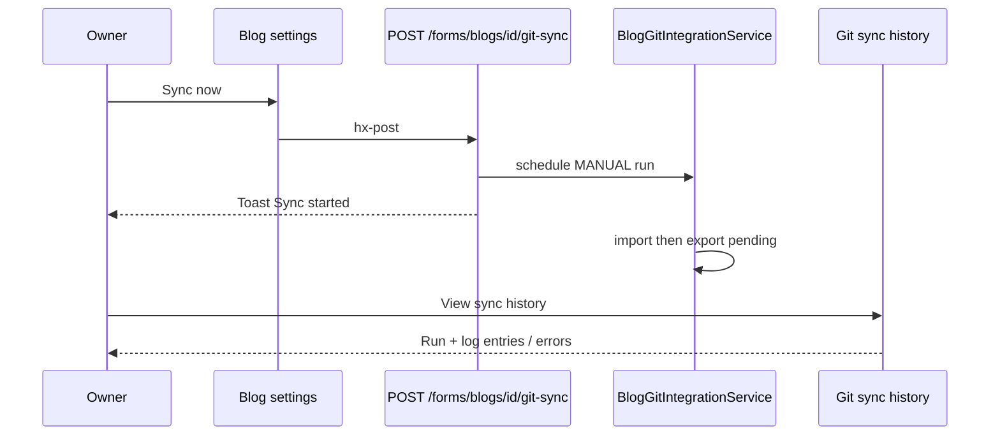

# Git ↔ Jekyll sync

**Feature version:** 2  
**Status:** architecture-ready  
**Production:** live (v1); v2 not shipped

## Changelog

### Per-blog credentials, auto-sync toggle, manual Sync — 2026-07-10

**Version:** 2  
**Status:** architecture-ready

**Description:** Authors configure **Git credentials on the blog only**: **HTTPS** username + password/PAT, or **SSH** private key (+ optional passphrase). Remotes may be HTTPS or SSH. **No server-wide credential fallback** — if the owner’s credentials are missing or wrong, the sync run **fails with a clear error** in history. A per-blog **Automatic sync** toggle: when off, the blog does **nothing** until **Sync now**. **Sync now** runs **import** plus **export of pending** local changes if any. Secrets are stored **encrypted at rest**, never re-displayed; UI warns authors to use a **dedicated** deploy key / PAT.

**Domain model:** updated 2026-07-10 — see [domain-specification.md](../docs/domain-specification.md) § Git sync (credentials, transport, automatic sync, Sync now; invariants 18–19)

**Impact on other features:**

| Feature / area | Impact |
|----------------|--------|
| [multi-blog.md](multi-blog.md) | Git section on blog **Settings** / **Edit**; credentials **per blog** (FQ3) |
| [post-publishing.md](post-publishing.md) | Export on publish/draft **only** when automatic sync is on (FQ4); otherwise no Git side effect |
| [account-deletion.md](account-deletion.md) | Blog delete must wipe encrypted credential columns with the blog |
| [authentication.md](authentication.md) | No change to login; blog owner gate unchanged |
| Ops / deployment | **Remove** reliance on `contraponto.git.username`/`password` for sync auth (FQ5); add encryption secret for at-rest storage; document deprecation of server Git credentials |
| Docs | [git-jekyll-convention.md](../docs/git-jekyll-convention.md), [deployment.md](../docs/deployment.md), [feature-catalog.md](../docs/feature-catalog.md) |
| `dev-import.sql` | Seed auto-sync off/on for `vepo` `notas`; **no** real secrets (credential-present false) |
| Error UX | Auth/transport failures must surface in sync history + notification (FQ5, FC11) |

#### Feature checklist

| ID | Criterion | Source | Done |
|----|-----------|--------|------|
| FC5 | Blog settings: HTTPS username + password/PAT (replace / clear); warning to use a dedicated PAT | FQ3, FQ5, FQ6 | ☐ |
| FC6 | Blog settings: SSH private key textarea + optional passphrase; warning to use a dedicated deploy key | FQ3, FQ6 | ☐ |
| FC7 | Remote URL accepts HTTPS **or** SSH; transport drives credential fields | FQ3 | ☐ |
| FC8 | **Automatic sync** off → blog does nothing (no poll, no export on publish/draft/warmup) until Sync now | FQ4 | ☐ |
| FC9 | **Sync now** (settings + history): import + export pending if any; trigger `MANUAL` | FQ1, FQ7 | ☐ |
| FC10 | Secrets stored encrypted at rest; never shown in UI, logs, or sync history snapshots | FQ6, FQ10 | ☐ |
| FC11 | Missing/invalid credentials and opaque transport failures → clear error in run history (and existing failure notification) | FQ5 | ☐ |
| FC12 | UI copy: secrets “kept encrypted / not shown again”; create a **specific** key or PAT for Contraponto | FQ6 | ☐ |
| FCdev | `dev-import.sql` + feature-catalog § Dev personas / Git rows | FCdev | ☐ |

#### Wireframe (v2 delta)

##### Screen: Blog settings — Git section (`GET /blogs/{id}/settings` or edit)

| Region | Elements | Notes |
|--------|----------|-------|
| Enable | Checkbox **Enable Git sync for this blog** | Existing |
| Remote | URL + branch | Hint: HTTPS or SSH (`git@…` / `ssh://…`) |
| Transport hint | Read-only label HTTPS / SSH | Derived from URL |
| HTTPS credentials | Username; password/PAT (blank = keep); **Clear stored credentials** | Shown when HTTPS |
| HTTPS warning | Hint under password | Create a **dedicated PAT** for this blog; stored encrypted and never shown again |
| SSH credentials | Private key textarea; optional passphrase; **Clear stored key** | Shown when SSH (FQ6) |
| SSH warning | Hint under key | Create a **dedicated deploy key** for this blog; stored encrypted and never shown again |
| Auto sync | Checkbox **Automatic sync** | When **off**: do nothing for this blog until Sync now (FQ4) |
| Actions | **Sync now** button; link **View sync history** | Owner-only; toast on start; failures → history (FQ5) |

##### Screen: Git sync history (`GET /blogs/{blogId}/git-sync`)

| Region | Elements | Notes |
|--------|----------|-------|
| Header | **Sync now** + existing title | Same form POST as settings |
| List | Existing run rows | Show `MANUAL` trigger; auth errors readable (FQ5) |

```text
[✓] Enable Git sync for this blog

Remote URL: [ https://…  or  git@host:path.git ]
Branch:     [ source ]
Transport:  HTTPS | SSH   (derived)

── HTTPS ──
Username: [ …… ]
Password / PAT: [ …… ]  (leave blank to keep)
[ ] Clear stored credentials
⚠ Create a dedicated personal access token for this blog.
  It is stored encrypted and will never be shown again.

── SSH (when URL is SSH) ──
Private key: [ paste PEM / OpenSSH ]
Passphrase (optional): [ …… ]
[ ] Clear stored key
⚠ Create a dedicated deploy key for this blog.
  It is stored encrypted and will never be shown again.

[✓] Automatic sync
    When off: this blog does nothing until you press Sync now.

[ Sync now ]     [ View sync history ]
```

### Production baseline — 2026-07-07

**Version:** 1  
**Status:** done

**Production:** live — deployed capability

**Development approval:** approved — production baseline (shipped)  
**Review approval:** approved 2026-07-07 — production baseline

#### Feature checklist (v1)

| ID | Criterion | Done |
|----|-----------|------|
| FC1 | Enable Git on blog settings | ☑ |
| FC2 | Export on publish/draft | ☑ |
| FC3 | Sync history + run detail UI | ☑ |
| FC4 | Failed sync notifications | ☑ |
| FCdev | `alice`, `vepo` blogs with git_enabled | ☑ |

## Summary

Per-blog **Git integration** exports posts to a remote **Jekyll-compatible** repository and **imports** remote changes. **v1** uses server-wide HTTPS credentials (`contraponto.git.username` / `password`), HTTPS remotes only, automatic export on publish/draft, optional scheduled poll, and **sync history**.

**v2** (planned) moves credentials to the **blog settings UI only** (HTTPS password/PAT or SSH key — no server fallback), allows SSH remotes, adds **Automatic sync** (when off: idle until Sync now), and **Sync now** (import + export pending). Secrets are encrypted at rest and never re-displayed; authors are warned to use a dedicated key/PAT.

## Wireframe

| Screen | Route | Notes |
|--------|-------|-------|
| Blog settings — Git section | `GET /blogs/{id}/settings` (also edit) | Enable, remote, branch; **v2:** credentials, warnings, auto sync, Sync now |
| Sync history | `GET /blogs/{blogId}/git-sync` | Paginated runs; **v2:** Sync now in header |
| Run detail | `GET /blogs/{blogId}/git-sync/{runId}` | Log entries; auth failures visible |
| Manual sync (form) | `POST /forms/blogs/{id}/git-sync` | **v2** — owner-only; import + export pending |

## Impact

| Area | Effect |
|------|--------|
| Bounded contexts | `git` (integration); blog settings form in `blog` |
| Schema (v1) | `tb_blogs` git columns; `tb_git_sync_runs`, `tb_git_sync_run_entries` |
| Schema (v2) | Per-blog credential columns (encrypted); `git_auto_sync`; credential-present flag |
| CDI | `PostGitSyncRequestedEvent` → `GitPostCommittedObserver` (no-op when auto sync off) |
| Auth for Git | **Only** blog-owner credentials (FQ5); missing/wrong → failed run + error detail |
| Docs | [git-jekyll-convention.md](../docs/git-jekyll-convention.md), deployment (deprecate server Git user/pass for auth), feature-catalog |
| Tests | Credential/SSH/manual/auto-sync; assert no use of server username/password; failure messaging |

### Risks

| Risk | Mitigation |
|------|------------|
| Secrets in DB / backups | Encrypt at rest (AES-GCM); never log or snapshot plaintext (FQ10) |
| SSRF via SSH/HTTPS remotes | Extend outbound host validation for both transports |
| SSH host key MITM | Pin / known_hosts under workspace (**AQ2**) |
| Auto sync off → silent idle | Copy: “does nothing until Sync now” (FQ4) |
| No server fallback | Authors must set credentials; clear auth errors in history (FQ5, FC11) |
| Opaque JGit errors | Classifier + user-facing remediation (FC11) |
| Import success silent | Unchanged — failures/partials + export success only (FQ2) |

### Feature questions (FQ*n*)

| # | Question | Status | Answer |
|---|----------|--------|--------|
| FQ1 | Manual **Sync now** button? | answered | **Yes** — settings + history; trigger `MANUAL` |
| FQ2 | Notify on import success? | answered | **No** — failures/partials + export success only |
| FQ3 | Credential scope: per blog, per user, or hybrid? | answered | **Per blog** |
| FQ4 | What does **Automatic sync** disable? | answered | When off: **do nothing** for the blog — wait for manual Sync now (no poll, no export on publish/draft/warmup) |
| FQ5 | Keep server-wide `contraponto.git.username`/`password` as fallback? | answered | **No.** Use only credentials the blog owner sets. If sync fails, record/show the error (history + existing failure notification) |
| FQ6 | How does the author provide the SSH private key? | answered | **Textarea.** Store **encrypted** (FQ10). Warning: create a **dedicated** key; it is kept encrypted and never shown again. Same warning pattern for HTTPS PAT |
| FQ7 | What does **Sync now** run? | answered | **Import + export pending** if any |
| FQ8 | Concurrent Sync now while a run is already active for the blog? | open | **Proposed:** skip with toast — one active run per blog |
| FQ9 | Confirm modal before Sync now? | open | **Proposed:** no — toast + history link |
| FQ10 | Storage of secrets: hash or encrypt? | answered | **Encrypted** (reversible crypto at rest) — not one-way hash. Product copy: “stored encrypted / never shown again” |

**Blocking for architecture:** none (FQ product scope closed). FQ8–FQ9 informational. Open **AQ2–AQ5** for Architect.

**Impact review (2026-07-10):** FQ3–FQ7 recorded. Removed server credential fallback. Auto-sync-off = idle until Sync now. Sync now = import + export pending. Added FC12 (dedicated-key warning). **FQ10:** user confirmed **encrypted** (not hashed) — AES-GCM at rest; hash risk row removed.

## Architecture

### ADRs aplicáveis

| ADR | Status | Relevância |
|-----|--------|------------|
| [0002](../docs/adr/0002-backend-java-quarkus-jakarta-ee.md) | Accepted | Quarkus / Jakarta |
| [0003](../docs/adr/0003-frontend-qute-htmx.md) | Accepted | Settings form + Sync now via HTMX |
| [0005](../docs/adr/0005-postgresql-database.md) | Accepted | Flyway columns on `tb_blogs` |
| [0013](../docs/adr/0013-cdi-events-cross-context.md) | Proposed | `PostGitSyncRequestedEvent` (gated by automatic sync) |
| [0015](../docs/adr/0015-federation-outbound-fetch-ssrf.md) | Accepted | Outbound host blocking pattern for remotes |
| [0017](../docs/adr/0017-per-blog-git-credentials-ssh.md) | **Proposed** | Per-blog encrypted credentials + SSH; no server auth fallback |

**Stop:** accept **ADR-0017** (and confirm open AQs below) before task break.

### Bounded contexts

| Context | Role |
|---------|------|
| `git` | Credentials crypto, transport, sync orchestration, Sync now endpoint, classifier |
| `blog` | Persist Git fields on `Blog`; settings form save |
| `shared.security` | Extend outbound host validation for SSH remotes (or git-local SSH host validator reusing same blocklists) |
| `notification` | Existing failure/success notifications unchanged |

### Packages / layers

| Layer | Types |
|-------|-------|
| Endpoint | `BlogSaveEndpoint` (credentials + auto sync fields); new `GitSyncTriggerEndpoint` `@Path("/forms/blogs/{id}/git-sync")` |
| Service | `BlogGitCredentialsService` (encrypt/decrypt/clear); `BlogGitIntegrationService` (use blog credentials only; honour auto sync; manual import+export); `GitSyncErrorClassifier` (auth/network for upload-pack) |
| Repository | `BlogRepository.findActiveBlogIdsForGitPoll` filters `gitAutoSync` |
| Config | `ContrapontoGitConfig` / `ContrapontoGitSettings`: add `credentialEncryptionSecret`; **stop reading username/password for auth** |
| Transport | HTTPS: `UsernamePasswordCredentialsProvider` from blog; SSH: JGit Apache SSH + decrypted key |

### Schema (Flyway)

| Column | Type | Notes |
|--------|------|-------|
| `git_auto_sync` | `BOOLEAN NOT NULL DEFAULT TRUE` | Automatic sync |
| `git_auth_username` | `VARCHAR(255)` nullable | HTTPS username only (plaintext; not a secret) |
| `git_auth_secret_encrypted` | `TEXT` nullable | **Encrypted** HTTPS password/PAT **or** SSH private key (same column; transport selects meaning) |
| `git_auth_passphrase_encrypted` | `TEXT` nullable | **Encrypted** SSH key passphrase (optional) |
| `git_credentials_configured` | `BOOLEAN NOT NULL DEFAULT FALSE` | UI “configured” without decrypting |

**Invariant:** HTTPS password/PAT is never stored in plaintext — only ciphertext in `git_auth_secret_encrypted` (same rule as SSH private key). Clear credentials → null ciphertext + `git_credentials_configured = false`. Blank secret on save → keep existing.

### Routes / templates

| Method | Path | Notes |
|--------|------|-------|
| GET | `/blogs/{id}/settings` (and edit) | Extended `gitSyncSection.html` |
| POST | existing blog save form | Persist Git fields + credentials |
| POST | `/forms/blogs/{id}/git-sync` | Sync now — owner only; Toast |
| GET | `/blogs/{id}/git-sync` | History + Sync now button |

### Cross-context

| Mechanism | Change |
|-----------|--------|
| `PostGitSyncRequestedEvent` | Fire / handle only when `gitEnabled && gitAutoSync` |
| `BLOG_SAVE_WARMUP` | Only when auto sync on |
| `GitRemotePollScheduler` | Only blogs with auto sync on |
| `MANUAL` trigger | New; schedules import then export-pending |

### Design específico da feature (v2)

| Area | Design |
|------|--------|
| Credentials | Per blog only ([ADR-0017](../docs/adr/0017-per-blog-git-credentials-ssh.md)); AES-GCM; never in snapshots/logs |
| Transport | HTTPS or SSH from URL; SSH via `org.eclipse.jgit.ssh.apache` |
| Host keys | `known_hosts` under blog workspace; accept-and-pin first success (AQ2) |
| Auto sync | Off → idle until Sync now |
| Sync now | Import + export pending; one active run per blog → toast skip (FQ8 proposed) |
| Failures | Clear auth/network remediation; no silent server fallback |
| Server config | `contraponto.git.credential-encryption-secret` required to store secrets; deprecate username/password for auth |

### HTMX component model

| Component id | Fragment / route | Activator | Request | Swap scope | Events out | Events in | JS companion | Auth allowlist |
|--------------|------------------|-----------|---------|------------|------------|-----------|--------------|----------------|
| `#git-sync` fieldset | Part of blog settings page | Form submit (existing save) | `POST` blog save | Full page / hub redirect as today | Toast on validation error | — | `none` | No |
| Sync now (settings) | `/forms/blogs/{id}/git-sync` | Button click | `hx-post` | None (toast only) or stay on page | `Toast` | — | `none` | No |
| Sync now (history) | same | Button in list header | `hx-post` | same | `Toast` | — | `none` | No |
| History list/detail | existing | Nav links | `hx-get` | `main` + `hx-select="main"` | — | — | `none` | No |

**Mechanism choice:** Sync now → Toast only (priority 1 inline headers via `Toast`); no OOB list refresh required (async run appears on next history load). Credential fieldsets: **static** form (AQ5) — show HTTPS or SSH blocks based on saved URL / server-side after save; no JS companion.

### HTMX interaction diagram



### `htmx-events.md` delta

- §4 **Git Sync now (v2)** — Toast-only mutation; no new custom events; no auth allowlist row.

### Tests

| Kind | Coverage |
|------|----------|
| Unit | Credentials encrypt/decrypt/clear/keep; auto sync gates; classifier for upload-pack → auth/network |
| Quarkus | Sync now schedules run; poll query excludes auto-off; no server username/password used |
| Web | Settings: warnings, Sync now toast; history shows MANUAL / auth error |
| Arch | git package size; no secrets logged |

### Architecture questions (AQ*n*)

| # | Question | Status | Answer |
|---|----------|--------|--------|
| AQ1 | Async export after publish? | answered | **Yes** — observer `AFTER_SUCCESS` |
| AQ2 | SSH host key verification policy? | open | **Proposed (in ADR-0017):** accept-and-pin under blog workspace `known_hosts` |
| AQ3 | Encryption secret shared with ActivityPub? | open | **Proposed (in ADR-0017):** separate `contraponto.git.credential-encryption-secret` |
| AQ4 | JGit SSH library? | open | **Proposed (in ADR-0017):** `org.eclipse.jgit.ssh.apache` |
| AQ5 | Credential fieldset: static vs HTMX swap? | open | **Proposed:** static form; transport from URL validated on save |

**Blocking for task break:** accept **ADR-0017**; confirm **AQ2–AQ5** (or accept proposed). FQ8–FQ9 remain informational (architecture assumes proposed: skip concurrent + no confirm modal).
