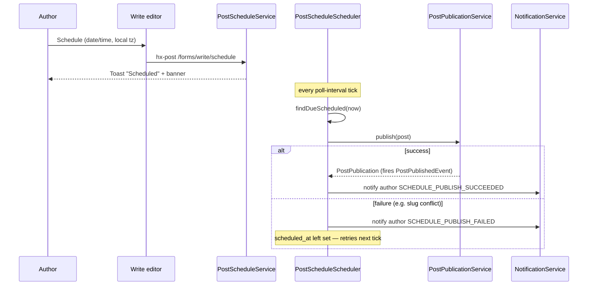

# Post publishing & version history

**Feature version:** 2  
**Status:** tasks-ready  
**Production:** live (v1 — draft/publish/republish/unpublish); v2 (scheduled publishing) not shipped

## Changelog

### Scheduled publishing — 2026-07-20

**Version:** 2  
**Status:** tasks-ready

**Description:** Authors set a future date/time on a draft so it **publishes automatically** without a manual click — same publish semantics as today (immutable snapshot per [ADR-0012](../docs/adr/0012-post-publication-versioning.md), `PostPublishedEvent`, notifications, Git export, ActivityPub delivery). A background poller (same pattern as `ActivityPubDeliveryScheduler` / `GitRemotePollScheduler`) publishes due posts. Authors can reschedule, cancel (revert to draft), or publish immediately before it fires. Until it fires, a scheduled post stays invisible to readers, search, RSS, sitemap, and ActivityPub — identical visibility to an ordinary draft.

**Domain model:** updated 2026-07-20 — see [domain-specification.md](../docs/domain-specification.md) § Posts & publishing (Scheduled post, Schedule, Reschedule, Cancel schedule, Schedule poller), Audience & notifications (`SCHEDULE_PUBLISH_*`), Author workspaces (Dashboard), and invariants 41–45.

**Impact on other features:**

| Feature / area | Impact |
|----------------|--------|
| [multi-blog.md](multi-blog.md) | None — same author/blog ownership and `BlogAccess.canEdit` gate as manual publish |
| [blog-audience.md](blog-audience.md) | Follower notifications must fire at **actual publish time**, not at schedule-set time |
| [git-sync.md](git-sync.md) | Export-on-publish (`PostGitSyncRequestedEvent`) must fire at actual publish time, not at schedule-set time |
| [activitypub-integration.md](activitypub-integration.md) | `Create` activity delivery must fire at actual publish time; a scheduled-not-yet-due post must not appear in the outbox or be fetchable |
| [search.md](search.md) | Scheduled posts excluded from the index until published |
| [seo.md](seo.md) | Scheduled posts excluded from sitemap/crawlable links until published |
| [rss-syndication.md](rss-syndication.md) | Scheduled posts excluded from the feed until published |
| [editor-review.md](editor-review.md) | None — featuring stays a post-publish action, unchanged (FQ5) |
| [dashboard-analytics.md](dashboard-analytics.md) | New fragment `GET /manage/dashboard/components/scheduled` designed here (Architecture § Routes, HTMX model, AQ5) — dashboard-analytics.md itself still needs its own changelog entry/review, not yet updated |
| [notification-retention.md](notification-retention.md) | New `NotificationType` constants `SCHEDULE_PUBLISH_SUCCEEDED`/`FAILED`, reusing existing retention policy (ADR-0010) unchanged |
| `dev-import.sql` | Seed at least one scheduled-but-not-due post for the happy path |

#### Feature checklist

| ID | Criterion | Source | Done |
|----|-----------|--------|------|
| FC5 | Write editor offers **Schedule** alongside Save draft / Publish, with a future date+time picker in the author's local time (converted to UTC on save); rejects a target closer than the poller interval with an inline validation error | FQ3, FQ7 | ☐ |
| FC6 | Scheduled post auto-publishes at the target time with identical side effects to manual publish (snapshot, notifications, Git export, ActivityPub delivery) | — | ☐ |
| FC7 | Author can **reschedule** (no confirm modal — plain form edit) or **cancel** (confirm modal, reverts to draft), or **publish immediately**, before the scheduled time fires | FQ8 | ☐ |
| FC8 | Writing library shows a distinct **Scheduled** view/tab (not merged into Drafts or Published) | — | ☐ |
| FC9 | A due-but-missed schedule (server downtime) publishes on the next poller tick rather than silently dropping | FQ4 | ☐ |
| FC10 | Scheduled-not-yet-due posts stay invisible to readers, search, sitemap/RSS, and ActivityPub outbox — same visibility as a draft | — | ☐ |
| FC11 | Author gets an in-app notification when a scheduled post publishes successfully or fails (e.g. a slug conflict introduced meanwhile) | FQ6 | ☐ |
| FC12 | Dashboard shows the author's upcoming scheduled posts | FQ9 | ☐ |
| FCdev | `dev-import.sql` includes a scheduled-but-not-due post | — | ☐ |

#### Wireframe (v2 delta)

##### Screen: Write editor (`GET /write`, `/write/draft/{id}`)

| Region | Elements | Notes |
|--------|----------|-------|
| Toolbar | New **Schedule** action next to Save draft / Publish | Opens date/time picker (FQ3 timezone) |
| Scheduled banner | "Scheduled to publish {datetime}" + **Reschedule** / **Cancel** / **Publish now** | Shown when the open draft has a pending schedule |

##### Screen: Writing library (`GET /writing/library`)

| Region | Elements | Notes |
|--------|----------|-------|
| Tabs | New **Scheduled** tab alongside Drafts / Published | Row shows target date/time; row actions: Reschedule (no modal), Cancel (confirm modal), Publish now |

##### Screen: Dashboard (author's own)

| Region | Elements | Notes |
|--------|----------|-------|
| Upcoming scheduled posts | List/widget of the author's own pending scheduled posts with target date/time | Links into Write editor or Writing library's Scheduled tab; needs dashboard-analytics' own review (cross-feature impact) |

**Feature checklist reviewed (phase 3):** FC5–FC12 and FCdev already cover the full v2 scope; no new criteria surfaced during task modeling.

#### Tasks (phase 3)

| ID | Layer | Depends | Expected outcome | Tests | Done |
|----|-------|---------|-------------------|-------|------|
| T1-java | java | — | Flyway `V0.0.15__post_scheduled_publish.sql`: `tb_posts.scheduled_at TIMESTAMP NULL` + partial index `idx_posts_scheduled_due`; `Post.scheduledAt` field; `PostRepository.findDueScheduled(now)` and `findPageByAuthorAndScheduled` queries | TC1 | ☐ |
| T2-java | java | T1-java | `PostScheduleService.schedule/reschedule` — reject a target closer than the poll interval; `PostScheduleService.cancel` — clear `scheduledAt`, revert to plain draft | TC2, TC3 | ☐ |
| T3-java | java | T2-java | `ScheduleEndpoint` `POST /forms/write/schedule` (schedule/reschedule) + `POST /forms/write/schedule/cancel`; `BlogAccess.canEdit` gate; `Toast` response | TC4, TC5 | ☐ |
| T4-java | java | T1-java | `PostPublicationService.publish` always nulls `scheduledAt` on transition to published — covers manual publish, "Publish now", and the scheduler uniformly | TC6 | ☐ |
| T5-java | java | T2-java, T4-java | `PostScheduleScheduler` — `@Scheduled(every = "${contraponto.post.schedule.poll-interval}")`, `ConcurrentExecution.SKIP`; iterate `findDueScheduled(now)`; call `publish(post)` per post in its own `@Transactional` unit; catch per-post failures; `application.properties` default `contraponto.post.schedule.poll-interval=2m` | TC7, TC8 | ☐ |
| T6-java | java | T5-java | `NotificationType.SCHEDULE_PUBLISH_SUCCEEDED`/`FAILED` constants + `linkUrl` case (reuse `postLink`); `PostScheduleScheduler` notifies the author on each attempt | TC9 | ☐ |
| T7-java | java | T1-java | `LibraryEndpoint.tab` — extend the `switch` with `case "scheduled"` using `findPageByAuthorAndScheduled` | TC10 | ☐ |
| T8-java | java | T1-java | Dashboard: `DashboardAnalyticsService` upcoming-scheduled query; new fragment endpoint `GET /manage/dashboard/components/scheduled` (mirrors existing `.../components/analytics`); extend `DashboardPage` | TC11 | ☐ |
| T9-htmx | htmx | T3-java | Write editor: **Schedule** toolbar button + inline date/time picker; **Scheduled banner** (Reschedule form, Cancel → confirm modal, Publish now button) | TC12 | ☐ |
| T10-js | js | T9-htmx | `write.js` — convert the `datetime-local` picker value to a UTC instant before `hx-post`; extend existing dirty-state guard to cover the schedule form | TC13 | ☐ |
| T11-htmx | htmx | T7-java | Writing library: **Scheduled** tab (nav + row template — date/time, Reschedule/Cancel/Publish now); Cancel wired to existing `confirm-modal.js` component | TC14, TC15 | ☐ |
| T12-htmx | htmx | T8-java | Dashboard: upcoming-scheduled widget fragment template, loaded like the existing analytics fragment | TC16 | ☐ |
| Tdev | dev | T3-java, T7-java, T8-java | `dev-import.sql`: one scheduled-but-not-due post on an existing seed blog; [feature-catalog.md](../docs/feature-catalog.md) § Dev personas if the click path is new | TC17 | ☐ |

**Stop for Development approval (phase 4)** — approve task IDs before implementation.

#### Test coverage (phase 3)

| ID | Kind | Covers | Scenario | Done |
|----|------|--------|----------|------|
| TC1 | unit/migration | T1-java | Flyway applies; `Post.scheduledAt` maps; partial index exists | ☐ |
| TC2 | unit | T2-java | Schedule rejects a target closer than the poll interval; accepts a valid future UTC instant | ☐ |
| TC3 | unit | T2-java | Cancel clears `scheduledAt` and the post behaves as a plain draft | ☐ |
| TC4 | quarkus | T3-java | `POST /forms/write/schedule` sets `scheduledAt`; non-owner → 403 | ☐ |
| TC5 | quarkus | T3-java | `POST /forms/write/schedule/cancel` clears `scheduledAt` | ☐ |
| TC6 | unit | T4-java | `publish()` always nulls `scheduledAt`, whether called manually or by the scheduler | ☐ |
| TC7 | quarkus | T5-java | Scheduler publishes exactly the due posts, fires `PostPublishedEvent` once each, skips not-yet-due posts | ☐ |
| TC8 | quarkus | T5-java | Catch-up: a post whose `scheduledAt` is already in the past (simulated downtime) still publishes on the next tick (FQ4) | ☐ |
| TC9 | quarkus | T6-java | Author receives `SCHEDULE_PUBLISH_SUCCEEDED`/`FAILED` on each scheduler attempt (FQ6) | ☐ |
| TC10 | quarkus | T7-java | Library Scheduled tab lists only the author's `published = false, scheduledAt != null` posts | ☐ |
| TC11 | quarkus | T8-java | Dashboard scheduled fragment lists only the logged-in author's own upcoming scheduled posts | ☐ |
| TC12 | web | T9-htmx | Write editor shows the Schedule action and the Scheduled banner when a schedule is pending | ☐ |
| TC13 | web | T10-js | Scheduling via the picker submits a UTC instant matching the displayed local time (FQ3) | ☐ |
| TC14 | web | T11-htmx | Library Scheduled tab: Cancel opens the confirm modal; Reschedule does not (FQ8) | ☐ |
| TC15 | web | T11-htmx | Publish now from a scheduled post publishes immediately and removes it from the Scheduled tab | ☐ |
| TC16 | web | T12-htmx | Dashboard shows the upcoming-scheduled-posts widget | ☐ |
| TC17 | quarkus | Tdev | Dev-seeded scheduled post is visible and exercisable in the Library Scheduled tab and Dashboard | ☐ |
| TC18 | arch | T1-java, T6-java | `post`/`notification` package size stays within `PackageSizeRulesTest`'s cap (FC10-adjacent guardrail) | ☐ |
| TC19 | quarkus | T1-java | A scheduled-not-due post stays excluded from search index, RSS feed, sitemap, and ActivityPub outbox (FC10) | ☐ |

### Production baseline — 2026-07-07

**Version:** 1  
**Status:** done

**Production:** live — deployed capability

## Summary

Authors write posts in the **editor** (`/write`), **save drafts**, **publish** immutable **publication snapshots** ([ADR-0012](../docs/adr/0012-post-publication-versioning.md)), **republish** when the working copy diverges, **unpublish**, and manage posts in the **Writing hub library**. Readers see the **live publication** on the post page; authors view **version history** and diffs. Publish/unpublish fires CDI events for downstream contexts ([ADR-0013](../docs/adr/0013-cdi-events-cross-context.md)).

**v2** (planned) adds **scheduled publishing**: authors set a future date/time on a draft and a background poller publishes it automatically with the same side effects as a manual publish. See the changelog entry above for scope and open questions.

## Wireframe

| Screen | Route | Notes |
|--------|-------|-------|
| Write editor | `GET /write`, `/write/draft/{id}` | Toolbar: Save draft, Publish; **v2:** Schedule |
| Post (reader) | `GET /{username}/post/{slug}` | Version control, Edit (author) |
| Version history modal | `GET …/components/history/modal` | Diff between snapshots |
| Writing library | `GET /writing/library` | Drafts / Published tabs; **v2:** Scheduled tab |

## Impact

| Area | Effect |
|------|--------|
| Bounded contexts | `post`, `write`, `library`; **v2 adds:** `dashboard`, `notification` (see Architecture § Bounded contexts (v2)) |
| Schema (v1) | `tb_posts`, `tb_post_publications`, `tb_post_slug_aliases`, tag/image dependency tables |
| Schema (v2) | `tb_posts.scheduled_at` (nullable, UTC) + partial index — no new table (see Architecture § Schema (Flyway, v2)) |
| CDI (v1) | `PostPublishedEvent`, `PostUnpublishedEvent`, `PostGitSyncRequestedEvent` |
| CDI (v2) | Same events, fired by the scheduler at actual publish time instead of a user request — no new event type |
| Tests | `PostPublicationServiceTest`, `PublishEndpointTest`, `WriteTest`, `PostChangeHistoryTest`, `LibraryEndpoint` tests; **v2:** scheduler poll/catch-up, pre-publish visibility (search/RSS/ActivityPub) |

### Risks

| Risk | Mitigation |
|------|------------|
| Identical republish spam | `isIdenticalSnapshot` skips new version + notifications |
| Published post delete | Must unpublish first |
| **(v2)** Missed schedule (server downtime spans the target time) | Poller catch-up publishes late on the next tick instead of silently dropping (FQ4 — confirmed) |
| **(v2)** Scheduled-not-yet-due post leaks early via search/RSS/ActivityPub | Reuse the existing `published=false` visibility gate — no new read path bypasses it (FC10) |

### Feature questions (FQ*n*)

| # | Question | Status | Answer |
|---|----------|--------|--------|
| FQ1 | Delete publication snapshots on unpublish? | answered | **No** — retained for history |
| FQ2 | Featured curation in publish flow? | answered | **No** — separate editor-review feature |
| FQ3 | What timezone governs the scheduled time — UTC/server, or the author's browser-local time converted on save? | answered | **Author's local time** — captured in the browser at save time, converted to UTC for storage. The picker and stored/scheduled instant are UTC internally; display converts back to the viewer's local time. |
| FQ4 | If the scheduled time already passed before the poller catches up (e.g. server was down), publish immediately on the next tick, or require the author to notice and act? | answered | **Publish immediately, however late** — matches the existing ActivityPub delivery / Git sync catch-up pattern. No separate "expired schedule" state in v1. |
| FQ5 | Can a scheduled post be marked **featured** (editor-review) before it goes live, so it's already featured the instant it publishes? | answered | **No** — featuring stays a post-publish action, unchanged from v1 |
| FQ6 | Does the author get an in-app notification confirming the scheduled publish succeeded or failed (e.g. a slug conflict introduced meanwhile)? | answered | **Yes** — notify on both success and failure, reusing the existing in-app notification channel |
| FQ7 | Minimum lead time — can an author schedule "5 minutes from now," or is there a floor tied to the poller interval? | answered | **Yes, a floor** — the picker rejects a target closer than the poller interval, with an inline validation error |
| FQ8 | Does Cancel/reschedule use the existing confirm-modal pattern ([contraponto-confirm-modals.mdc](../.cursor/rules/contraponto-confirm-modals.mdc)), same as unpublish/delete? | answered | **Cancel only.** Cancel (reverts to draft) uses the confirm modal, same weight as unpublish/delete. Reschedule (just picking a new time) is a plain form edit, no modal |
| FQ9 | Should the dashboard surface an author's own upcoming scheduled posts, or is the Writing library's Scheduled tab sufficient? | answered | **Both** — the dashboard also surfaces upcoming scheduled posts, in addition to the Writing library's Scheduled tab |

**Blocking for architecture:** none (all FQs answered). Phase 1b (Domain Model) and phase 2 (Architecture) complete — see `## Architecture` below; blocking items for task break are **AQ2–AQ5**.

**Impact review (2026-07-20, round 1):** FQ3 (author's local time, converted to UTC internally) and FQ4 (publish immediately on next poller tick, however late — no silent drop) answered. No changes to the delta Feature checklist or Wireframe beyond what FC5 (date+time picker) and FC9 (late catch-up) already specified.

**Impact review (2026-07-20, round 2):** FQ5–FQ9 answered. Featuring stays post-publish (no change). Added **FC11** (in-app notification on schedule outcome, impacts notification-retention.md) and **FC12** (dashboard upcoming-scheduled widget, impacts dashboard-analytics.md — now in scope, needs that feature's own review). FC5 gains a minimum-lead-time validation rule (FQ7). FC7 reworded: confirm modal on Cancel only, not Reschedule (FQ8). Added a Dashboard screen to the v2 Wireframe delta.

## Architecture

### ADRs aplicáveis

| ADR | Status | Relevância |
|-----|--------|------------|
| [0002](../docs/adr/0002-backend-java-quarkus-jakarta-ee.md) | Accepted | Backend |
| [0003](../docs/adr/0003-frontend-qute-htmx.md) | Accepted | Write + library HTMX |
| [0005](../docs/adr/0005-postgresql-database.md) | Accepted | Flyway migration for `scheduled_at` (v2) |
| [0010](../docs/adr/0010-notification-retention.md) | Accepted | `SCHEDULE_PUBLISH_*` reuses existing notification retention (v2) |
| [0012](../docs/adr/0012-post-publication-versioning.md) | Proposed | Snapshots — unchanged by scheduled publish (v2 reuses `publish()` as-is) |
| [0013](../docs/adr/0013-cdi-events-cross-context.md) | Proposed | Publish side effects — `PostPublishedEvent` fired identically whether manual or scheduled (v2) |

**No new ADR for v2.** The poll-scheduler shape (`@Scheduled` + `ConcurrentExecution.SKIP` + per-row iteration) already has two precedents in this codebase (`GitRemotePollScheduler`, `ActivityPubDeliveryScheduler`), neither of which required its own ADR — this is a feature-local application of an established pattern, not a new transversal decision.

### Bounded contexts (v2)

| Context | Role |
|---------|------|
| Content publishing (`post`, `write`) | `Post.scheduledAt`; `PostScheduleService`; `PostScheduleScheduler` |
| Author workspace (`library`, `dashboard`) | Library **Scheduled** tab; Dashboard upcoming-scheduled widget |
| Reader engagement (`notification`) | New `SCHEDULE_PUBLISH_*` constants on existing `NotificationType` — no new files (package is size-capped, not frozen; see Packages below) |
| Discovery & syndication (`search`, `rss`, `seo`) / Integration (`activitypub`, `git`) | **No change** — already gated on `published = true`; `PostPublishedEvent` still fires only at actual publish time |

### Packages / layers (v2)

| Layer | Types |
|-------|-------|
| Entity | `Post.scheduledAt` — new nullable `LocalDateTime` (UTC) field; **no new entity/table** |
| Repository | `PostRepository.findDueScheduled(LocalDateTime now)` (new query); `PostRepository.findPageByAuthorAndScheduled` (Library tab, new query) |
| Service | `PostScheduleService` (new) — schedule/reschedule/cancel validation + persistence; delegates the actual publish to the existing `PostPublicationService.publish` unchanged |
| Scheduler | `PostScheduleScheduler` (new) — mirrors `GitRemotePollScheduler` shape exactly |
| Endpoint | `ScheduleEndpoint` (new) `@Path("/forms/write/schedule")` — schedule/reschedule + `.../cancel`; existing `PublishEndpoint` reused for "Publish now" (must also null `scheduledAt`) |
| Library | `LibraryEndpoint.tab` — extend the existing `switch` with `case "scheduled"` |
| Dashboard | `DashboardEndpoint` / `DashboardAnalyticsService` — add upcoming-scheduled query; extend `DashboardPage` |
| Notification | `NotificationType` — add `SCHEDULE_PUBLISH_SUCCEEDED`, `SCHEDULE_PUBLISH_FAILED` constants + `linkUrl` switch case (reuses existing `postLink`) |

**Package-size check** ([contraponto-bounded-contexts.mdc](../.cursor/rules/contraponto-bounded-contexts.mdc)): `post` is currently at 19 top-level types (cap 25); `PostScheduleService` + `PostScheduleScheduler` bring it to 21 — within cap. `notification` is **grandfathered/frozen** at its current count — v2 must add **zero new files** there, only new enum constants + a switch case in the existing `NotificationType.java`.

### Schema (Flyway, v2)

New migration `V0.0.15__post_scheduled_publish.sql`:

| Column | Type | Notes |
|--------|------|-------|
| `scheduled_at` | `TIMESTAMP NULL` on `tb_posts` | UTC instant; set on Schedule/Reschedule; cleared on any publish (manual, "Publish now", or scheduler) or on Cancel |

Partial index for the poll query: `CREATE INDEX idx_posts_scheduled_due ON tb_posts (scheduled_at) WHERE published = false AND scheduled_at IS NOT NULL;`

**Invariant (spec #45):** `scheduled_at` is only meaningful while `published = false`.

### Routes / templates (v2)

| Method | Path | Notes |
|--------|------|-------|
| POST | `/forms/write/schedule` | New — schedule or reschedule; server validates target ≥ poll interval away (FQ7, AQ1) |
| POST | `/forms/write/schedule/cancel` | New — confirm-modal gated (FQ8); reverts to draft |
| POST | `/forms/write/publish` | Existing, reused for "Publish now" — must clear `scheduledAt` if set |
| GET | `/writing/library/components/tab/scheduled` | New tab value on the existing `LibraryEndpoint.tab` route |
| GET | `/write`, `/write/draft/{id}` | Extended — Scheduled banner when `scheduledAt != null` |
| GET | dashboard route (existing) | Extended — upcoming-scheduled widget |

### Cross-context (v2)

| Mechanism | Change |
|-----------|--------|
| `PostPublishedEvent` | Fired identically whether `publish()` is called manually or by `PostScheduleScheduler` — **no new event type** |
| Schedule outcome notification | `PostScheduleScheduler` calls `NotificationService` directly (author-only, not audience-wide) after each publish attempt on a due post — success or failure — reusing `Notification`/`NotificationService`; only `NotificationType` gains constants |

### Design específico da feature (v2)

| Area | Design |
|------|--------|
| Services (v1) | `PostPublicationService.publish`, `PostManagementService.unpublish/delete`, `PostChangeDiffService` |
| Access (v1) | `PostAccess` → `BlogAccess.canEdit` |
| Write (v1) | `PostWriteService` IDOR-safe resolution |
| Images (v1) | `PostImageDependencyService` sync on draft; snapshot on publish |
| Poll pattern (v2) | `@Scheduled(every = "${contraponto.post.schedule.poll-interval}", concurrentExecution = ConcurrentExecution.SKIP)`; iterate `PostRepository.findDueScheduled(now)`; call `PostPublicationService.publish(post)` per post in its own `@Transactional` unit so one failure doesn't block others — same shape as `GitRemotePollScheduler` |
| Timezone (v2) | `scheduled_at` stored as UTC `LocalDateTime`, matching the existing `createdAt`/`updatedAt`/`publishedAt` convention — no new `ZonedDateTime`/`Instant` type. Browser JS converts the `datetime-local` picker value to UTC before submit; display converts back client-side (FQ3) |
| Minimum lead time (v2) | Validated against `contraponto.post.schedule.poll-interval` — exact multiplier open (AQ1) |
| Failure handling (v2) | If `publish()` throws inside the poll loop (e.g. a slug conflict introduced meanwhile), catch per-post, notify the author `SCHEDULE_PUBLISH_FAILED`, leave `scheduled_at` untouched so it retries next tick — no auto-cancel (AQ2 open: retry indefinitely vs. fall back to draft after N attempts) |
| Publish now override (v2) | Reuses `PublishEndpoint` as-is; must additionally null `scheduledAt` so a leftover schedule can't refire |
| Confirm modal (v2) | Cancel reuses `ConfirmModalEndpoint` / `confirm-modal.js` exactly like unpublish/delete (FQ8) |

### HTMX component model

| Component id | Route | Activator | Target/swap | Events out | Events in | JS |
|--------------|-------|-----------|-------------|------------|-----------|-----|
| Write save | `POST /forms/write/draft` | Save button | `none` (toast URL) | toast | — | `write.js` dirty state |
| Write publish | `POST /forms/write/publish` | Publish | `main` from post page | toast | — | `write.js` |
| Library tabs | `GET /writing/library/components/tab/{type}` | Tab click | `#libraryContent` | — | — | none |
| Unpublish/delete | confirm modal → forms | Row action | row or hub | toast | — | confirm modal |
| History modal | `GET …/components/history/modal` | Version button | `#modal-container` | — | — | none |
| **(v2)** Schedule | `POST /forms/write/schedule` | Toolbar **Schedule** button, inline picker | write page banner region | toast | — | `write.js` (local→UTC conversion, dirty-state guard) |
| **(v2)** Reschedule | `POST /forms/write/schedule` | Banner form submit (no modal) | banner region (inline swap) | toast | — | `write.js` |
| **(v2)** Cancel schedule | `POST /forms/write/schedule/cancel` | Confirm modal → submit | banner region / `main` | toast | — | `confirm-modal.js` |
| **(v2)** Publish now (from schedule) | `POST /forms/write/publish` (existing) | Banner button | `main` | toast | — | `write.js` (existing) |
| **(v2)** Library Scheduled tab | `GET /writing/library/components/tab/scheduled` | Tab click | `#libraryContent` | — | — | none |
| **(v2)** Dashboard upcoming-scheduled | `GET /manage/dashboard/components/scheduled` (new fragment, mirrors existing `.../components/analytics`) | `load` | dashboard region | — | — | none |

**Mechanism choice (v2):** Schedule / Reschedule / Cancel / Publish-now all resolve with inline/local swap + Toast (priority 1 per [htmx-events.md](../docs/htmx-events.md) §1) — same as Save draft / Publish today. No OOB broadcast needed; the affected UI (banner, tab, dashboard widget) is local to a page the author is already viewing or reloads on next visit.

### HTMX interaction diagram (v2)

### `htmx-events.md` delta

**None.** No new custom event type (§3), no auth-sensitive chrome (§2), no new scoped-refresh pattern (§1) — v2 reuses the existing Toast + local-swap mechanism already covered by §1's "smallest mechanism" rule, same as Save draft/Publish today. `write.js` already exists as a JS companion (§5); no new module.

### Tests (v2)

| Kind | Coverage |
|------|----------|
| Unit | `PostScheduleService` schedule/reschedule/cancel validation (lead-time floor, UTC conversion boundary); `PostRepository.findDueScheduled` query |
| Quarkus | `PostScheduleScheduler` publishes due posts and fires `PostPublishedEvent` once; skips not-yet-due; catch-up publishes an overdue post on the next tick (FQ4) |
| Web | Write editor Schedule/Reschedule/Cancel/Publish-now flows; Library Scheduled tab; Dashboard widget; confirm modal on Cancel only, not Reschedule (FQ8) |
| Arch | `post`/`notification` package size within cap ([contraponto-bounded-contexts.mdc](../.cursor/rules/contraponto-bounded-contexts.mdc)); scheduled-not-due post excluded from search/RSS/sitemap/ActivityPub (reuse existing `published = false` visibility tests) |

### Architecture questions (AQ*n*)

| # | Question | Status | Answer |
|---|----------|--------|--------|
| AQ1 | Publish response swaps full post page? | answered | **Yes** — `hx-target="main"` |
| AQ2 *(v2)* | Minimum lead time: exactly one poll interval, or a safety multiple (e.g. 2×)? | answered | 1× `contraponto.post.schedule.poll-interval` |
| AQ3 *(v2)* | If `publish()` fails repeatedly (e.g. a permanent slug conflict), does the schedule retry forever or fall back to a plain draft after N attempts? | answered | Retry indefinitely — matches FQ4's "no silent drop"; the author already gets a failure notification on every attempt (FQ6) to notice and fix it |
| AQ4 *(v2)* | Default `contraponto.post.schedule.poll-interval`? | answered | `2m`, same as `contraponto.git.poll-interval`'s current default |
| AQ5 *(v2)* | Dashboard upcoming-scheduled widget: new HTMX fragment, or inline in the existing dashboard render? | answered | New fragment `GET /manage/dashboard/components/scheduled`, consistent with the existing `.../components/analytics` fragment |

**Blocking for task break:** none. All AQs (AQ1–AQ5) answered.

**Impact review (2026-07-20, round 3):** AQ2–AQ5 accepted as proposed. No changes to schema, packages, routes, or HTMX model beyond what was already drafted above.

#### Feature checklist

| ID | Criterion | Done |
|----|-----------|------|
| FC1 | Save draft / publish / republish | ☑ |
| FC2 | Unpublish + delete draft | ☑ |
| FC3 | Writing library tabs | ☑ |
| FC4 | Version history modal | ☑ |
| FCdev | Draft + multi-version published posts in seed | ☑ |

**Development approval:** approved — production baseline (shipped)
**Review approval:** approved 2026-07-07 — production baseline
